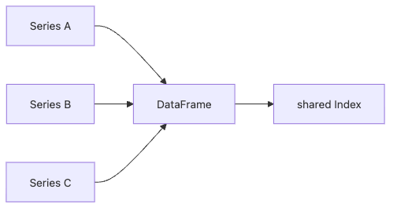

# 시리즈와 데이터프레임

Pandas를 쓰기 시작하면 금방 이런 질문이 나옵니다. 시리즈와 데이터프레임은 이름만 다른 두 자료구조일까요, 아니면 하나의 모델을 다른 크기로 보여 주는 걸까요. 이 관계를 초반에 분명히 잡아 두지 않으면 열 선택, 정렬, 산술 연산, 조인에서 계속 감으로만 코드를 쓰게 됩니다.

이 글은 Pandas 101 시리즈의 2번째 글입니다.

이번 글의 핵심은 간단합니다. 데이터프레임은 서로 같은 레이블 체계를 공유하는 시리즈의 묶음입니다. 이 관점을 잡으면 Pandas의 많은 동작이 훨씬 자연스럽게 읽힙니다.

## 이 글에서 다룰 문제

- 시리즈는 내부적으로 어떤 구조일까요?
- 데이터프레임을 열 중심으로 본다는 말은 무엇을 뜻할까요?
- 인덱스는 왜 단순한 행 번호가 아닐까요?
- `df["x"]`가 시리즈라는 사실이 왜 중요할까요?
- 정렬이 맞지 않을 때 왜 `NaN`이 생길까요?

> 데이터프레임을 그냥 표로만 보면 행을 따라가게 됩니다. 반대로 같은 인덱스를 공유하는 시리즈의 모음으로 보면 열 선택, 열 연산, 정렬 기반 계산이 모두 한 모델 안에서 설명됩니다.

## 왜 중요한가

Pandas의 대부분 연산은 결국 시리즈 수준의 계산으로 환원됩니다. 데이터프레임의 한 열이 시리즈라는 사실을 이해하면 열 선택이 왜 특정 타입을 반환하는지, 왜 인덱스 정렬이 자동으로 일어나는지, 왜 레이블이 숫자 배열만큼 중요한지가 한 번에 연결됩니다.

## 한눈에 보는 개념


*여러 시리즈가 공통 인덱스를 공유할 때 데이터프레임이 만들어지는 구조*

## 핵심 용어

- 시리즈: 값과 인덱스를 함께 가진 1차원 구조입니다.
- **데이터프레임**: 공통 인덱스를 공유하는 시리즈들의 묶음입니다.
- **값 배열**: 내부 계산에 쓰이는 기저 배열입니다.
- 인덱스: 행 레이블입니다.
- **열 레이블**: 각 시리즈를 구분하는 이름입니다.

## 전과 후

이전 관점: 데이터프레임을 그저 행과 열이 있는 표로만 봅니다.

이후 관점: 데이터프레임을 여러 시리즈가 같은 인덱스 위에 놓인 구조로 이해합니다.

## 실습: 구조를 직접 만들어 보기

### 1단계 - 시리즈 만들고 속성 보기

```python
import pandas as pd
s = pd.Series([1.0, 2.0, 3.0], index=["a", "b", "c"], name="x")
print(s.values, s.index, s.name)
```

시리즈는 값만 담는 배열이 아니라 레이블과 이름까지 갖춘 구조입니다. 이후 정렬과 연산은 이 레이블을 기준으로 움직입니다.

### 2단계 - 시리즈끼리 계산하기

```python
print(s * 10)
print(s + s)
```

시리즈 산술은 단순 반복문이 아니라 인덱스가 붙은 배열 연산입니다. 이 차이가 나중에 정렬 기반 계산의 핵심이 됩니다.

### 3단계 - 데이터프레임 만들기

```python
df = pd.DataFrame({
    "x": [1, 2, 3],
    "y": [10, 20, 30],
}, index=["a", "b", "c"])
print(df)
```

데이터프레임을 시리즈 묶음으로 본다는 말은 출력 형태에서도 바로 드러납니다. 같은 인덱스를 공유하는 두 열이 한 표 안에 나란히 놓여 있는지 확인해 보세요.

**예상 출력:**

```text
   x   y
a  1  10
b  2  20
c  3  30
```

이 데이터프레임은 같은 인덱스를 공유하는 두 개의 시리즈를 옆으로 붙여 둔 것처럼 볼 수 있습니다. 그래서 열 단위 연산이 자연스럽습니다.

### 4단계 - 열 하나를 고르면 시리즈가 나옵니다

```python
col = df["x"]
print(type(col), col)
```

`df["x"]`가 데이터프레임이 아니라 시리즈라는 사실은 매우 중요합니다. 열 선택 뒤에 이어지는 메서드와 연산이 모두 시리즈 문법으로 연결되기 때문입니다.

### 5단계 - 인덱스가 자동으로 맞춰집니다

```python
s1 = pd.Series([1, 2, 3], index=["a", "b", "c"])
s2 = pd.Series([10, 20, 30], index=["b", "c", "d"])
print(s1 + s2)
```

여기서 핵심은 값이 아니라 인덱스 정렬입니다. 겹치지 않는 레이블에는 `NaN`이 생기고, 공통 레이블에서만 실제 덧셈이 일어납니다.

**예상 출력:**

```text
a     NaN
b    12.0
c    23.0
d     NaN
dtype: float64
```

Pandas는 단순히 같은 위치의 값을 더하지 않습니다. 먼저 인덱스를 맞춘 뒤 계산하고, 맞지 않는 위치는 `NaN`으로 남깁니다.

## 이 코드에서 먼저 봐야 할 점

- `df["x"]`는 시리즈를 반환합니다.
- 시리즈 산술에서는 인덱스 정렬이 자동으로 일어납니다.
- `NaN`은 정렬이 맞지 않았다는 중요한 단서가 될 수 있습니다.

## 자주 하는 실수 다섯 가지

1. `df["x"]`를 데이터프레임으로 착각합니다.
2. 인덱스가 어긋나 생긴 `NaN`을 단순 결측치로만 봅니다.
3. 항상 `values`로 넘겨 레이블 정보를 잃어버립니다.
4. `name` 속성을 무시해 시리즈 식별이 어려워집니다.
5. 두 데이터프레임의 행 순서가 같다고 가정한 채 더합니다.

## 실무에서는 이렇게 이어집니다

A/B 테스트 비교, 시계열 정렬, 여러 소스의 데이터 결합에서 Pandas가 강한 이유는 바로 인덱스 정렬입니다. 눈에 잘 보이지 않지만, 이 동작이 많은 계산의 정확도를 지탱합니다.

## 실무에서는 이렇게 생각합니다

- 먼저 인덱스가 무엇을 의미하는지 분명히 합니다.
- 열 선택은 곧 시리즈 사고방식으로 넘어가는 순간이라고 봅니다.
- 정렬 불일치에서 생긴 `NaN`을 디버깅 단서로 활용합니다.
- `df.values` 의존도를 낮춥니다.
- 시리즈 이름을 적극적으로 붙여 흐름을 읽기 쉽게 만듭니다.

## 체크리스트

- [ ] 시리즈와 데이터프레임을 구분할 수 있습니다.
- [ ] 인덱스와 열 레이블의 역할을 설명할 수 있습니다.
- [ ] `df["col"]`이 시리즈임을 알고 있습니다.
- [ ] 인덱스 정렬이 자동이라는 점을 이해하고 있습니다.

## 연습 문제

1. 시리즈 세 개를 만든 뒤 하나의 데이터프레임으로 합쳐 공통 인덱스를 확인해 보세요.
2. 서로 다른 인덱스를 가진 두 시리즈를 더해 `NaN` 위치를 살펴보세요.
3. `df["x"]`와 `df[["x"]]`의 타입 차이를 코드로 확인해 보세요.

## 정리와 다음 글

데이터프레임은 시리즈를 공통 인덱스 위에 모아 둔 구조입니다. 이 기본 모델을 이해하면 이후의 선택, 집계, 병합도 모두 한층 단단하게 읽힙니다. 다음 글에서는 CSV와 Excel 파일을 정확하게 읽는 방법을 다루겠습니다.

<!-- toc:begin -->
- [Pandas란 무엇인가?](./01-what-is-pandas.md)
- **시리즈와 데이터프레임 (현재 글)**
- CSV와 Excel 읽기 (예정)
- 필터링과 선택 (예정)
- 결측치 처리 (예정)
- 그룹화와 집계 (예정)
- 병합과 조인 (예정)
- 시계열 데이터 다루기 (예정)
- 적용 함수와 벡터화 (예정)
- 실전 데이터 분석 (예정)
<!-- toc:end -->

## 참고 자료

- [pandas — Series API](https://pandas.pydata.org/docs/reference/series.html)
- [pandas — DataFrame API](https://pandas.pydata.org/docs/reference/frame.html)
- [pandas — Intro to data structures](https://pandas.pydata.org/docs/user_guide/dsintro.html)
- [Wes McKinney — Python for Data Analysis](https://wesmckinney.com/book/)

Tags: Pandas, Series, DataFrame, Python, Beginner
