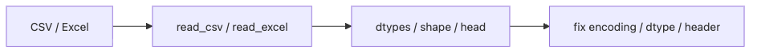

# CSV와 Excel 읽기

분석 작업이 자주 실패하는 이유는 복잡한 모델보다 훨씬 앞단에 있습니다. 파일을 처음 읽는 순간 문자 인코딩이 깨지고, 숫자 열이 문자열로 들어오고, 날짜가 날짜로 해석되지 않으면 그 뒤의 계산은 전부 흔들립니다. 읽기 단계는 사소한 준비가 아니라 분석 품질을 결정하는 첫 관문입니다.

이 글은 Pandas 101 시리즈의 3번째 글입니다.

이번 글에서는 `read_csv`와 `read_excel`을 단순한 파일 열기 함수로 보지 않고, 데이터를 의도한 형태로 적재하는 설정 지점으로 보겠습니다.

## 이 글에서 다룰 문제

- `read_csv`와 `read_excel`에서 가장 먼저 봐야 할 옵션은 무엇일까요?
- 문자 인코딩과 구분자는 왜 자주 문제를 일으킬까요?
- 자료형을 명시하면 어떤 이점이 있을까요?
- 날짜 열은 언제 읽는 시점에 처리하는 편이 좋을까요?
- 큰 파일은 어떤 방식으로 메모리 부담을 줄일 수 있을까요?

> 파일 읽기는 데이터를 메모리에 복사하는 작업이 아니라 데이터 계약을 해석하는 작업입니다. 처음부터 인코딩, 구분자, 자료형, 날짜 열을 분명히 잡아 두면 뒤의 정제와 디버깅 비용이 크게 줄어듭니다.

## 왜 중요한가

실제 분석의 상당 부분은 적재와 정제에 들어갑니다. 읽는 순간의 작은 실수 하나가 나중에는 자료형 버그, 정렬 오류, 잘못된 집계로 되돌아옵니다. 그래서 숙련된 엔지니어일수록 데이터가 들어오는 첫 단계에 더 많은 주의를 둡니다.

## 한눈에 보는 개념


*인코딩, 자료형, 헤더를 점검하며 파일을 읽는 적재 흐름*

## 핵심 용어

- 인코딩: 파일의 문자 표현 방식입니다.
- 구분자: 열을 나누는 문자입니다.
- 헤더: 열 이름이 들어 있는 행 위치입니다.
- **자료형 지정**: 열별 타입을 명시하는 설정입니다.
- **날짜 파싱**: 날짜 열을 읽는 시점에 날짜형으로 바꾸는 작업입니다.

## 전과 후

이전 관점: `read_csv`만 호출하고 결과가 이상하면 나중에 고칩니다.

이후 관점: 인코딩, 자료형, 날짜 열, 시트 이름을 읽는 순간부터 의식합니다.

## 실습: 다섯 단계로 읽기

### 1단계 - 기본으로 읽기

```python
import pandas as pd
df = pd.read_csv("sales.csv")
print(df.shape, df.dtypes)
```

파일을 읽자마자 크기와 자료형을 함께 보는 이유가 여기 있습니다. 열 개수는 맞아도 자료형이 어긋나면 이후 계산이 모두 흔들릴 수 있습니다.

**예상 출력:**

```text
(3, 3)
product_id    object
qty            int64
amount       float64
dtype: object
```

기본 호출은 빠른 확인에는 좋지만, 그대로 운영 코드가 되면 위험합니다. 읽은 직후 `shape`와 `dtypes`를 같이 보는 습관이 중요합니다.

### 2단계 - 인코딩과 구분자 지정하기

```python
df = pd.read_csv("data.csv", encoding="latin-1", sep=";")
print(df.head())
```

문자가 깨지거나 열이 한 칸으로 뭉쳐 들어오면 가장 먼저 확인할 항목이 인코딩과 구분자입니다. 파일 형식은 CSV처럼 보여도 실제 설정은 제각각인 경우가 많습니다.

### 3단계 - 자료형을 명시하기

```python
df = pd.read_csv(
    "sales.csv",
    dtype={"product_id": "string", "qty": "int32"},
    parse_dates=["date"],
)
print(df.dtypes)
```

자료형을 명시하면 메모리를 아끼는 것뿐 아니라, 선행 0이 중요한 식별자나 날짜 열을 안정적으로 다룰 수 있습니다. 읽은 뒤에 고치는 것보다 읽을 때 바로 맞추는 편이 낫습니다.

### 4단계 - Excel 읽기

```python
xls = pd.read_excel("report.xlsx", sheet_name="Q1", header=1)
print(xls.head())
```

Excel은 CSV보다 구조 변형이 많습니다. 시트 이름과 헤더 위치를 명시해 두면 사람이 손으로 만든 파일에서도 훨씬 안정적으로 읽을 수 있습니다.

### 5단계 - 큰 파일은 나눠서 읽기

```python
total = 0
for chunk in pd.read_csv("big.csv", chunksize=100_000):
    total += len(chunk)
print(total)
```

청크 단위 적재는 큰 파일을 통째로 메모리에 올리지 않고도 행 수나 부분 집계를 확인할 수 있게 해 줍니다. 운영 환경에서는 이런 중간 확인이 메모리 사고를 예방합니다.

**예상 출력:**

```text
1000000
```

메모리에 한 번에 올리기 어려운 파일은 `chunksize`를 기준으로 나눠 읽는 편이 안전합니다. 행 수 계산, 부분 집계, 전처리처럼 순차 처리가 가능한 작업에서 특히 유용합니다.

## 이 코드에서 먼저 봐야 할 점

- 비영어권 데이터에서는 인코딩이 첫 번째 함정입니다.
- 자료형을 명시하면 메모리와 정확도를 함께 잡을 수 있습니다.
- `chunksize`는 메모리 한계를 피하는 표준 패턴입니다.

## 자주 하는 실수 다섯 가지

1. 인코딩을 생략해 글자가 깨진 채로 분석을 시작합니다.
2. 식별자 열을 숫자로 읽어 선행 0을 잃습니다.
3. 날짜를 문자열로 둔 채 나중까지 끌고 갑니다.
4. 헤더 위치가 다른 Excel 파일을 기본값으로 읽습니다.
5. `sheet_name`을 지정하지 않아 첫 시트만 읽고 끝냅니다.

## 실무에서는 이렇게 이어집니다

ERP CSV, 회계 Excel, 외부 기관 데이터처럼 실무 파일은 형식이 늘 일정하지 않습니다. 그래서 팀 단위로는 읽기 옵션을 표준 함수로 감싸 두고, 인코딩과 자료형 설정을 코드에 고정하는 경우가 많습니다.

## 실무에서는 이렇게 생각합니다

- 파일 읽기 코드는 별도 모듈로 분리합니다.
- 자료형은 가능한 한 명시적으로 적습니다.
- `parse_dates` 대상은 항상 검토합니다.
- 큰 파일은 `chunksize`로 메모리를 방어합니다.
- 원본 파일은 손대지 않고 읽기 로직만 조정합니다.

## 체크리스트

- [ ] 인코딩을 항상 검토합니다.
- [ ] 필요한 열의 자료형을 지정합니다.
- [ ] 날짜 열을 읽는 시점에 처리할지 판단합니다.
- [ ] Excel에서는 시트 이름과 헤더 위치를 확인합니다.

## 연습 문제

1. UTF-8이 아닌 CSV를 읽고 자료형을 출력해 보세요.
2. `parse_dates` 유무에 따라 출력 자료형이 어떻게 달라지는지 비교해 보세요.
3. `chunksize`를 이용해 행 수를 세는 함수를 작성해 보세요.

## 정리와 다음 글

좋은 분석은 대개 좋은 적재에서 시작합니다. 파일을 읽는 순간부터 데이터 계약을 의식하면 뒤의 정제와 해석이 훨씬 단단해집니다. 다음 글에서는 읽어 온 표에서 필요한 행과 열을 고르는 방법을 다루겠습니다.

<!-- toc:begin -->
- [Pandas란 무엇인가?](./01-what-is-pandas.md)
- [시리즈와 데이터프레임](./02-series-and-dataframe.md)
- **CSV와 Excel 읽기 (현재 글)**
- 필터링과 선택 (예정)
- 결측치 처리 (예정)
- 그룹화와 집계 (예정)
- 병합과 조인 (예정)
- 시계열 데이터 다루기 (예정)
- 적용 함수와 벡터화 (예정)
- 실전 데이터 분석 (예정)
<!-- toc:end -->

## 참고 자료

- [pandas — read_csv](https://pandas.pydata.org/docs/reference/api/pandas.read_csv.html)
- [pandas — read_excel](https://pandas.pydata.org/docs/reference/api/pandas.read_excel.html)
- [pandas — IO tools](https://pandas.pydata.org/docs/user_guide/io.html)
- [Real Python — Reading and Writing CSV Files](https://realpython.com/python-csv/)

Tags: Pandas, CSV, Excel, DataAnalysis, Beginner
