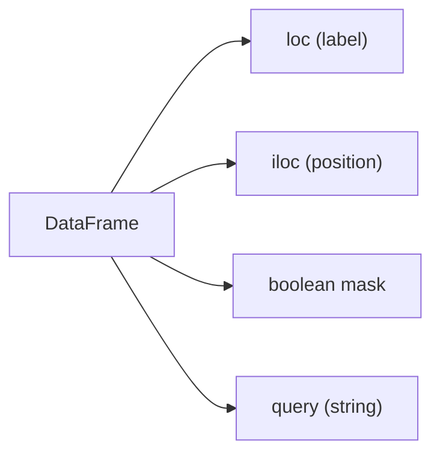

# 필터링과 선택

Pandas를 익히다 보면 같은 표에서 원하는 부분을 고르는 방법이 여러 개라는 사실이 먼저 헷갈립니다. `loc`, `iloc`, 조건 마스크, `query`까지 모두 비슷해 보이지만 실제로는 의도가 다릅니다. 이 차이를 이해하지 못하면 선택 코드는 금방 읽기 어려워지고, 할당 시점에는 경고까지 따라옵니다.

이 글은 Pandas 101 시리즈의 4번째 글입니다.

이번 글에서는 행과 열을 고르는 네 가지 방식을 기능 목록이 아니라 의도에 맞는 도구 상자로 정리해 보겠습니다.

## 이 글에서 다룰 문제

- `loc`와 `iloc`는 언제 구분해서 써야 할까요?
- 조건 마스크는 어떤 상황에서 가장 자연스러울까요?
- 표현식이 길어질수록 `query`가 왜 읽기 쉬워질까요?
- 왜 `and/or` 대신 `&/|`를 써야 할까요?
- 선택 이후 할당에서는 왜 더 조심해야 할까요?

> Pandas의 선택 도구는 여러 개가 아니라 역할이 나뉜 여러 손잡이입니다. 레이블로 고를 때, 위치로 고를 때, 조건으로 고를 때를 구분하면 코드가 짧아지는 것보다 더 중요한 이점, 즉 의도가 드러나는 코드를 얻습니다.

## 왜 중요한가

분석은 거의 모든 단계에서 부분 집합을 뽑는 작업을 반복합니다. 느리거나 모호한 선택 코드는 이후의 집계, 조인, 시각화까지 함께 흔듭니다. 그래서 선택 연산은 작은 문법이 아니라 분석의 기본 동작으로 봐야 합니다.

## 한눈에 보는 개념



## 핵심 용어

- **레이블 기반 선택**: 이름으로 행과 열을 고르는 방식입니다.
- **위치 기반 선택**: 숫자 위치로 고르는 방식입니다.
- **불리언 마스크**: 참과 거짓으로 행을 걸러내는 시리즈입니다.
- **문자열 질의**: 문자열 식으로 조건을 적는 방식입니다.
- **집합 포함 검사**: 값이 특정 집합에 속하는지 확인하는 방식입니다.

## 전과 후

이전 관점: `df[조건]`만으로 모든 문제를 풀려다 경고와 혼란을 만납니다.

이후 관점: 레이블, 위치, 조건이라는 의도에 맞춰 `loc`, `iloc`, `query`를 나눠 씁니다.

## 실습: 다섯 단계로 고르기

### 1단계 - 열 선택하기

```python
import pandas as pd
df = pd.DataFrame({"x": [1, 2, 3], "y": [10, 20, 30]}, index=["a", "b", "c"])
print(df["x"])
print(df[["x", "y"]])
```

열 하나를 고르면 시리즈가, 열 여러 개를 고르면 데이터프레임이 나옵니다. 이 차이는 이후 메서드 체인과 할당 방식에 직접 영향을 줍니다.

### 2단계 - 레이블로 고르기

```python
print(df.loc["a"])
print(df.loc[["a", "c"], "x"])
```

`loc`는 행과 열의 이름을 기준으로 고를 때 가장 명확합니다. 특히 할당과 함께 쓰일 때도 의도가 분명하게 드러납니다.

### 3단계 - 위치로 고르기

```python
print(df.iloc[0])
print(df.iloc[0:2, 0])
```

`iloc`는 순수하게 위치만 중요할 때 쓰면 됩니다. 슬라이싱 감각은 파이썬 리스트와 비슷하지만, 이름이 아닌 위치를 쓴다는 점을 잊지 않아야 합니다.

### 4단계 - 조건으로 고르기

```python
print(df[df["x"] > 1])
print(df[(df["x"] > 1) & (df["y"] < 30)])
```

조건 마스크는 필터링에서 가장 많이 쓰는 패턴입니다. 단, 여러 조건을 묶을 때는 반드시 괄호와 `&`, `|`를 함께 써야 합니다.

### 5단계 - 문자열 식과 포함 검사 쓰기

```python
print(df.query("x > 1 and y < 30"))
print(df[df["x"].isin([1, 3])])
```

조건이 길어지면 `query`가 가독성을 높여 줄 수 있습니다. 특정 값 집합을 기준으로 고를 때는 `isin`이 긴 OR 체인보다 낫습니다.

## 이 코드에서 먼저 봐야 할 점

- `loc`는 끝점을 포함하고 `iloc`는 끝점을 제외합니다.
- `&`와 `|`는 비트 연산자이며 `and/or`와 다릅니다.
- 조건식이 길어질수록 `query`가 읽기 쉬운 선택지가 될 수 있습니다.

## 자주 하는 실수 다섯 가지

1. 마스크 조건에서 `and/or`를 써서 오류를 냅니다.
2. 체이닝 인덱싱으로 `SettingWithCopyWarning`를 만듭니다.
3. `loc`가 끝점을 포함한다는 사실을 놓칩니다.
4. `iloc`에 레이블을 넣어 선택하려고 합니다.
5. `isin` 대신 `|`를 길게 이어 붙입니다.

## 실무에서는 이렇게 이어집니다

지표 대시보드, 이상치 탐지, 실험군 분리처럼 조건 기반 선택은 분석 함수의 중심입니다. 그래서 많은 팀이 할당에는 `loc`를 기본 규칙으로 삼고, 복잡한 조건은 이름 붙은 변수로 분리해 읽기 쉽게 유지합니다.

## 실무에서는 이렇게 생각합니다

- 복잡한 조건은 먼저 변수로 분리합니다.
- 할당할 때는 항상 `loc`를 우선합니다.
- `query`는 읽기 쉬워질 때만 씁니다.
- `isin`, `between` 같은 도구로 코드를 줄입니다.
- 경고를 무시하지 않습니다.

## 체크리스트

- [ ] `loc`와 `iloc`를 구분할 수 있습니다.
- [ ] 여러 조건을 괄호와 `&/|`로 표현할 수 있습니다.
- [ ] 체이닝 인덱싱을 피해야 하는 이유를 알고 있습니다.
- [ ] `query`와 `isin`의 용도를 설명할 수 있습니다.

## 연습 문제

1. `loc`로 특정 레이블의 부분 집합을 뽑아 보세요.
2. `iloc`로 처음 5행을 출력해 보세요.
3. 두 개 이상의 조건을 `query`로 표현해 보세요.

## 정리와 다음 글

선택은 분석에서 가장 자주 반복되는 기본 동작입니다. 의도에 맞는 선택 도구를 고를 수 있어야 이후의 정제와 집계도 안정적으로 이어집니다. 다음 글에서는 결측치를 어떻게 진단하고 다룰지 살펴보겠습니다.

<!-- toc:begin -->
- [Pandas란 무엇인가?](./01-what-is-pandas.md)
- [시리즈와 데이터프레임](./02-series-and-dataframe.md)
- [CSV와 Excel 읽기](./03-read-csv-and-excel.md)
- **필터링과 선택 (현재 글)**
- 결측치 처리 (예정)
- 그룹화와 집계 (예정)
- 병합과 조인 (예정)
- 시계열 데이터 다루기 (예정)
- 적용 함수와 벡터화 (예정)
- 실전 데이터 분석 (예정)
<!-- toc:end -->

## 참고 자료

- [pandas — Indexing and selecting data](https://pandas.pydata.org/docs/user_guide/indexing.html)
- [pandas — query](https://pandas.pydata.org/docs/reference/api/pandas.DataFrame.query.html)
- [pandas — Boolean indexing](https://pandas.pydata.org/docs/user_guide/indexing.html#boolean-indexing)
- [Real Python — Pandas DataFrame Indexing](https://realpython.com/pandas-dataframe/)

Tags: Pandas, Filtering, Selection, Indexing, Beginner
