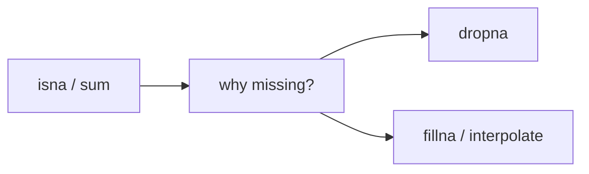

# missing value 처리

> Pandas 101 시리즈 (5/10)


## 이 글에서 다룰 문제

현실 데이터의 *상당 부분* 은 결측치입니다. *처리 방식* 에 따라 *모델 성능* 과 *분석 신뢰도* 가 갈립니다.

## 전체 흐름


## Before/After

**Before**: *“그냥 dropna”* — 행이 *80% 사라짐*.

**After**: *“원인별 처리”* — *센서 결측은 보간*, *입력 누락은 모델링*.

## 5단계 결측치

### 1단계 — 결측 탐지

```python
import numpy as np, pandas as pd
df = pd.DataFrame({"x": [1, np.nan, 3], "y": [np.nan, 2, 3]})
print(df.isna())
print(df.isna().sum())
```

### 2단계 — 제거

```python
print(df.dropna())            # 결측 있는 행 제거
print(df.dropna(axis=1))      # 결측 있는 열 제거
```

### 3단계 — 채우기

```python
print(df.fillna(0))
print(df.fillna(df.mean(numeric_only=True)))
```

### 4단계 — 직전/직후값

```python
print(df.fillna(method="ffill"))
print(df.fillna(method="bfill"))
```

### 5단계 — 보간

```python
ts = pd.Series([1.0, np.nan, np.nan, 4.0])
print(ts.interpolate())
```

## 이 코드에서 주목할 점

- *isna().sum()* 은 *결측 진단의 첫 단계*.
- *fillna(평균)* 은 *분포를 왜곡* 할 수 있습니다.
- *interpolate* 는 *시계열* 에서 자연스럽습니다.

## 자주 하는 실수 5가지

1. ***dropna 남용* 으로 데이터 *대부분 소실*.**
2. ***0으로 채워서* *분포 왜곡*.**
3. ***ffill* 만 쓰고 *시작 부분 NaN* 무시.**
4. ***categorical 평균* 으로 채우기 시도.**
5. ***결측의 의미* 를 *기록 없이* 임의 처리.**

## 실무에서는 이렇게 쓰입니다

센서 데이터, 설문, 거래 로그 — *결측 패턴* 자체가 *시그널* 입니다. *MAR/MCAR/MNAR* 가설을 세우고 *처리 방식 의사결정 문서* 를 남깁니다.

## 체크리스트

- [ ] *isna().sum()* 으로 *진단* 한다.
- [ ] *dropna 영향도* 를 *측정* 한다.
- [ ] *fillna 전략* 을 *명시* 한다.
- [ ] *결측 비율* 을 *기록* 한다.

## 정리 및 다음 단계

결측치 처리는 *분석의 무결성* 을 결정합니다. 다음 글에서는 *groupby* 를 다룹니다.

<!-- toc:begin -->
- [Pandas란 무엇인가?](./01-what-is-pandas.md)
- [Series와 DataFrame](./02-series-and-dataframe.md)
- [CSV와 Excel 읽기](./03-read-csv-and-excel.md)
- [filtering과 selection](./04-filtering-and-selection.md)
- **missing value 처리 (현재 글)**
- groupby (예정)
- merge와 join (예정)
- time series (예정)
- apply와 vectorization (예정)
- 실전 데이터 분석 (예정)
<!-- toc:end -->

## 참고 자료

- [pandas — Working with missing data](https://pandas.pydata.org/docs/user_guide/missing_data.html)
- [pandas — fillna](https://pandas.pydata.org/docs/reference/api/pandas.DataFrame.fillna.html)
- [pandas — interpolate](https://pandas.pydata.org/docs/reference/api/pandas.DataFrame.interpolate.html)
- [scikit-learn — Imputation](https://scikit-learn.org/stable/modules/impute.html)

Tags: Pandas, MissingValues, DataCleaning, Python, Beginner
