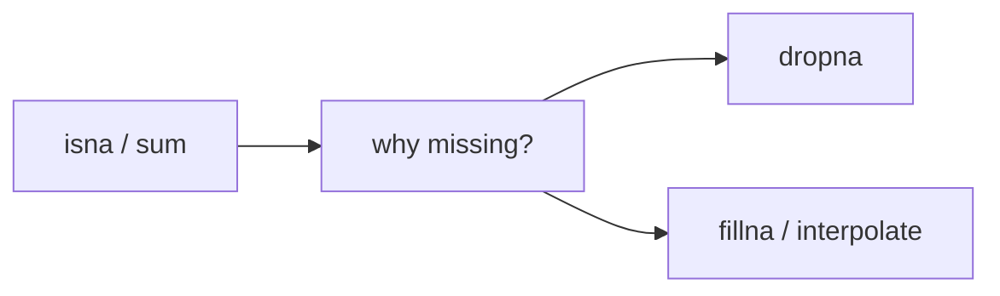

# 결측치 처리

현실 데이터는 깔끔하게 채워져 있지 않습니다. 센서가 값을 놓치고, 설문 응답이 비고, 거래 로그 일부가 비정상적으로 빠지기도 합니다. 그래서 결측치를 어떻게 다루는지는 정제 단계의 작은 선택이 아니라 분석 신뢰도를 결정하는 핵심 판단이 됩니다.

이 글은 Pandas 101 시리즈의 5번째 글입니다.

이번 글에서는 `NaN`을 단순히 지워야 할 쓰레기 값으로 보지 않고, 데이터가 왜 비어 있는지 해석해야 할 신호로 보겠습니다.

## 이 글에서 다룰 문제

- `NaN`과 `pd.NA`는 어떤 의미를 가질까요?
- 결측치를 먼저 어떻게 진단해야 할까요?
- 언제 제거하고 언제 채워야 할까요?
- `fillna`와 `interpolate`는 어떤 차이가 있을까요?
- 결측 처리 정책을 왜 기록으로 남겨야 할까요?

> 결측치는 데이터가 망가졌다는 뜻일 수도 있지만, 어떤 과정이 비어 있다는 뜻일 수도 있습니다. 원인을 모른 채 지우거나 채우면 분석이 깔끔해지는 대신 해석이 틀어질 수 있습니다.

## 왜 중요한가

결측치 처리 방식은 모델 성능과 분석 해석을 모두 바꿉니다. 같은 데이터라도 무작정 `dropna`를 쓰면 표본이 심하게 줄어들 수 있고, 무심코 0이나 평균으로 채우면 분포가 왜곡될 수 있습니다.

## 한눈에 보는 개념



## 핵심 용어

- **NaN**: 숫자형 결측을 나타내는 대표 표식입니다.
- **통합 결측 표식**: Pandas가 제공하는 결측 표현입니다.
- **행 또는 열 제거**: 결측이 있는 축을 삭제하는 방식입니다.
- 채우기: 상수, 평균, 이전 값 등으로 대체하는 방식입니다.
- 보간: 주변 값을 이용해 중간 값을 추정하는 방식입니다.

## 전과 후

이전 관점: `dropna()` 한 줄로 끝내고 데이터 대부분을 잃습니다.

이후 관점: 결측 원인에 따라 제거, 대체, 보간을 다르게 선택합니다.

## 실습: 결측치를 다루는 다섯 단계

### 1단계 - 결측치 찾기

```python
import numpy as np, pandas as pd
df = pd.DataFrame({"x": [1, np.nan, 3], "y": [np.nan, 2, 3]})
print(df.isna())
print(df.isna().sum())
```

결측치 처리는 항상 진단에서 시작합니다. 특히 `isna().sum()`은 열별 결측 규모를 가장 빠르게 보여 주는 기본 점검입니다.

### 2단계 - 제거하기

```python
print(df.dropna())            # drop rows with any NaN
print(df.dropna(axis=1))      # drop columns with any NaN
```

제거는 간단하지만 비용이 큽니다. 어떤 행이나 열이 얼마나 사라지는지 측정하지 않으면 분석 대상 자체가 바뀔 수 있습니다.

### 3단계 - 값 채우기

```python
print(df.fillna(0))
print(df.fillna(df.mean(numeric_only=True)))
```

상수나 평균으로 채우는 방식은 빠르지만 의미가 약할 수 있습니다. 특히 평균 대체는 분포와 분산을 왜곡할 수 있다는 점을 염두에 둬야 합니다.

### 4단계 - 앞값이나 뒷값으로 채우기

```python
print(df.fillna(method="ffill"))
print(df.fillna(method="bfill"))
```

앞값 채우기와 뒷값 채우기는 순서가 있는 데이터에서 자주 쓰입니다. 다만 선두 결측이나 후미 결측은 그대로 남을 수 있으니 끝단 처리를 따로 생각해야 합니다.

### 5단계 - 보간하기

```python
ts = pd.Series([1.0, np.nan, np.nan, 4.0])
print(ts.interpolate())
```

보간은 시계열처럼 흐름이 있는 데이터에 특히 잘 맞습니다. 모든 결측에 쓸 수 있는 만능 도구는 아니지만, 연속값의 빈 구간을 다룰 때는 매우 자연스럽습니다.

## 이 코드에서 먼저 봐야 할 점

- `isna().sum()`은 결측 진단의 첫 단계입니다.
- 평균 대체는 분포를 왜곡할 수 있습니다.
- `interpolate()`는 시계열 결측에 잘 맞습니다.

## 자주 하는 실수 다섯 가지

1. `dropna`를 남용해 대부분의 행을 잃습니다.
2. 0으로 채워 분포를 인위적으로 바꿉니다.
3. `ffill`만 쓰고 선두 결측을 놓칩니다.
4. 범주형 열에 평균을 채우려 합니다.
5. 결측 처리 기준을 기록하지 않은 채 임의로 바꿉니다.

## 실무에서는 이렇게 이어집니다

센서 데이터, 설문 데이터, 거래 로그에서는 결측 패턴 자체가 중요한 신호일 수 있습니다. 그래서 결측 원인 가설을 먼저 세우고, 처리 방식을 문서화한 뒤 분석이나 모델링에 들어가는 편이 안전합니다.

## 실무에서는 이렇게 생각합니다

- 결측을 처리하기 전에 왜 비었는지 먼저 묻습니다.
- 처리 정책을 코드와 문서에 함께 남깁니다.
- 필요하면 결측 여부 자체를 별도 열로 남깁니다.
- 시계열에서는 보간을 적극적으로 검토합니다.
- 머신러닝에서는 결측 자체를 특징으로 활용할지 판단합니다.

## 체크리스트

- [ ] `isna().sum()`으로 결측 규모를 진단할 수 있습니다.
- [ ] `dropna`가 데이터 양에 주는 영향을 측정합니다.
- [ ] `fillna` 전략을 명시적으로 정합니다.
- [ ] 결측 비율과 처리 기준을 기록합니다.

## 연습 문제

1. 열별 결측 비율을 계산해 보세요.
2. `dropna` 전후의 행 수를 비교해 보세요.
3. 시계열에서 `ffill`과 `interpolate()`의 결과 차이를 살펴보세요.

## 정리와 다음 글

결측치 처리는 데이터를 깨끗하게 만드는 작업이 아니라 데이터의 의미를 보존하는 작업입니다. 원인을 묻고 정책을 분명히 해야 분석 무결성이 유지됩니다. 다음 글에서는 여러 행을 기준별로 묶어 집계하는 `groupby`를 살펴보겠습니다.

<!-- toc:begin -->
- [Pandas란 무엇인가?](./01-what-is-pandas.md)
- [시리즈와 데이터프레임](./02-series-and-dataframe.md)
- [CSV와 Excel 읽기](./03-read-csv-and-excel.md)
- [필터링과 선택](./04-filtering-and-selection.md)
- **결측치 처리 (현재 글)**
- 그룹화와 집계 (예정)
- 병합과 조인 (예정)
- 시계열 데이터 다루기 (예정)
- 적용 함수와 벡터화 (예정)
- 실전 데이터 분석 (예정)
<!-- toc:end -->

## 참고 자료

- [pandas — Working with missing data](https://pandas.pydata.org/docs/user_guide/missing_data.html)
- [pandas — fillna](https://pandas.pydata.org/docs/reference/api/pandas.DataFrame.fillna.html)
- [pandas — interpolate](https://pandas.pydata.org/docs/reference/api/pandas.DataFrame.interpolate.html)
- [scikit-learn — Imputation](https://scikit-learn.org/stable/modules/impute.html)

Tags: Pandas, MissingValues, DataCleaning, Python, Beginner
