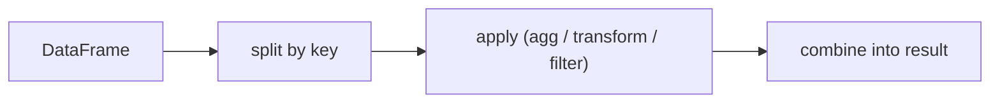

# groupby

> Pandas 101 시리즈 (6/10)

<!-- a-grade-intro:begin -->

**핵심 질문**: *groupby* 는 *SQL의 GROUP BY* 와 *완전히 같은 것* 일까요?

> *groupby는 *split-apply-combine* 패턴입니다. agg, transform, filter 세 얼굴을 가집니다.*

<!-- a-grade-intro:end -->

## 이 글에서 배울 것

- *split-apply-combine* 모델
- *agg / transform / filter* 의 차이
- *멀티키 grouping*
- 5단계 groupby 실습
- 흔한 함정 5가지

## 왜 중요한가

*집계는 분석의 핵심 동작* 입니다. *groupby* 를 잘 쓰면 *수십 줄 for문* 이 *한 줄* 로 바뀝니다.

## 개념 한눈에 보기



## 핵심 용어 정리

- **groupby**: *키별로 그룹* 을 *나눔*.
- **agg**: *그룹별 단일 값* 으로 *축약*.
- **transform**: *그룹별 계산* 을 *원본 shape* 으로 돌려줌.
- **filter**: *그룹 조건* 으로 *행 필터링*.
- **as_index**: *그룹 키* 를 *인덱스* 로 만들지 결정.

## Before/After

**Before**: *“for문으로 카테고리별 합계”* — 느리고 길다.

**After**: *“groupby + agg”* — *한 줄* 로 *모든 키* 처리.

## 실습: 5단계 groupby

### 1단계 — 데이터 준비

```python
import pandas as pd
df = pd.DataFrame({
    "city": ["Seoul", "Seoul", "Busan", "Busan"],
    "month": ["Jan", "Feb", "Jan", "Feb"],
    "sales": [100, 120, 80, 95],
})
```

### 2단계 — 단순 합계

```python
print(df.groupby("city")["sales"].sum())
```

### 3단계 — agg 다중 통계

```python
print(df.groupby("city").agg(
    total=("sales", "sum"),
    mean=("sales", "mean"),
    n=("sales", "count"),
))
```

### 4단계 — transform

```python
df["share"] = df["sales"] / df.groupby("city")["sales"].transform("sum")
print(df)
```

### 5단계 — filter

```python
big = df.groupby("city").filter(lambda g: g["sales"].sum() > 200)
print(big)
```

## 이 코드에서 주목할 점

- *agg* 는 *그룹당 한 행*, *transform* 은 *원본과 같은 shape*.
- *named aggregation* 으로 *컬럼명 제어*.
- *filter* 는 *boolean 반환* 이 아니라 *행 자체* 를 반환.

## 자주 하는 실수 5가지

1. ***transform과 agg* 혼동.**
2. ***as_index=False* 미설정으로 *인덱스 의외성*.**
3. ***reset_index* 누락으로 *후속 join* 어려움.**
4. ***멀티키* 일 때 *대괄호 누락*.**
5. ***apply 남용* 으로 *느려짐*.**

## 실무에서는 이렇게 쓰입니다

세그먼트 분석, 코호트 리텐션, KPI 집계 — *groupby* 는 *비즈니스 인텔리전스의 동력* 입니다. *transform* 은 *피처 엔지니어링* 의 핵심 도구.

## 시니어 엔지니어는 이렇게 생각합니다

- *agg 우선*, *apply 최후*.
- *named aggregation* 으로 *결과 가독성*.
- *transform* 으로 *피처 만들기*.
- *멀티키* 를 *튜플 인덱스* 로 본다.
- *as_index* 를 *의식적으로* 선택.

## 체크리스트

- [ ] *split-apply-combine* 을 설명할 수 있다.
- [ ] *agg / transform / filter* 를 구분한다.
- [ ] *named aggregation* 을 쓴다.
- [ ] *멀티키* groupby 를 한다.

## 연습 문제

1. *카테고리별 평균과 표준편차* 를 *named agg* 로 출력하세요.
2. *transform* 으로 *그룹 평균* 을 *원본에 붙이는* 코드를 작성하세요.
3. *filter* 로 *합계가 임계 이상* 인 그룹만 남기세요.

## 정리 및 다음 단계

groupby는 *분석의 동력* 입니다. 다음 글에서는 *merge와 join* 을 다룹니다.

<!-- toc:begin -->
- [Pandas란 무엇인가?](./01-what-is-pandas.md)
- [Series와 DataFrame](./02-series-and-dataframe.md)
- [CSV와 Excel 읽기](./03-read-csv-and-excel.md)
- [filtering과 selection](./04-filtering-and-selection.md)
- [missing value 처리](./05-missing-values.md)
- **groupby (현재 글)**
- merge와 join (예정)
- time series (예정)
- apply와 vectorization (예정)
- 실전 데이터 분석 (예정)
<!-- toc:end -->

## 참고 자료

- [pandas — Group by: split-apply-combine](https://pandas.pydata.org/docs/user_guide/groupby.html)
- [pandas — agg](https://pandas.pydata.org/docs/reference/api/pandas.core.groupby.DataFrameGroupBy.agg.html)
- [pandas — transform](https://pandas.pydata.org/docs/reference/api/pandas.core.groupby.DataFrameGroupBy.transform.html)
- [Wes McKinney — Python for Data Analysis](https://wesmckinney.com/book/)

Tags: Pandas, GroupBy, Aggregation, DataAnalysis, Beginner
