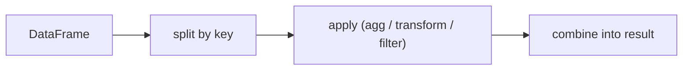

# 그룹화와 집계

분석이 표를 읽는 단계에서 끝나는 경우는 거의 없습니다. 결국은 도시별 매출, 사용자군별 전환율, 월별 지표처럼 어떤 기준으로 묶고 요약해야 의미가 생깁니다. 그래서 `groupby`는 Pandas의 옵션 하나가 아니라 분석 자체를 움직이는 핵심 축에 가깝습니다.

이 글은 Pandas 101 시리즈의 6번째 글입니다.

이번 글에서는 `groupby`를 SQL 문법의 대응물로만 보지 않고, 분할하고 적용한 뒤 다시 결합하는 분석 패턴으로 이해해 보겠습니다.

## 이 글에서 다룰 문제

- `groupby`는 어떤 흐름으로 동작할까요?
- 집계, 변환, 필터는 왜 서로 다른 얼굴일까요?
- 여러 통계를 한 번에 계산할 때는 어떻게 쓰는 편이 좋을까요?
- 원본 모양을 유지하면서 그룹 기준 값을 붙이는 방법은 무엇일까요?
- `apply`보다 `agg`나 `transform`을 먼저 떠올려야 하는 이유는 무엇일까요?

> `groupby`를 단순 집계 함수로만 보면 결과만 보게 됩니다. 반대로 데이터를 기준값으로 나누고, 각 묶음에 계산을 적용한 뒤, 결과를 다시 표 형태로 모은다고 보면 `agg`, `transform`, `filter`의 차이도 자연스럽게 드러납니다.

## 왜 중요한가

집계는 분석의 중심입니다. `groupby`를 제대로 쓰면 반복문 수십 줄이 한 줄로 줄어들 뿐 아니라, 계산 의도도 함께 선명해집니다. 비즈니스 지표, 코호트 분석, 특징 생성이 모두 여기서 이어집니다.

## 한눈에 보는 개념



## 핵심 용어

- 그룹화: 특정 키를 기준으로 데이터를 여러 묶음으로 나누는 일입니다.
- 집계: 그룹마다 하나의 값을 남기는 계산입니다.
- 변환: 그룹 계산 결과를 원본 길이에 맞춰 되돌리는 방식입니다.
- 필터: 그룹 단위 조건으로 행을 남기거나 버리는 방식입니다.
- **인덱스화 여부**: 그룹 키를 결과 인덱스로 둘지 결정하는 설정입니다.

## 전과 후

이전 관점: 카테고리별 합계를 반복문으로 직접 계산합니다.

이후 관점: 기준 열로 나눈 뒤 요약 규칙을 한 번에 선언합니다.

## 실습: 다섯 단계로 그룹화하기

### 1단계 - 데이터 준비하기

```python
import pandas as pd
df = pd.DataFrame({
    "city": ["Seoul", "Seoul", "Busan", "Busan"],
    "month": ["Jan", "Feb", "Jan", "Feb"],
    "sales": [100, 120, 80, 95],
})
```

작은 예제지만 `groupby`의 기본 감각을 잡기에는 충분합니다. 어떤 열을 기준으로 묶을지 먼저 정하는 것이 출발점입니다.

### 2단계 - 합계 구하기

```python
print(df.groupby("city")["sales"].sum())
```

가장 기본적인 그룹화입니다. 도시별로 묶은 뒤 매출 열의 합계를 계산합니다. 이 한 줄이 `groupby`의 가장 단순한 얼굴입니다.

### 3단계 - 여러 통계 한 번에 계산하기

```python
print(df.groupby("city").agg(
    total=("sales", "sum"),
    mean=("sales", "mean"),
    n=("sales", "count"),
))
```

이름 붙은 집계를 쓰면 출력 열 이름을 제어할 수 있어 결과 표가 훨씬 읽기 쉬워집니다. 실무에서는 이 패턴을 가장 많이 씁니다.

### 4단계 - 원본 모양을 유지한 채 계산 붙이기

```python
df["share"] = df["sales"] / df.groupby("city")["sales"].transform("sum")
print(df)
```

`transform`은 그룹별 계산 결과를 원본 행 수에 맞춰 되돌려 줍니다. 그래서 비율, 평균 대비 편차, 표준화 같은 특징 생성에 잘 맞습니다.

### 5단계 - 그룹 조건으로 걸러내기

```python
big = df.groupby("city").filter(lambda g: g["sales"].sum() > 200)
print(big)
```

`filter`는 그룹 전체가 조건을 만족할 때 그 그룹의 행을 남깁니다. 개별 행 조건이 아니라 그룹 수준 조건이라는 점이 핵심입니다.

## 이 코드에서 먼저 봐야 할 점

- `agg`는 그룹당 한 행을 만들고 `transform`은 원본 모양을 유지합니다.
- 이름 붙은 집계는 결과 열 이름을 읽기 좋게 만듭니다.
- `filter`는 참과 거짓을 반환하는 함수가 아니라 행을 남기는 도구입니다.

## 자주 하는 실수 다섯 가지

1. `agg`와 `transform`의 결과 모양 차이를 혼동합니다.
2. `as_index=False`를 의식하지 않아 예상 밖 인덱스를 만납니다.
3. `reset_index()`를 빼먹어 다음 조인이 불편해집니다.
4. 여러 키 그룹화에서 대괄호 문법을 놓칩니다.
5. `apply`를 남용해 속도와 가독성을 함께 잃습니다.

## 실무에서는 이렇게 이어집니다

세그먼트 분석, 유지율 계산, 월별 지표 집계처럼 `groupby`는 사실상 비즈니스 인텔리전스의 기본 엔진입니다. 특히 `transform`은 그룹 평균 대비 점수나 그룹 내 비중 같은 특징을 만들 때 자주 쓰입니다.

## 실무에서는 이렇게 생각합니다

- 먼저 `agg`를 생각하고 `apply`는 마지막에 검토합니다.
- 출력 열 이름은 이름 붙은 집계로 명확하게 만듭니다.
- 특징 생성에는 `transform`을 적극적으로 씁니다.
- 여러 키 그룹화는 복합 키 인덱스처럼 다룹니다.
- 그룹 키를 인덱스로 둘지 열로 둘지 의도적으로 결정합니다.

## 체크리스트

- [ ] 분할, 적용, 결합 모델을 설명할 수 있습니다.
- [ ] 집계, 변환, 필터의 차이를 이해하고 있습니다.
- [ ] 이름 붙은 집계를 사용할 수 있습니다.
- [ ] 여러 키 기준 그룹화를 할 수 있습니다.

## 연습 문제

1. 카테고리별 평균과 표준편차를 이름 붙은 집계로 출력해 보세요.
2. 그룹 평균을 원본 데이터프레임에 다시 붙여 보세요.
3. 합계가 특정 기준을 넘는 그룹만 `filter`로 남겨 보세요.

## 정리와 다음 글

`groupby`는 분석 결과를 만드는 핵심 동력입니다. 데이터를 묶고, 계산하고, 다시 표로 되돌리는 감각을 익혀 두면 이후의 지표 계산이 훨씬 빨라집니다. 다음 글에서는 여러 표를 하나로 합치는 병합과 조인을 다루겠습니다.

<!-- toc:begin -->
- [Pandas란 무엇인가?](./01-what-is-pandas.md)
- [시리즈와 데이터프레임](./02-series-and-dataframe.md)
- [CSV와 Excel 읽기](./03-read-csv-and-excel.md)
- [필터링과 선택](./04-filtering-and-selection.md)
- [결측치 처리](./05-missing-values.md)
- **그룹화와 집계 (현재 글)**
- 병합과 조인 (예정)
- 시계열 데이터 다루기 (예정)
- 적용 함수와 벡터화 (예정)
- 실전 데이터 분석 (예정)
<!-- toc:end -->

## 참고 자료

- [pandas — Group by: split-apply-combine](https://pandas.pydata.org/docs/user_guide/groupby.html)
- [pandas — agg](https://pandas.pydata.org/docs/reference/api/pandas.core.groupby.DataFrameGroupBy.agg.html)
- [pandas — transform](https://pandas.pydata.org/docs/reference/api/pandas.core.groupby.DataFrameGroupBy.transform.html)
- [Wes McKinney — Python for Data Analysis](https://wesmckinney.com/book/)

Tags: Pandas, GroupBy, Aggregation, DataAnalysis, Beginner
