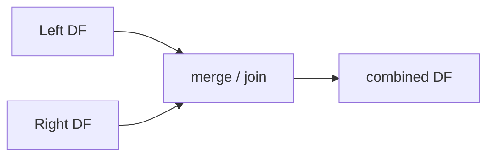

# merge와 join

> Pandas 101 시리즈 (7/10)


## 이 글에서 다룰 문제

데이터는 *여러 테이블에 흩어져* 있습니다. *조인 능력* 이 곧 *분석 능력* 입니다.

## 전체 흐름


## Before/After

**Before**: *“merge 한 번 했더니 행이 폭증”* — *중복 키* 로 *카티시안 폭발*.

**After**: *“validate='one_to_one' 또는 'one_to_many'”* — *의도와 다르면 즉시 에러*.

## 5단계 조인

### 1단계 — 데이터 준비

```python
import pandas as pd
users = pd.DataFrame({"uid": [1, 2, 3], "name": ["a", "b", "c"]})
orders = pd.DataFrame({"uid": [1, 1, 2], "amount": [100, 200, 50]})
```

### 2단계 — inner

```python
print(users.merge(orders, on="uid"))
```

### 3단계 — left와 outer

```python
print(users.merge(orders, on="uid", how="left"))
print(users.merge(orders, on="uid", how="outer", indicator=True))
```

### 4단계 — suffixes

```python
df1 = pd.DataFrame({"k": [1], "v": [10]})
df2 = pd.DataFrame({"k": [1], "v": [20]})
print(df1.merge(df2, on="k", suffixes=("_a", "_b")))
```

### 5단계 — validate

```python
try:
    users.merge(orders, on="uid", validate="one_to_one")
except Exception as e:
    print("expected:", type(e).__name__)
```

## 이 코드에서 주목할 점

- *indicator=True* 는 *행 출처* 를 알려줍니다.
- *suffixes* 로 *동명 컬럼 충돌* 을 해결합니다.
- `validate`로 조인 가정을 코드에 명시합니다.

## 자주 하는 실수 5가지

1. ***중복 키* 로 *행 폭증*.**
2. ***how 미지정* 의 *기본 inner* 를 모름.**
3. ***suffixes 미설정* 으로 *컬럼 덮어쓰기*.**
4. ***left 와 right 의 키 dtype 불일치*.**
5. ***reset_index* 누락으로 *index 충돌*.**

## 실무에서는 이렇게 쓰입니다

CRM × 주문, 광고 × 전환, 사용자 × 이벤트처럼 데이터 분석의 상당수는 조인입니다. `validate`는 데이터 계약을 코드로 표현하는 방법입니다.

## 체크리스트

- [ ] *5가지 how* 를 안다.
- [ ] *validate* 를 쓴다.
- [ ] *indicator* 로 출처를 본다.
- [ ] *suffixes* 를 쓴다.

## 정리 및 다음 단계

조인은 *데이터 분석의 절반* 입니다. 다음 글에서는 *time series* 를 다룹니다.

<!-- toc:begin -->
- [Pandas란 무엇인가?](./01-what-is-pandas.md)
- [Series와 DataFrame](./02-series-and-dataframe.md)
- [CSV와 Excel 읽기](./03-read-csv-and-excel.md)
- [filtering과 selection](./04-filtering-and-selection.md)
- [missing value 처리](./05-missing-values.md)
- [groupby](./06-groupby.md)
- **merge와 join (현재 글)**
- time series (예정)
- apply와 vectorization (예정)
- 실전 데이터 분석 (예정)
<!-- toc:end -->

## 참고 자료

- [pandas — Merge, join, concatenate and compare](https://pandas.pydata.org/docs/user_guide/merging.html)
- [pandas — merge](https://pandas.pydata.org/docs/reference/api/pandas.DataFrame.merge.html)
- [pandas — join](https://pandas.pydata.org/docs/reference/api/pandas.DataFrame.join.html)
- [SQL Joins Explained — Mode Analytics](https://mode.com/sql-tutorial/sql-joins/)

Tags: Pandas, Merge, Join, SQL, Beginner
