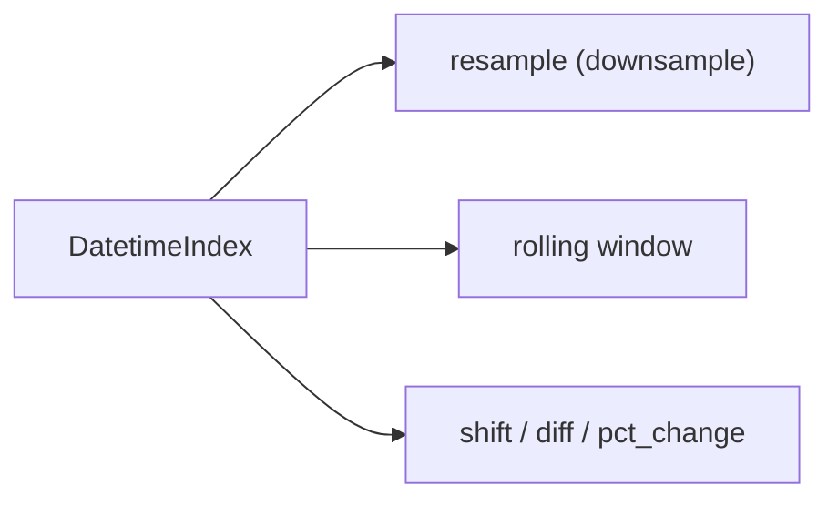

# 시계열 데이터 다루기

매출, 트래픽, 센서, 금융 데이터처럼 시간 순서가 중요한 데이터는 일반 표와 같은 방식으로만 보면 자주 막힙니다. 날짜가 문자열로 남아 있으면 비교가 어색하고, 주간 합계나 이동 평균을 구하려 해도 코드가 금방 지저분해집니다. 시계열은 시간 축을 인덱스로 삼는 순간부터 다루는 감각이 바뀝니다.

이 글은 Pandas 101 시리즈의 8번째 글입니다.

이번 글에서는 시계열을 별도 라이브러리의 영역으로 보지 않고, Pandas 안에서 날짜 인덱스와 시간 단위 계산으로 푸는 기본 패턴으로 정리해 보겠습니다.

## 이 글에서 다룰 문제

- 날짜 열을 인덱스로 두면 무엇이 달라질까요?
- 리샘플링은 단순 집계와 어떤 차이가 있을까요?
- 이동 평균 같은 창 기반 계산은 어떻게 할까요?
- 시차 이동은 어떤 분석에 유용할까요?
- 시간대 정보는 왜 초반부터 명시적으로 다뤄야 할까요?

> 시계열의 핵심은 값이 아니라 시간 축입니다. 시간을 단순 문자열 열로 두면 비교와 집계가 모두 불편해지지만, 날짜 인덱스로 올려 두면 선택, 집계, 창 계산이 한 문법 안에서 자연스럽게 이어집니다.

## 왜 중요한가

운영 지표의 대부분은 시간에 따라 변합니다. 시간 축을 제대로 다루면 주간 합계, 월간 평균, 이동 평균, 전일 대비 변화처럼 실무에서 자주 쓰는 질문을 짧고 안정적인 코드로 풀 수 있습니다.

## 한눈에 보는 개념



## 핵심 용어

- **날짜 인덱스**: 시간을 레이블로 가지는 인덱스입니다.
- **리샘플링**: 시간 단위를 바꿔 다시 묶는 작업입니다.
- **이동 창 계산**: 일정 구간을 밀어 가며 통계를 구하는 방식입니다.
- **시차 이동**: 값을 시간 축에서 앞으로 또는 뒤로 미는 연산입니다.
- **시간대 부여와 변환**: 시간대 정보를 붙이고 다른 시간대로 바꾸는 작업입니다.

## 전과 후

이전 관점: 날짜를 문자열로 둔 채 필터링과 비교를 억지로 합니다.

이후 관점: 날짜 인덱스로 바꾼 뒤 시간 슬라이싱과 단위 변환을 자연스럽게 수행합니다.

## 실습: 다섯 단계로 시계열 다루기

### 1단계 - 날짜 인덱스 만들기

```python
import pandas as pd
idx = pd.date_range("2026-01-01", periods=10, freq="D")
ts = pd.Series(range(10), index=idx)
print(ts.head())
```

시계열 작업의 시작은 시간을 문자열이 아니라 날짜형 인덱스로 올려 두는 일입니다. 이 순간부터 Pandas의 시계열 문법을 사용할 수 있습니다.

### 2단계 - 시간 구간으로 자르기

```python
print(ts.loc["2026-01-03":"2026-01-06"])
```

날짜 인덱스가 있으면 문자열 슬라이싱만으로도 기간 선택이 자연스럽게 됩니다. 특정 월, 특정 주, 특정 날짜 범위를 빠르게 고를 수 있습니다.

### 3단계 - 시간 단위 바꾸기

```python
print(ts.resample("3D").sum())
```

`resample()`은 시간 축을 새 단위로 묶어 다시 계산하는 도구입니다. 일별 데이터를 3일 단위나 주간 단위로 바꾸는 식의 작업이 여기에 해당합니다.

### 4단계 - 이동 평균 계산하기

```python
print(ts.rolling(window=3).mean())
```

이동 창 계산은 추세를 부드럽게 보고 싶을 때 유용합니다. 특히 지표가 출렁이는 운영 데이터에서는 이동 평균이 패턴을 읽는 데 큰 도움이 됩니다.

### 5단계 - 시간대 바꾸기

```python
ts2 = ts.tz_localize("UTC").tz_convert("Asia/Seoul")
print(ts2.head())
```

시간대는 먼저 붙이고 그다음 변환해야 합니다. 시간대가 없는 시간과 있는 시간을 섞으면 비교와 병합에서 오류가 쉽게 생깁니다.

## 이 코드에서 먼저 봐야 할 점

- 문자열 슬라이싱은 날짜 인덱스에서 특히 강력합니다.
- `resample()`은 항상 집계 함수와 함께 써야 의미가 생깁니다.
- 시간대는 먼저 부여하고 그다음 변환합니다.

## 자주 하는 실수 다섯 가지

1. `to_datetime` 없이 문자열 날짜를 그대로 사용합니다.
2. `resample()`만 호출하고 집계 함수를 빼먹습니다.
3. 이동 창 계산에서 `min_periods` 같은 경계 조건을 놓칩니다.
4. 시간대 정보가 없는 시간과 있는 시간을 섞습니다.
5. `shift()` 뒤에 생기는 `NaN` 처리를 잊습니다.

## 실무에서는 이렇게 이어집니다

매출 추세, 사용자 활동 패턴, 센서 모니터링처럼 시간 흐름이 핵심인 데이터에서는 시간 단위 변환과 이동 통계가 기본 도구가 됩니다. 특히 글로벌 서비스에서는 시간대를 통일하는 작업이 분석 정확도를 좌우합니다.

## 실무에서는 이렇게 생각합니다

- 분석 전 시간 기준을 UTC로 통일할지 먼저 정합니다.
- 리샘플링 주기는 분석 목적에 맞춰 선택합니다.
- 이동 계산의 경계 `NaN`을 명시적으로 처리합니다.
- 빈 구간은 보간이 맞는지 검토합니다.
- `shift()`를 특징 생성 도구로도 활용합니다.

## 체크리스트

- [ ] 날짜 인덱스를 만들 수 있습니다.
- [ ] `resample()`과 집계 함수를 함께 쓸 수 있습니다.
- [ ] `rolling()`으로 이동 평균을 계산할 수 있습니다.
- [ ] 시간대를 부여하고 변환할 수 있습니다.

## 연습 문제

1. 일별 시리즈를 주간 합계로 리샘플링해 보세요.
2. 7일 이동 평균을 만들고 경계 `NaN`을 살펴보세요.
3. UTC 시간을 서울 시간으로 바꾼 결과를 출력해 보세요.

## 정리와 다음 글

시계열 분석의 출발점은 시간을 날짜 인덱스로 올려 두는 일입니다. 이 감각만 잡혀도 기간 선택, 단위 변환, 이동 계산이 모두 같은 언어 안에서 풀립니다. 다음 글에서는 속도와 표현력에 큰 차이를 만드는 벡터화와 `apply`를 살펴보겠습니다.

<!-- toc:begin -->
- [Pandas란 무엇인가?](./01-what-is-pandas.md)
- [시리즈와 데이터프레임](./02-series-and-dataframe.md)
- [CSV와 Excel 읽기](./03-read-csv-and-excel.md)
- [필터링과 선택](./04-filtering-and-selection.md)
- [결측치 처리](./05-missing-values.md)
- [그룹화와 집계](./06-groupby.md)
- [병합과 조인](./07-merge-and-join.md)
- **시계열 데이터 다루기 (현재 글)**
- 적용 함수와 벡터화 (예정)
- 실전 데이터 분석 (예정)
<!-- toc:end -->

## 참고 자료

- [pandas — Time series / date functionality](https://pandas.pydata.org/docs/user_guide/timeseries.html)
- [pandas — resample](https://pandas.pydata.org/docs/reference/api/pandas.DataFrame.resample.html)
- [pandas — rolling](https://pandas.pydata.org/docs/reference/api/pandas.DataFrame.rolling.html)
- [Forecasting — Hyndman & Athanasopoulos](https://otexts.com/fpp3/)

Tags: Pandas, TimeSeries, Resample, Datetime, Beginner
