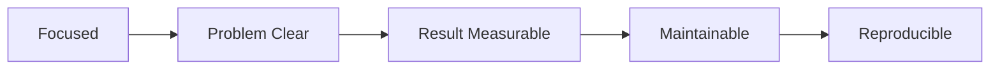

# Traits of a Good Project

> Portfolio Project 101 series (2/10)

<!-- a-grade-intro:begin -->

**Core question**: Is a *bigger project* *always* a *better project*?

> *Completion* and *clear problem framing* matter *much more* than *size*.

<!-- a-grade-intro:end -->

## What You Will Learn

- *Small but complete* projects
- A *clear problem*
- *Measurable* results
- *Maintainability*
- *Reproducibility*

## Why It Matters

Knowing the *traits* shows where to *focus*.

## Concept at a Glance



## Key Terms

- **focused**: *small scope*.
- **clear problem**: *unambiguous*.
- **measurable**: *numeric* result.
- **maintainable**: *editable*.
- **reproducible**: *replayable*.

## Before/After

**Before**: A *10-feature* *unfinished* app.

**After**: A *3-feature* *complete* app.

## Hands-on: Trait Table

### Step 1 — Scope score

```python
focus = 5
```

### Step 2 — Problem clarity

```python
problem_score = 4
```

### Step 3 — Result metrics

```python
result = {"latency_ms": 120, "users": 30}
```

### Step 4 — Maintainability

```python
maintainable = {"tests": True, "docs": True}
```

### Step 5 — Reproducibility

```python
reproducible = {"docker": True, "seed": True}
```

## What to Notice in This Code

- *Small scope* leads to *completion*.
- *Results* are *numeric*.
- *Reproducibility* uses *containers*.

## Five Common Mistakes

1. **Stacking *features* only.**
2. **An *abstract* problem.**
3. **No *results*.**
4. **No *tests*.**
5. **No *Docker*.**

## How This Shows Up in Production

OSS projects also start from *small scope + clear results*.

## How a Senior Engineer Thinks

- *Completion* beats *size*.
- A *clear problem* gives *code* purpose.
- *Results* are *numeric*.
- *Maintainability* is *standard*.
- *Reproducibility* uses *Docker*.

## Checklist

- [ ] *Three* features or fewer.
- [ ] *One-line* problem.
- [ ] *Numeric* result.
- [ ] *Docker + tests*.

## Practice Problems

1. Define *small scope* in one line.
2. State *measurable result* in one line.
3. State the meaning of *reproducibility* in one line.

## Wrap-up and Next Steps

Next post: *Writing the README*.

<!-- toc:begin -->
- [What is a Portfolio Project](./01-what-is-a-portfolio-project.md)
- **Traits of a Good Project (current)**
- Writing the README (upcoming)
- Building the Demo (upcoming)
- Deploying the Project (upcoming)
- Tests and Documentation (upcoming)
- Recording Tech Decisions (upcoming)
- Summarizing as Blog Posts (upcoming)
- Explaining in Interviews (upcoming)
- Portfolio Improvement Checklist (upcoming)
<!-- toc:end -->

## References

- [Worse Is Better - Richard Gabriel](https://www.dreamsongs.com/RiseOfWorseIsBetter.html)
- [Less is More - John Maeda](https://www.amazon.com/Laws-Simplicity-Design-Technology-Business/dp/0262134721)
- [The Pragmatic Programmer](https://pragprog.com/titles/tpp20/the-pragmatic-programmer-20th-anniversary-edition/)
- [12 Factor App](https://12factor.net/)

Tags: Portfolio, Quality, Scope, Project, Beginner
