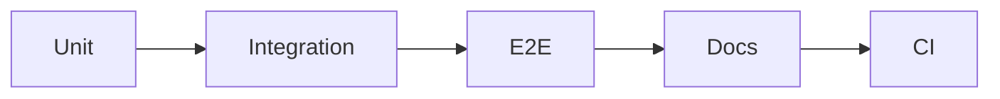

# Tests and Documentation

This is post 6 in the Portfolio Project 101 series.

> Portfolio Project 101 series (6/10)

<!-- a-grade-intro:begin -->

**Core question**: *Why* is there *no trust* without *tests*?

> Code without *proof* is only a *claim*.

<!-- a-grade-intro:end -->

## What You Will Learn

- Three *minimum tests*
- *CI* automation
- *Code coverage*
- *API docs*
- A *user guide*

## Why It Matters

*Tests + docs* are *proof* of *professionalism*.

## Concept at a Glance



## Key Terms

- **unit test**: a *unit* check.
- **integration**: a *boundary* check.
- **E2E**: a *full flow*.
- **CI**: *automatic verification*.
- **docs**: *documentation*.

## Before/After

**Before**: *Manual* checks only.

**After**: Automatic checks on *push*.

## Hands-on: Test Table

### Step 1 — Unit test

```python
def test_add():
    assert 1 + 1 == 2
```

### Step 2 — Integration

```python
def test_api(client):
    assert client.get("/health").status_code == 200
```

### Step 3 — E2E

```python
e2e_steps = ["login", "create", "delete"]
```

### Step 4 — CI config

```yaml
on: [push]
jobs:
  test:
    runs-on: ubuntu-latest
```

### Step 5 — Docs

```python
docs = ["README", "API.md", "CHANGELOG.md"]
```

## What to Notice in This Code

- *Unit* tests are *fast*.
- *Integration* tests cover *boundaries*.
- *E2E* tests cover *flows*.

## Five Common Mistakes

1. **Only *unit* tests.**
2. **No *E2E*.**
3. **No *CI*.**
4. **No *API docs*.**
5. **No *CHANGELOG*.**

## How This Shows Up in Production

OSS projects also run *CI* on every push.

## How a Senior Engineer Thinks

- *Tests* form a *pyramid*.
- *CI* is *standard*.
- *API docs* are *auto-generated*.
- *CHANGELOG* is *kept*.
- *Coverage* is a *metric*.

## Checklist

- [ ] *Unit* tests.
- [ ] One *E2E*.
- [ ] *CI* workflow.
- [ ] *API docs*.

## Practice Problems

1. Define *unit test* in one line.
2. State what *E2E* means in one line.
3. State the role of *CI* in one line.

## Wrap-up and Next Steps

Next post: *Recording Tech Decisions*.

<!-- toc:begin -->
- [What is a Portfolio Project](./01-what-is-a-portfolio-project.md)
- [Traits of a Good Project](./02-traits-of-a-good-project.md)
- [Writing the README](./03-writing-the-readme.md)
- [Building the Demo](./04-building-the-demo.md)
- [Deploying the Project](./05-deploying-the-project.md)
- **Tests and Documentation (current)**
- Recording Tech Decisions (upcoming)
- Summarizing as Blog Posts (upcoming)
- Explaining in Interviews (upcoming)
- Portfolio Improvement Checklist (upcoming)
<!-- toc:end -->

## References

- [Test Pyramid - Martin Fowler](https://martinfowler.com/articles/practical-test-pyramid.html)
- [pytest Docs](https://docs.pytest.org/)
- [GitHub Actions Docs](https://docs.github.com/actions)
- [Keep a Changelog](https://keepachangelog.com/)

Tags: Portfolio, Testing, Documentation, Quality, Beginner
