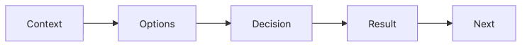

# Recording Tech Decisions

When reviewers inspect a portfolio project, they care about more than the final code. They also want to know why a specific stack was chosen, what alternatives were considered, and what trade-offs were accepted. Code shows the outcome, but it rarely shows the judgment on its own.

This is post 7 in the Portfolio Project 101 series. Here we will use a lightweight ADR-style format to record technical choices and make design judgment visible in a way that is easy to keep up.

---

> A good decision note does not declare a perfect answer. It records what options existed, why one was chosen, and what consequences came with it.

## Questions this chapter answers

- Why do technical choices usually stay invisible if you only show code?
- How do alternatives and consequences make a project more persuasive?
- How lightweight can an ADR be and still be useful?
- What kinds of written traces make judgment visible in a portfolio?

## Why It Matters

Hiring loops often care as much about decision quality as implementation quality. Two projects may ship the same capability, but the one that explains why a framework was chosen and what was sacrificed for speed or simplicity usually reads much deeper.

Decision records help because they make constraint-aware thinking visible. They also help you later, when you need to remember why something was done a certain way.

## Mental Model

A useful decision record usually flows from context to options, then to the decision, the consequence, and the likely next step.



*The ADR flow from context and options to consequence and next step*

This order matters because choices only make sense inside a real situation. “We picked FastAPI” is weak on its own. “We picked FastAPI because we had a solo developer, a short deadline, and a need for fast API docs” is much more informative.

## Key Terms

- **ADR**: Architecture Decision Record, usually a short document for one decision.
- **Context**: the project constraints or conditions behind the choice.
- **Options**: the realistic alternatives you considered.
- **Decision**: the chosen direction.
- **Consequence**: what the decision improved and what it cost.

## Before and After

**Before**: “We just built it that way,” with no explanation of why the choice happened.

**After**: the project keeps a short note that captures the situation, options, decision, and result.

The second project makes judgment much easier to see.

## Step by Step

### Step 1 — Write the context first

A choice only becomes meaningful when its constraints are visible.

```python
context = "solo dev, 2-week deadline, Python familiar"
```

This prevents hindsight from flattening every decision into a generic “best practice.”

### Step 2 — List the real options

Comparison gives the final choice weight.

```python
options = ["FastAPI", "Flask", "Django"]
```

You do not need a giant matrix. Two or three realistic options are enough.

### Step 3 — State the decision clearly

The final choice should be plain and unambiguous.

```python
decision = "FastAPI"
```

The power comes from placing that line after the context and the options.

### Step 4 — Record the reasoning as criteria

The explanation is stronger when it uses criteria rather than taste.

```python
why = ["async", "type_hints", "swagger_auto"]
```

Those criteria are easy to connect back to the problem and the constraints.

### Step 5 — Record the consequence honestly

Good notes include both gains and costs.

```python
result = {"build_time": "fast", "trade": "smaller_ecosystem"}
```

That honesty is what makes the note feel like judgment instead of self-promotion.

## What to Notice in the Code

- Context belongs at the top because choices only make sense inside constraints.
- Options matter because they prove the decision was not arbitrary.
- Consequences matter because trade-offs are where engineering judgment becomes visible.

## Common Mistakes

1. Writing only the final decision without alternatives.
2. Using trend or preference as the whole justification.
3. Recording no consequence, so the note cannot be evaluated later.
4. Keeping ADRs outside the repository where reviewers never see them.
5. Forgetting numbering or dates, which makes the history hard to follow.

Decision records do not need to be long. They need to be clear and complete.

## How This Reads in Practice

Many teams keep notes like `docs/adr/0001-...md` for exactly this reason. As time passes, people forget why a decision happened. New contributors only see the final state. ADRs close that gap.

The same habit helps portfolio work. A small project starts to read like a thoughtful engineering artifact when reviewers can see not only what was built, but why.

## Checklist

- [ ] I chose a folder for ADR notes.
- [ ] I recorded at least a few meaningful technical choices.
- [ ] Each note includes context, options, decision, and consequence.
- [ ] The notes are ordered by number or date.

## Practice Problems

1. Choose one project decision that deserves an ADR today.
2. List two alternatives you genuinely considered.
3. Write one benefit and one cost of the chosen option.

## Wrap-up and Next Steps

Technical decision records reveal the judgment behind the result. When you write down the context, compare the alternatives, explain the decision criteria, and record the consequence honestly, even a small project becomes much easier to evaluate as real engineering work.

Next, we will expand the project beyond the repository and look at how to turn it into a technical post that others can discover through search.

<!-- toc:begin -->
## In this series

- [What is a Portfolio Project](./01-what-is-a-portfolio-project.md)
- [Traits of a Good Project](./02-traits-of-a-good-project.md)
- [Writing the README](./03-writing-the-readme.md)
- [Building the Demo](./04-building-the-demo.md)
- [Deploying the Project](./05-deploying-the-project.md)
- [Tests and Documentation](./06-tests-and-documentation.md)
- **Recording Tech Decisions (current)**
- Summarizing as Blog Posts (upcoming)
- Explaining in Interviews (upcoming)
- Portfolio Improvement Checklist (upcoming)
<!-- toc:end -->

## References

- [Documenting Architecture Decisions](https://cognitect.com/blog/2011/11/15/documenting-architecture-decisions)
- [Architecture Decision Records](https://adr.github.io/)
- [Thoughtworks Technology Radar — Lightweight ADRs](https://www.thoughtworks.com/en-us/radar/techniques/lightweight-architecture-decision-records)
- [ADR Tools](https://github.com/npryce/adr-tools)

Tags: Portfolio, ADR, Decision, Architecture, Beginner
