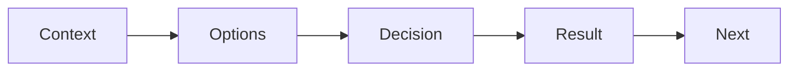

# Recording Tech Decisions

> Portfolio Project 101 series (7/10)

<!-- a-grade-intro:begin -->

**Core question**: *Why* does *the reason* for picking a tech matter more than the *code* itself?

> Reviewers grade *judgment*, not just *output*.

<!-- a-grade-intro:end -->

## What You Will Learn

- The *ADR* idea
- *Context decision result*
- Comparing *options*
- *Reversibility*
- *Document location*

## Why It Matters

*Decision records* are *evidence* of *judgment*.

## Concept at a Glance



## Key Terms

- **ADR**: *Architecture Decision Record*.
- **context**: the *situation*.
- **options**: the *alternatives*.
- **decision**: the *choice*.
- **consequence**: the *outcome*.

## Before/After

**Before**: *We just did it that way*.

**After**: The *reason* is written down.

## Hands-on: ADR Table

### Step 1 — Context

```python
context = "solo dev, 2-week deadline, Python familiar"
```

### Step 2 — Options

```python
options = ["FastAPI", "Flask", "Django"]
```

### Step 3 — Decision

```python
decision = "FastAPI"
```

### Step 4 — Reasoning

```python
why = ["async", "type_hints", "swagger_auto"]
```

### Step 5 — Result

```python
result = {"build_time": "fast", "trade": "smaller_ecosystem"}
```

## What to Notice in This Code

- *Context* sits *on top*.
- *Options* are *at least two*.
- *Results* are *honest*.

## Five Common Mistakes

1. **No *options*.**
2. **Reasoning is just *trend*.**
3. **No *result* recorded.**
4. **No *ADR* next to the *code*.**
5. **No *version* control.**

## How This Shows Up in Production

Companies keep ADRs as `docs/adr/0001-...md` files.

## How a Senior Engineer Thinks

- *Decisions* are *recorded*.
- *Options* are *documented*.
- *Results* are *honest*.
- *Numbers* are *ordered*.
- *Location* is *in repo*.

## Checklist

- [ ] *ADR* folder.
- [ ] At least *three* ADRs.
- [ ] *Options + decision + result*.
- [ ] *Numbered*.

## Practice Problems

1. State the meaning of *ADR* in one line.
2. Define *context* in one line.
3. State the value of recording *results* in one line.

## Wrap-up and Next Steps

Next post: *Summarizing as Blog Posts*.

<!-- toc:begin -->
- [What is a Portfolio Project](./01-what-is-a-portfolio-project.md)
- [Traits of a Good Project](./02-traits-of-a-good-project.md)
- [Writing the README](./03-writing-the-readme.md)
- [Building the Demo](./04-building-the-demo.md)
- [Deploying the Project](./05-deploying-the-project.md)
- [Tests and Documentation](./06-tests-and-documentation.md)
- **Recording Tech Decisions (current)**
- Summarizing as Blog Posts (upcoming)
- Explaining in Interviews (upcoming)
- Portfolio Improvement Checklist (upcoming)
<!-- toc:end -->

## References

- [Architecture Decision Records](https://adr.github.io/)
- [ADR Tools - Nat Pryce](https://github.com/npryce/adr-tools)
- [Documenting Architecture Decisions - Michael Nygard](https://cognitect.com/blog/2011/11/15/documenting-architecture-decisions)
- [ThoughtWorks Tech Radar](https://www.thoughtworks.com/radar/techniques/lightweight-architecture-decision-records)

Tags: Portfolio, ADR, Decision, Architecture, Beginner
