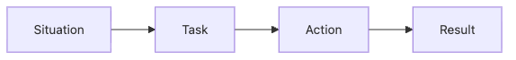

# Explaining in Interviews

Interview answers do not get stronger just because they get longer. In most cases, a tighter explanation of the problem, the decision, and the result is much more persuasive than a broad tour of every library in the stack. Interviewers usually want to hear judgment, not a dependency list.

This is post 9 in the Portfolio Project 101 series. Here we will shape a portfolio project into a short interview answer that makes the problem, the action, and the result easy to follow under time pressure.

---

> A strong interview answer is not a product pitch. It is a compressed record of problem, task, action, result, and learning.

## Questions this chapter answers

- What do interviewers usually want to hear before they care about implementation detail?
- Why is the STAR structure especially useful for short project answers?
- How do numbers and trade-offs change the credibility of the answer?
- How do you make your personal contribution clear in solo and team contexts?

## Why It Matters

Interviews are short, and people remember stories more than stacks. Many candidates have touched similar tools. Fewer can explain a project as a chain of problem, decision, and result.

The first minute or two matters a lot because it shapes the quality of the follow-up questions. If the initial answer is vague, the rest of the conversation tends to stay vague too.

## Mental Model

A project answer becomes much easier to control when it follows situation, task, action, and result.



*The STAR answer shape from situation to measurable result*

This structure prevents a common failure mode: jumping straight into implementation without first explaining why the project existed or what success looked like.

## Key Terms

- **Answer structure**: the order that keeps the explanation easy to follow.
- **Short summary answer**: a project explanation that fits into about two minutes.
- **Trade-off**: what you gained and what you knowingly accepted as a cost.
- **Metric**: a number that supports the result.
- **Follow-up question**: the deeper question that comes after your first explanation lands.

## Before and After

**Before**: “I built an API with Flask.”

**After**: “I built a scheduling tool to unify scattered team schedules, used Flask plus PostgreSQL to keep the first version simple, and kept average response time around 120 ms for a 30-user pilot.”

Both may be true, but the second answer gives the interviewer a problem, a design choice, and a result in a single pass.

## Step by Step

### Step 1 — Situation

Open with the real context that made the project worth building.

```python
situation = "The team schedule kept getting lost across tools"
```

The situation should be concrete enough that the interviewer can picture the pain quickly.

### Step 2 — Task

State what the project needed to accomplish.

```python
task = "Show every schedule on a single screen"
```

That line clarifies scope and makes later trade-offs easier to explain.

### Step 3 — Action

Describe what you actually did and why that path made sense.

```python
action = ["Flask API", "PostgreSQL", "Deploy to Render"]
```

The tools matter less than the reason they were chosen. One sentence about why you picked the path often does more work than three sentences of implementation detail.

### Step 4 — Result

Give the interviewer at least one number.

```python
result = {"users": 30, "latency_ms": 120}
```

Metrics create evidence. They do not need to be huge. They need to be real.

### Step 5 — Lesson

Close with what the project taught you.

```python
lesson = "Small MVPs survive"
```

That line is often what turns a build log into an engineering answer.

## What to Notice in the Code

- STAR is not a memorization trick. It is a way to stabilize the explanation order.
- Metrics do the work of proof.
- The lesson gives the answer a strong closing line and a natural bridge to follow-up discussion.

## Common Mistakes

1. Listing technologies without explaining the problem or result.
2. Giving no numbers, so the scale and impact stay abstract.
3. Avoiding trade-offs, which makes the answer sound shallow.
4. Blurring personal contribution in a group project.
5. Ending without a lesson or reflection.

Those mistakes often leave the interviewer wondering whether the candidate really understood the project end to end.

## How This Reads in Practice

Teams use the same basic structure when they write retrospectives or summarize incidents: what happened, what needed to be done, what action was taken, and what happened next. Interview answers work well for the same reason.

The goal is not to sound rehearsed. The goal is to sound clear.

## Checklist

- [ ] I can finish the answer in about two minutes.
- [ ] The answer includes at least one metric.
- [ ] I can name at least one trade-off.
- [ ] I can end with one lesson I would reuse.

## Practice Problems

1. Rewrite your project in four sentences using STAR.
2. Choose one number that should appear in the result.
3. Name one technical choice and explain why an alternative was rejected.

## Wrap-up and Next Steps

Explaining a portfolio project well is about structure, not volume. When situation, task, action, result, and lesson appear in a clean order, the answer becomes easier to follow and much easier to trust. Add one real metric and one real trade-off, and the same project suddenly sounds far more mature.

Next, we will close the series with a final checklist you can use before sharing a portfolio project publicly.

<!-- toc:begin -->
## In this series

- [What is a Portfolio Project](./01-what-is-a-portfolio-project.md)
- [Traits of a Good Project](./02-traits-of-a-good-project.md)
- [Writing the README](./03-writing-the-readme.md)
- [Building the Demo](./04-building-the-demo.md)
- [Deploying the Project](./05-deploying-the-project.md)
- [Tests and Documentation](./06-tests-and-documentation.md)
- [Recording Tech Decisions](./07-recording-tech-decisions.md)
- [Summarizing as Blog Posts](./08-summarizing-as-blog-posts.md)
- **Explaining in Interviews (current)**
- Portfolio Improvement Checklist (upcoming)
<!-- toc:end -->

## References

- [How to use the STAR interview response technique](https://www.indeed.com/career-advice/interviewing/how-to-use-the-star-interview-response-technique)
- [Google re:Work — Structured interviewing](https://rework.withgoogle.com/guides/hiring-use-structured-interviewing/steps/introduction/)
- [The Tech Resume Inside Out](https://thetechresume.com/)
- [The Manager's Path](https://www.oreilly.com/library/view/the-managers-path/9781491973882/)

Tags: Portfolio, Interview, STAR, Communication, Beginner
