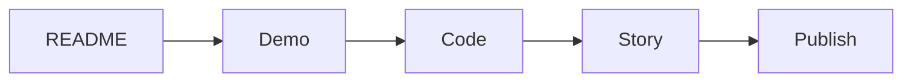

# Portfolio Improvement Checklist

This is the final post in the Portfolio Project 101 series.

> Portfolio Project 101 series (10/10)

<!-- a-grade-intro:begin -->

**Core question**: What is the *last* thing to *check* before you *share* your *portfolio*?

> The *eyes of a first-time visitor*.

<!-- a-grade-intro:end -->

## What You Will Learn

- A *pre-launch* checklist
- *README* review
- *Demo* review
- *Code* review
- *Story* review

## Why It Matters

The *first impression* is decided in *three minutes*.

## Concept at a Glance



## Key Terms

- **smoke test**: A *basic functional check*.
- **fresh eyes**: A *first-time visitor*.
- **dead link**: A *broken link*.
- **stale**: *Out of date*.
- **launch**: A *public release*.

## Before/After

**Before**: Only the *author* understands the *README*.

**After**: A *first-time visitor* can *run it* in *five minutes*.

## Hands-on: A Five Step Review

### Step 1 — README Review

```python
readme = ["What", "Why", "How", "Demo", "License"]
```

### Step 2 — Demo Review

```python
demo = {"url": "https://demo.example.com", "uptime": 0.99}
```

### Step 3 — Code Review

```python
code = {"tests": True, "lint": True, "ci": True}
```

### Step 4 — Story Review

```python
story = ["Problem", "Solution", "Result", "Lesson"]
```

### Step 5 — Launch

```python
launch = ["GitHub", "Blog", "LinkedIn"]
```

## What to Notice in This Code

- *README* is the *entrance*.
- *Demo* is the *evidence*.
- *Story* is the *memory*.

## Five Common Mistakes

1. **A *stale* README.**
2. **A *broken* demo link.**
3. **A *failing* test suite.**
4. **A *missing* license.**
5. **No *screenshots*.**

## How This Shows Up in Production

Open source projects run the same *pre-release checklist* before every release.

## How a Senior Engineer Thinks

- See it through *fresh eyes*.
- The *value* must show in *three minutes*.
- The *demo* must be *live*.
- The *story* must travel with *numbers*.
- The *checklist* becomes a *routine*.

## Checklist

- [ ] All *five README* parts present.
- [ ] *Demo* link *works*.
- [ ] *Tests* pass.
- [ ] *License* is declared.
- [ ] At least *one screenshot*.

## Practice Problems

1. Write the meaning of *smoke test* in one line.
2. Write the definition of *fresh eyes* in one line.
3. Write the last check before *launch* in one line.

## Wrap-up and Next Steps

This is the *final* post in *Portfolio Project 101*. The next series covers *Technical Writing*.

<!-- toc:begin -->
- [What Is a Portfolio Project](./01-what-is-a-portfolio-project.md)
- [Traits of a Good Project](./02-traits-of-a-good-project.md)
- [Writing the README](./03-writing-the-readme.md)
- [Building the Demo](./04-building-the-demo.md)
- [Deploying the Project](./05-deploying-the-project.md)
- [Tests and Documentation](./06-tests-and-documentation.md)
- [Recording Tech Decisions](./07-recording-tech-decisions.md)
- [Summarizing as Blog Posts](./08-summarizing-as-blog-posts.md)
- [Explaining in Interviews](./09-explaining-in-interviews.md)
- **Portfolio Improvement Checklist (current)**
<!-- toc:end -->

## References

- [The Pragmatic Programmer - Hunt & Thomas](https://pragprog.com/titles/tpp20/the-pragmatic-programmer-20th-anniversary-edition/)
- [Open Source Guides - GitHub](https://opensource.guide/)
- [Release Engineering - Google SRE Book](https://sre.google/sre-book/release-engineering/)
- [Choose a License](https://choosealicense.com/)

Tags: Portfolio, Checklist, Quality, Review, Beginner
