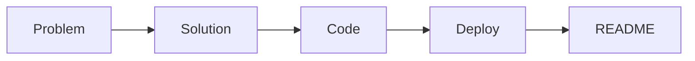

# 포트폴리오 프로젝트란 무엇인가

> 포트폴리오 프로젝트 101 시리즈 (1/10)


## 이 글에서 다룰 문제

포트폴리오는 경험을 증명하는 가장 빠른 도구입니다.

## 전체 흐름


## Before/After

**Before**: 코드만 GitHub에 올립니다.

**After**: 문제 정의, 데모, README가 함께 있습니다.

## 최소 포트폴리오

### 1단계 — 프로젝트 정의

```python
project = {"name": "task-tracker", "problem": "팀 일정 분실"}
```

### 2단계 — 데모 URL

```python
demo_url = "https://demo.example.com"
```

### 3단계 — README 골격

```python
sections = ["problem", "demo", "stack", "run", "next"]
```

### 4단계 — 결정 기록

```python
decisions = [{"why": "FastAPI", "trade": "less_admin"}]
```

### 5단계 — 한 줄 소개

```python
pitch = "팀 일정 분실을 해결하는 미니 SaaS"
```

## 이 코드에서 주목할 점

- 프로젝트는 문제에서 시작합니다.
- 데모는 바로 열어 볼 수 있는 URL이어야 합니다.
- README는 다섯 개 핵심 섹션으로 정리합니다.

## 자주 하는 실수 5가지

1. 스크린샷만 있고 실제 사용 흐름이 없습니다.
2. README가 한 줄로 끝납니다.
3. 결정 근거가 없습니다.
4. 데모가 내려가 있습니다.
5. 기능 자랑만 하고 문제 해결 맥락이 없습니다.

## 실무에서는 이렇게 쓰입니다

채용 담당자는 60초 안에 문제, 해결, 결과를 찾습니다.

## 체크리스트

- [ ] 문제를 한 줄로 설명했다.
- [ ] 데모 URL이 바로 보인다.
- [ ] README를 5개 섹션으로 정리했다.
- [ ] 결정 기록을 남겼다.

## 정리 및 다음 단계

다음 글은 좋은 프로젝트의 조건입니다.

<!-- toc:begin -->
- **포트폴리오 프로젝트란 무엇인가 (현재 글)**
- 좋은 프로젝트의 조건 (예정)
- README 작성 (예정)
- 데모 만들기 (예정)
- 배포하기 (예정)
- 테스트와 문서화 (예정)
- 기술적 의사결정 기록 (예정)
- 블로그 글로 정리하기 (예정)
- 면접에서 설명하기 (예정)
- 포트폴리오 개선 체크리스트 (예정)
<!-- toc:end -->

## 참고 자료

- [GitHub README Best Practices](https://docs.github.com/en/repositories/managing-your-repositorys-settings-and-features/customizing-your-repository/about-readmes)
- [Portfolio for Engineers - Cal Newport](https://calnewport.com/)
- [Show Your Work - Austin Kleon](https://austinkleon.com/show-your-work/)
- [Hiring Without Whiteboards](https://github.com/poteto/hiring-without-whiteboards)

Tags: Portfolio, Career, Project, Hiring, Beginner
