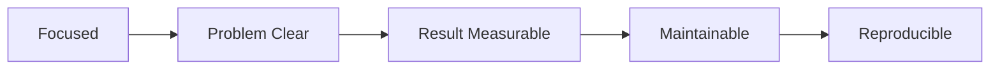

# 좋은 프로젝트의 조건

> 포트폴리오 프로젝트 101 시리즈 (2/10)


## 이 글에서 다룰 문제

좋은 프로젝트의 조건을 알면 어디에 집중해야 하는지 보입니다.

## 전체 흐름


## Before/After

**Before**: 기능은 10개지만 끝까지 다듬지 못한 앱입니다.

**After**: 기능은 3개뿐이어도 완성도 있게 마무리한 앱입니다.

## 평가 표

### 1단계 — 범위 점수

```python
focus = 5
```

### 2단계 — 문제 명확도

```python
problem_score = 4
```

### 3단계 — 결과 측정

```python
result = {"latency_ms": 120, "users": 30}
```

### 4단계 — 유지보수성

```python
maintainable = {"tests": True, "docs": True}
```

### 5단계 — 재현성

```python
reproducible = {"docker": True, "seed": True}
```

## 이 코드에서 주목할 점

- 작은 범위가 완성도를 만듭니다.
- 결과는 수치로 보여줘야 합니다.
- 재현성은 컨테이너 같은 실행 환경 정리에서 드러납니다.

## 자주 하는 실수 5가지

1. 기능만 늘리고 우선순위를 정하지 않습니다.
2. 문제 정의가 추상적이라 누가 왜 쓰는지 보이지 않습니다.
3. 결과를 보여 주는 수치가 없습니다.
4. 테스트가 없어 신뢰가 떨어집니다.
5. Docker 같은 재현 환경이 없습니다.

## 실무에서는 이렇게 쓰입니다

오픈소스 프로젝트도 작은 범위와 명확한 결과를 우선합니다.

## 체크리스트

- [ ] 핵심 기능을 3개 이내로 묶었다.
- [ ] 문제를 한 줄로 설명할 수 있다.
- [ ] 결과를 수치로 제시했다.
- [ ] Docker와 테스트로 재현 경로를 마련했다.

## 정리 및 다음 단계

다음 글은 README 작성입니다.

<!-- toc:begin -->
- [포트폴리오 프로젝트란 무엇인가](./01-what-is-a-portfolio-project.md)
- **좋은 프로젝트의 조건 (현재 글)**
- README 작성 (예정)
- 데모 만들기 (예정)
- 배포하기 (예정)
- 테스트와 문서화 (예정)
- 기술적 의사결정 기록 (예정)
- 블로그 글로 정리하기 (예정)
- 면접에서 설명하기 (예정)
- 포트폴리오 개선 체크리스트 (예정)
<!-- toc:end -->

## 참고 자료

- [Worse Is Better - Richard Gabriel](https://www.dreamsongs.com/RiseOfWorseIsBetter.html)
- [Less is More - John Maeda](https://www.amazon.com/Laws-Simplicity-Design-Technology-Business/dp/0262134721)
- [The Pragmatic Programmer](https://pragprog.com/titles/tpp20/the-pragmatic-programmer-20th-anniversary-edition/)
- [12 Factor App](https://12factor.net/)

Tags: Portfolio, Quality, Scope, Project, Beginner
