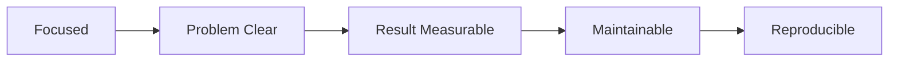

# 좋은 프로젝트의 조건

포트폴리오 프로젝트를 만들다 보면 기능을 많이 넣을수록 더 좋아 보일 것 같다는 생각이 듭니다. 하지만 실제로는 반대인 경우가 많습니다. 범위가 커질수록 마무리 품질은 떨어지고, 문제 정의는 흐려지고, 결과는 설명하기 어려워집니다. 포트폴리오에서 강하게 남는 프로젝트는 큰 프로젝트가 아니라 끝까지 다듬은 프로젝트입니다.

이 글은 Portfolio Project 101 시리즈의 2번째 글입니다. 여기서는 채용 관점에서 좋은 프로젝트를 가르는 조건이 무엇인지, 왜 완성도와 문제 선명도가 기능 개수보다 더 중요하게 읽히는지 살펴보겠습니다.

## 이 글에서 다룰 문제

> 좋은 프로젝트는 크기보다 초점이 분명하고, 결과를 확인할 수 있으며, 다시 실행할 수 있는 상태를 갖춥니다.

- 왜 큰 프로젝트가 항상 더 좋은 포트폴리오가 되지는 않을까요?
- 문제 정의, 결과 지표, 유지보수성, 재현성은 각각 어떻게 드러날까요?
- 기능이 적어도 강한 프로젝트로 읽히게 만드는 기준은 무엇일까요?
- 리뷰어는 화려한 스택보다 어떤 흔적을 더 신뢰할까요?

## 왜 중요한가

좋은 프로젝트의 조건을 알면 어디에 시간을 써야 하는지가 분명해집니다. 초보 개발자는 종종 기능 추가에 대부분의 시간을 쓰고, README나 테스트, 배포 안정성은 뒤로 미룹니다. 하지만 리뷰어는 기능 개수보다 문제의 선명함, 마무리 수준, 반복 가능성을 더 빨리 확인합니다.

포트폴리오는 제품 홍보물이 아니라 역량 증명 자료입니다. 그래서 "무엇을 얼마나 많이 만들었는가"보다 "무엇을 왜 만들었고 어디까지 완성했는가"가 더 중요합니다. 범위를 줄이더라도 끝까지 밀어 붙인 흔적이 있으면 프로젝트는 훨씬 믿을 만하게 보입니다.

## 머릿속에 먼저 그릴 그림

좋은 프로젝트는 초점, 문제 선명도, 결과, 유지보수성, 재현성이 한 흐름으로 이어집니다.



이 흐름은 단순한 평가표가 아닙니다. 범위가 작아야 문제를 또렷하게 설명할 수 있고, 문제가 또렷해야 결과를 수치로 보여 주기 쉽고, 그 결과를 믿게 하려면 유지보수성과 재현성이 뒤따라야 합니다. 좋은 프로젝트는 이 연결이 매끄럽습니다.

## 핵심 용어

- **집중된 범위**: 기능을 많이 넣기보다 핵심 흐름 몇 개에 초점을 맞춘 상태입니다.
- **분명한 문제**: 누구의 어떤 불편을 줄이려는지 한 문장으로 설명할 수 있는 상태입니다.
- **측정 가능한 결과**: 숫자나 지표로 확인할 수 있는 변화입니다.
- **유지보수성**: 테스트와 문서가 있어 나중에 다시 다루기 쉬운 상태입니다.
- 재현성: 다른 사람이 같은 환경을 다시 띄울 수 있는 상태입니다.

## 바꾸기 전과 후

**Before**: 기능은 많지만 끝까지 다듬지 못했고, 무엇이 핵심인지 설명하기 어렵습니다.

**After**: 기능은 적어도 문제와 결과가 분명하고, 실행 경로와 검증 방법이 정리되어 있습니다.

후자의 프로젝트가 더 강한 이유는 평가 포인트가 명확하기 때문입니다. 리뷰어는 이 프로젝트가 무엇을 겨냥했고, 어디까지 끝냈고, 얼마나 믿을 수 있는지를 빠르게 읽을 수 있습니다.

## 단계별로 살펴보기

### 1단계 — 범위 점수

먼저 프로젝트 범위가 과하지 않은지 봅니다.

```python
focus = 5
```

이 숫자는 절대 기준이 아니라 범위를 스스로 평가하는 출발점입니다. 핵심 기능이 몇 개인지, 그 기능들이 하나의 문제를 향하고 있는지 점검하면 프로젝트 초점이 훨씬 또렷해집니다.

### 2단계 — 문제 명확도

문제는 추상적일수록 약해집니다.

```python
problem_score = 4
```

"일정 관리 앱"보다 "팀 일정이 여러 도구에 흩어져 한 번에 보기 어려운 문제"가 훨씬 강합니다. 문제를 더 구체적으로 말할수록 구현 선택도 자연스럽게 설명됩니다.

### 3단계 — 결과 측정

좋은 프로젝트는 결과를 감각이 아니라 수치로 말합니다.

```python
result = {"latency_ms": 120, "users": 30}
```

숫자가 있으면 결과를 비교하고 질문하기가 쉬워집니다. 사용자 수, 응답 시간, 작업 시간 단축처럼 작은 지표라도 남겨 두면 프로젝트가 훨씬 현실적으로 읽힙니다.

### 4단계 — 유지보수성

프로젝트는 돌아가는 것만으로 끝나지 않습니다.

```python
maintainable = {"tests": True, "docs": True}
```

테스트와 문서는 "지금은 되지만 나중에는 모른다"는 상태를 줄여 줍니다. 포트폴리오에서 이 흔적은 구현 역량뿐 아니라 협업 감각까지 보여 줍니다.

### 5단계 — 재현성

다른 사람이 다시 띄울 수 있어야 프로젝트가 오래 살아남습니다.

```python
reproducible = {"docker": True, "seed": True}
```

Docker, 시드 데이터, 실행 명령은 모두 재현성을 높이는 장치입니다. 내 노트북에서만 되는 프로젝트는 설명이 길어질수록 약해집니다.

## 이 코드에서 먼저 볼 점

- 작은 범위가 오히려 완성도와 설명력을 높입니다.
- 결과는 숫자로 남겨야 비교와 질문이 쉬워집니다.
- 유지보수성과 재현성은 마무리 능력을 보여 주는 흔적입니다.

## 자주 하는 실수

1. 기능을 계속 추가하면서 핵심 문제가 무엇인지 잃어버리는 경우
2. 해결 결과를 숫자로 남기지 않아 성과가 흐릿한 경우
3. 테스트와 문서를 나중으로 미뤄 신뢰를 떨어뜨리는 경우
4. Docker나 시드 데이터가 없어 다른 사람이 재현하지 못하는 경우
5. 범위를 줄이지 못해 결국 완성도가 낮아지는 경우

좋은 프로젝트를 만드는 일은 더 많이 만드는 일이 아니라, 무엇을 끝까지 가져갈지 정하는 일에 가깝습니다. 범위를 줄이는 결정이 곧 품질을 올리는 결정인 경우가 많습니다.

## 실무에서는 이렇게 본다

오픈소스 프로젝트나 초기 제품도 대부분 작고 분명한 목표에서 출발합니다. 핵심 흐름이 정리되기 전에는 기능을 넓히지 않고, 결과와 운영 가능성을 먼저 다듬습니다. 개인 포트폴리오도 같은 기준으로 읽힙니다.

작은 프로젝트라도 문제 정의가 분명하고, 결과를 보여 줄 수 있고, 다시 실행할 수 있으면 충분히 강합니다. 반대로 기능이 많아도 방향이 흐리면 오래 기억되기 어렵습니다.

## 체크리스트

- [ ] 핵심 기능 수를 의식적으로 줄였다.
- [ ] 문제를 한 문장으로 설명할 수 있다.
- [ ] 결과를 보여 줄 숫자나 지표가 있다.
- [ ] 테스트, 문서, 재현 경로를 준비했다.

## 연습 문제

1. 여러분 프로젝트에서 지금 빼도 되는 기능 하나를 골라 보세요.
2. 현재 문제 정의를 더 구체적인 한 문장으로 다시 써 보세요.
3. 결과로 남길 수 있는 숫자 두 가지를 적어 보세요.

## 정리와 다음 글

좋은 포트폴리오 프로젝트는 크지 않아도 됩니다. 대신 문제를 분명히 말할 수 있어야 하고, 결과를 확인할 수 있어야 하며, 테스트와 문서, 재현 경로까지 갖춘 상태여야 합니다. 이런 조건이 모이면 작은 프로젝트도 충분히 강한 증거가 됩니다.

다음 글에서는 이렇게 다듬은 프로젝트를 저장소 입구인 README에서 어떻게 읽히게 만들지 이어서 살펴보겠습니다.

<!-- toc:begin -->
- [포트폴리오 프로젝트란 무엇인가](./01-what-is-a-portfolio-project.md)
- **좋은 프로젝트의 조건 (현재 글)**
- README 작성 (예정)
- 데모 만들기 (예정)
- 배포하기 (예정)
- 테스트와 문서화 (예정)
- 기술적 의사결정 기록 (예정)
- 블로그 글로 정리하기 (예정)
- 면접에서 설명하기 (예정)
- 포트폴리오 개선 체크리스트 (예정)
<!-- toc:end -->

## 참고 자료

- [Worse Is Better - Richard Gabriel](https://www.dreamsongs.com/RiseOfWorseIsBetter.html)
- [Less is More - John Maeda](https://www.amazon.com/Laws-Simplicity-Design-Technology-Business/dp/0262134721)
- [The Pragmatic Programmer](https://pragprog.com/titles/tpp20/the-pragmatic-programmer-20th-anniversary-edition/)
- [12 Factor App](https://12factor.net/)

Tags: Portfolio, Quality, Scope, Project, Beginner
