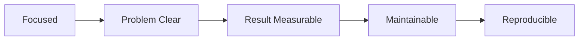

# 좋은 프로젝트의 조건

> 포트폴리오 프로젝트 101 시리즈 (2/10)


## 이 글에서 다룰 문제

*조건* 을 알면 *집중점* 이 보입니다.

## 개념 한눈에 보기



## Before/After

**Before**: *기능 10개* 의 *미완성* 앱.

**After**: *기능 3개* 의 *완성된* 앱.

## 실습: 평가 표

### 1단계 — 범위 점수

```python
focus = 5
```

### 2단계 — 문제 명확도

```python
problem_score = 4
```

### 3단계 — 결과 측정

```python
result = {"latency_ms": 120, "users": 30}
```

### 4단계 — 유지보수성

```python
maintainable = {"tests": True, "docs": True}
```

### 5단계 — 재현성

```python
reproducible = {"docker": True, "seed": True}
```

## 이 코드에서 주목할 점

- *작은 범위* 가 *완성* 을 만든다.
- *결과* 는 *수치*.
- *재현* 은 *컨테이너*.

## 자주 하는 실수 5가지

1. ***기능* 만 늘린다.**
2. ***문제 정의* 가 추상적.**
3. ***결과* 가 없다.**
4. ***테스트* 가 없다.**
5. ***도커* 가 없다.**

## 실무에서는 이렇게 쓰입니다

오픈소스 프로젝트도 *작은 범위 + 명확한 결과* 를 우선합니다.

## 체크리스트

- [ ] *3 기능* 이내.
- [ ] *문제 한 줄*.
- [ ] *결과 수치*.
- [ ] *Docker + 테스트*.

## 정리 및 다음 단계

다음 글은 *README 작성* 입니다.

<!-- toc:begin -->
- [포트폴리오 프로젝트란 무엇인가](./01-what-is-a-portfolio-project.md)
- **좋은 프로젝트의 조건 (현재 글)**
- README 작성 (예정)
- 데모 만들기 (예정)
- 배포하기 (예정)
- 테스트와 문서화 (예정)
- 기술적 의사결정 기록 (예정)
- 블로그 글로 정리하기 (예정)
- 면접에서 설명하기 (예정)
- 포트폴리오 개선 체크리스트 (예정)
<!-- toc:end -->

## 참고 자료

- [Worse Is Better - Richard Gabriel](https://www.dreamsongs.com/RiseOfWorseIsBetter.html)
- [Less is More - John Maeda](https://www.amazon.com/Laws-Simplicity-Design-Technology-Business/dp/0262134721)
- [The Pragmatic Programmer](https://pragprog.com/titles/tpp20/the-pragmatic-programmer-20th-anniversary-edition/)
- [12 Factor App](https://12factor.net/)

Tags: Portfolio, Quality, Scope, Project, Beginner
