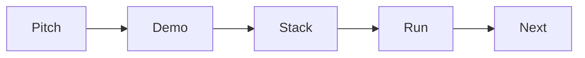

# README 작성

> 포트폴리오 프로젝트 101 시리즈 (3/10)


## 이 글에서 다룰 문제

*README* 는 *프로젝트* 의 *입구* 입니다.

## 전체 흐름


## Before/After

**Before**: *제목 + 설치* 만 있다.

**After**: *5 섹션* 이 모두 있다.

## README 골격

### 1단계 — 한 줄 소개

```markdown
> 팀 일정 분실을 해결하는 미니 SaaS
```

### 2단계 — 데모 링크

```markdown
[Live Demo](https://demo.example.com)
```

### 3단계 — 스택

```markdown
- FastAPI, PostgreSQL, Docker
```

### 4단계 — 실행

```bash
docker compose up
```

### 5단계 — 다음 작업

```markdown
- [ ] 알림 추가
```

## 이 코드에서 주목할 점

- *피치* 는 *문장 1개*.
- *데모* 는 *링크*.
- *실행* 은 *복붙* 가능.

## 자주 하는 실수 5가지

1. ***긴 머리말*.**
2. ***스크린샷* 만.**
3. ***실행 명령* 이 *복잡*.**
4. ***결정 근거* 가 없다.**
5. ***다음 작업* 이 없다.**

## 실무에서는 이렇게 쓰입니다

오픈소스 프로젝트의 *상위 10%* 는 모두 같은 5섹션 구조를 씁니다.

## 체크리스트

- [ ] *피치* 1줄.
- [ ] *데모* 링크.
- [ ] *실행* 명령.
- [ ] *다음* 체크박스.

## 정리 및 다음 단계

다음 글은 *데모 만들기* 입니다.

<!-- toc:begin -->
- [포트폴리오 프로젝트란 무엇인가](./01-what-is-a-portfolio-project.md)
- [좋은 프로젝트의 조건](./02-traits-of-a-good-project.md)
- **README 작성 (현재 글)**
- 데모 만들기 (예정)
- 배포하기 (예정)
- 테스트와 문서화 (예정)
- 기술적 의사결정 기록 (예정)
- 블로그 글로 정리하기 (예정)
- 면접에서 설명하기 (예정)
- 포트폴리오 개선 체크리스트 (예정)
<!-- toc:end -->

## 참고 자료

- [README Best Practices - GitHub](https://docs.github.com/en/repositories/managing-your-repositorys-settings-and-features/customizing-your-repository/about-readmes)
- [Awesome README](https://github.com/matiassingers/awesome-readme)
- [Make a README](https://www.makeareadme.com/)
- [Standard Readme](https://github.com/RichardLitt/standard-readme)

Tags: Portfolio, README, Documentation, Onboarding, Beginner
