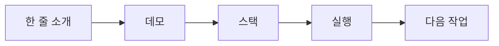

# README 작성

> 포트폴리오 프로젝트 101 시리즈 (3/10)

좋은 README는 프로젝트 설명서가 아니라 첫 번째 데모입니다. 채용 담당자나 동료 개발자는 코드를 읽기 전에 README부터 봅니다. 그 몇십 초 안에 이 프로젝트가 어떤 문제를 다루는지, 실제로 실행 가능한지, 어디까지 완성되었는지가 드러나지 않으면 저장소는 금방 닫힙니다.

초보자는 README를 맨 마지막에 대충 붙이는 문서라고 생각하기 쉽습니다. 하지만 포트폴리오에서는 반대입니다. README가 흐리면 프로젝트 전체가 흐려 보입니다. 반대로 README가 단단하면 구현 범위가 작아도 판단력과 전달력이 살아납니다.

## 이 글에서 다룰 문제

- 포트폴리오 README에서 첫 60초 안에 반드시 전달해야 하는 정보는 무엇일까요?
- 한 줄 소개, 데모, 기술 스택, 실행 방법, 다음 작업은 어떤 순서로 보여 주는 편이 읽기 쉬울까요?
- 스크린샷만 많은 README와 실제로 신뢰를 주는 README는 무엇이 다를까요?
- 채용 담당자나 협업자가 README를 보고 곧바로 다음 행동을 하게 만들려면 무엇을 빼고 무엇을 남겨야 할까요?

## 왜 중요한가

README는 프로젝트의 입구입니다. 방문자는 대부분 저장소를 열고 파일 목록을 훑은 뒤 README를 읽습니다. 여기서 문제 정의가 보이지 않거나 실행 방법이 복잡하면, 사람들은 구현 수준이 아니라 전달 수준에서 먼저 실망합니다.

특히 포트폴리오에서는 README가 단순한 안내문이 아닙니다. 여러분이 사용자를 어떻게 생각하는지 보여 주는 문서입니다. 처음 보는 사람이 무엇을 궁금해할지 예상하고, 그 질문에 짧고 정확하게 답하는 능력 자체가 실무 역량으로 읽힙니다.

## 한눈에 보는 흐름

README를 설계할 때는 다섯 단계 흐름으로 생각하면 편합니다. 먼저 프로젝트의 정체를 한 줄로 제시하고, 바로 데모나 스크린샷으로 증거를 보여 준 뒤, 기술 스택과 실행 방법을 짧게 정리하고, 마지막에 다음 작업을 열어 둡니다.



이 순서가 좋은 이유는 독자의 질문 순서와 같기 때문입니다. “이게 뭔가요?” 다음에는 “정말 돌아가나요?”가 오고, 그다음에야 “무엇으로 만들었나요?”와 “내가 직접 실행할 수 있나요?”가 이어집니다. README는 작성자 머릿속 순서가 아니라 독자 머릿속 순서를 따라야 합니다.

## 핵심 용어

- **한 줄 소개(pitch)**: 프로젝트의 문제와 성격을 한 문장으로 압축한 설명입니다.
- **데모(demo)**: 실제 동작을 확인할 수 있는 링크나 스크린샷입니다.
- **기술 스택(stack)**: 구현에 사용한 핵심 기술 목록입니다.
- **실행(run)**: 저장소를 내려받은 사람이 바로 따라 할 수 있는 명령입니다.
- **다음 작업(next)**: 아직 남아 있는 개선 항목이나 확장 계획입니다.

## 바꾸기 전 / 후

**Before**: 제목과 설치 명령만 있고, 이 프로젝트가 왜 존재하는지 알 수 없습니다.

**After**: 다섯 섹션이 모두 있고, 처음 보는 사람도 1분 안에 문제, 데모, 실행 방법을 파악할 수 있습니다.

전자의 README는 작성자에게만 친절합니다. 후자의 README는 독자에게 행동 경로를 줍니다. 포트폴리오에서는 바로 그 차이가 큽니다. “좋아 보이는 저장소”와 “실제로 검토 가능한 저장소”를 가르는 기준이기 때문입니다.

## 실습: README 골격 만들기

### 1단계 — 한 줄 소개

프로젝트가 해결하는 문제를 먼저 씁니다. 기술 이름보다 문제를 앞에 두는 편이 훨씬 잘 읽힙니다.

```markdown
> 팀 일정 분실을 해결하는 미니 SaaS
```

한 줄 소개는 길게 쓰지 않는 편이 좋습니다. 무엇을 만들었는지보다 무엇을 해결했는지를 먼저 보여 주면, 이후 섹션이 자연스럽게 이어집니다.

### 2단계 — 데모 링크

실행 가능한 URL이 있으면 바로 걸어 둡니다. URL이 없다면 최소한 스크린샷이나 짧은 영상 링크라도 있어야 합니다.

```markdown
[Live Demo](https://demo.example.com)
```

데모는 README에서 가장 빠르게 신뢰를 만드는 요소입니다. 글로 설명하는 것보다, 실제로 열리는 링크 하나가 더 많은 판단을 대신합니다.

### 3단계 — 스택

기술 스택은 장황하게 늘어놓지 말고 핵심만 남깁니다. 독자가 아키텍처 전체를 당장 알 필요는 없습니다.

```markdown
- FastAPI, PostgreSQL, Docker
```

여기서는 “무엇을 사용했는가”만 보이면 충분합니다. 왜 그 기술을 골랐는지는 본문이나 ADR, 블로그 글에서 풀어도 늦지 않습니다.

### 4단계 — 실행

실행 명령은 복사해서 바로 붙여 넣을 수 있어야 합니다. 가장 흔한 실패는 여러 문서를 오가야만 실행할 수 있게 만드는 것입니다.

```bash
docker compose up
```

가능하면 환경 변수 준비, 시드 데이터 적재, 기본 계정 정보도 이 주변에 함께 적어 두는 편이 좋습니다. README의 실행 섹션은 설치 매뉴얼이 아니라 온보딩 경로입니다.

### 5단계 — 다음 작업

남은 작업을 숨기지 말고 체크박스로 적어 두면 프로젝트가 정직해 보입니다. 완벽함보다 현재 상태를 정확히 보여 주는 편이 더 신뢰를 줍니다.

```markdown
- [ ] 알림 추가
```

이 섹션은 단순한 할 일 목록이 아닙니다. 작성자가 범위를 어디까지 잡았는지, 무엇을 아직 미완성으로 보고 있는지를 보여 주는 판단 기록입니다.

## 이 코드에서 봐야 할 점

- 한 줄 소개는 한 문장으로 끝나야 합니다. 제목을 다시 풀어 쓰는 대신 문제를 바로 말하는 편이 낫습니다.
- 데모는 텍스트 설명보다 링크가 먼저입니다. 방문자는 읽기보다 확인을 먼저 합니다.
- 실행 명령은 복사-붙여넣기 가능한 수준으로 단순해야 합니다. 실행 전제조건이 많다면 별도 섹션으로 분리합니다.

## 자주 하는 실수 5가지

1. 머리말이 너무 길어서 정작 프로젝트 설명이 뒤로 밀리는 경우
2. 스크린샷만 많고 실제 데모나 실행 방법이 없는 경우
3. 실행 명령이 복잡해서 처음 보는 사람이 바로 재현하지 못하는 경우
4. 왜 이런 구조를 택했는지 판단 근거가 전혀 드러나지 않는 경우
5. 다음 작업이 비어 있어서 프로젝트의 현재 상태를 읽기 어려운 경우

이 다섯 가지는 모두 같은 문제로 이어집니다. 독자가 저장소 안에서 길을 잃는다는 점입니다. README는 설명을 많이 하는 문서보다 길을 잃지 않게 해 주는 문서에 가깝습니다.

## 실무에서는 이렇게 보입니다

잘 관리되는 오픈소스 프로젝트를 보면 README 구조가 크게 다르지 않습니다. 짧은 소개, 빠른 시작, 데모 또는 예시, 핵심 문서 링크, 기여나 다음 단계가 반복됩니다. 이유는 간단합니다. 처음 들어온 사람이 가장 먼저 찾는 정보가 늘 비슷하기 때문입니다.

포트폴리오도 마찬가지입니다. 프로젝트 규모가 작더라도 README 구조가 안정적이면 검토자는 구현 품질뿐 아니라 커뮤니케이션 습관까지 함께 읽을 수 있습니다.

## 시니어 엔지니어는 이렇게 판단합니다

- 한 줄 소개가 프로젝트의 문제를 말하는지 먼저 봅니다.
- 데모가 살아 있으면 저장소 전체 신뢰도가 올라갑니다.
- 실행 방법이 한 줄에 가까울수록 온보딩 비용이 낮다고 판단합니다.
- 남은 작업이 정리되어 있으면 범위 감각이 있다고 봅니다.
- README 하나만 읽고도 다음 행동이 정해지는지 확인합니다.

결국 좋은 README는 문장력을 뽐내는 문서가 아닙니다. 독자가 다음에 무엇을 해야 하는지 망설이지 않게 만드는 문서입니다.

## 체크리스트

- [ ] 문제를 설명하는 한 줄 소개가 있다.
- [ ] 데모 링크 또는 스크린샷이 바로 보인다.
- [ ] 실행 명령을 복사해서 바로 실행할 수 있다.
- [ ] 핵심 기술 스택이 과하지 않게 정리되어 있다.
- [ ] 다음 작업이 체크박스로 남아 있다.

## 연습 문제

1. 여러분 프로젝트의 한 줄 소개를 기술 이름 없이 한 문장으로 써 보세요.
2. README를 처음 보는 사람이 30초 안에 찾을 정보 세 가지를 적어 보세요.
3. 실행 섹션에서 현재 가장 불친절한 부분이 무엇인지 한 줄로 적어 보세요.

## 정리 및 다음 글

README는 프로젝트의 요약본이 아니라 첫 번째 사용자 경험입니다. 문제를 먼저 말하고, 데모로 증명하고, 실행 방법을 단순하게 만들고, 남은 작업을 솔직하게 남겨 두면 작은 프로젝트도 훨씬 선명해집니다.

다음 글에서는 포트폴리오 프로젝트의 데모를 어떻게 설계해야 처음 보는 사람도 바로 핵심 흐름을 이해하는지 살펴보겠습니다.

<!-- toc:begin -->
- [포트폴리오 프로젝트란 무엇인가](./01-what-is-a-portfolio-project.md)
- [좋은 프로젝트의 조건](./02-traits-of-a-good-project.md)
- **README 작성 (현재 글)**
- 데모 만들기 (예정)
- 배포하기 (예정)
- 테스트와 문서화 (예정)
- 기술적 의사결정 기록 (예정)
- 블로그 글로 정리하기 (예정)
- 면접에서 설명하기 (예정)
- 포트폴리오 개선 체크리스트 (예정)
<!-- toc:end -->

## 참고 자료

- [README Best Practices - GitHub](https://docs.github.com/en/repositories/managing-your-repositorys-settings-and-features/customizing-your-repository/about-readmes)
- [Awesome README](https://github.com/matiassingers/awesome-readme)
- [Make a README](https://www.makeareadme.com/)
- [Standard Readme](https://github.com/RichardLitt/standard-readme)

Tags: Portfolio, README, Documentation, Onboarding, Beginner
