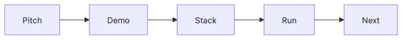

# README 작성

좋은 프로젝트도 README가 흐리면 입구에서 바로 힘을 잃습니다. 저장소에 처음 들어온 사람은 코드를 읽기 전에 README부터 봅니다. 그 몇십 초 안에 이 프로젝트가 어떤 문제를 다루는지, 실제로 열어 볼 데모가 있는지, 직접 실행할 수 있는지가 보이지 않으면 방문자는 금방 다른 저장소로 이동합니다.

이 글은 Portfolio Project 101 시리즈의 3번째 글입니다. 여기서는 포트폴리오 README를 단순한 안내문이 아니라 첫 번째 데모로 보고, 리뷰어가 60초 안에 프로젝트를 이해할 수 있게 만드는 구성과 문장 방식을 살펴보겠습니다.

## 이 글에서 다룰 문제

> 좋은 README는 저장소 설명서가 아니라 처음 들어온 사람이 다음 행동을 바로 정할 수 있게 만드는 입구 문서입니다.

- 포트폴리오 README에서 가장 먼저 보여 줘야 할 정보는 무엇일까요?
- 한 줄 소개, 데모, 스택, 실행 방법, 다음 작업은 왜 이 순서가 읽기 쉬울까요?
- 스크린샷이 많아도 README가 약하게 느껴지는 이유는 무엇일까요?
- 처음 보는 사람이 곧바로 실행하거나 검토를 이어 가게 만들려면 무엇을 남기고 무엇을 줄여야 할까요?

## 왜 중요한가

README는 프로젝트의 입구입니다. 같은 프로젝트라도 README가 단단하면 정리된 결과물처럼 보이고, README가 비어 있으면 미완성 연습 저장소처럼 보입니다. 리뷰어는 README를 통해 문제 감각, 커뮤니케이션 수준, 온보딩 배려까지 함께 읽습니다.

포트폴리오에서는 특히 이 차이가 큽니다. 저장소를 검토하는 사람은 여러분 프로젝트에 이미 익숙한 동료가 아닙니다. 낯선 사람이 짧은 시간 안에 핵심을 파악해야 합니다. README가 이 역할을 못 하면 구현 품질을 보여 줄 기회 자체가 줄어듭니다.

## 머릿속에 먼저 그릴 그림

README를 설계할 때는 독자의 질문 순서를 따라가면 좋습니다.



*README를 읽는 방문자의 질문 순서*

처음 보는 사람은 대개 이렇게 생각합니다. "이게 뭔가요?" 다음에는 "정말 돌아가나요?"가 오고, 그다음에야 "무엇으로 만들었나요?"와 "내가 직접 실행할 수 있나요?"가 이어집니다. README는 작성자 머릿속 순서가 아니라 방문자 머릿속 순서를 따라야 읽기 쉽습니다.

## 핵심 용어

- **한 줄 소개**: 프로젝트의 문제와 성격을 한 문장으로 압축한 설명입니다.
- 데모: 실제 동작을 보여 주는 링크나 스크린샷입니다.
- **기술 스택**: 구현에 사용한 핵심 기술 목록입니다.
- **실행 방법**: 저장소를 내려받은 사람이 바로 따라 할 수 있는 명령입니다.
- **다음 작업**: 아직 남아 있는 개선 계획이나 미완성 항목입니다.

## 바꾸기 전과 후

**Before**: 제목과 설치 명령만 있고, 왜 이 프로젝트가 존재하는지 알기 어렵습니다.

**After**: 한 줄 소개, 데모, 스택, 실행 방법, 다음 작업이 모두 있어 처음 보는 사람도 1분 안에 핵심을 파악할 수 있습니다.

전자의 README는 작성자 중심입니다. 후자의 README는 방문자 중심입니다. 포트폴리오에서는 후자 쪽이 훨씬 강합니다. 프로젝트가 무엇인지 설명하는 일을 독자에게 떠넘기지 않기 때문입니다.

## 단계별로 살펴보기

### 1단계 — 한 줄 소개

기술 이름보다 해결하려는 문제를 앞에 둡니다.

```markdown
> A mini SaaS that fixes lost team schedules
```

한 줄 소개는 제목을 다시 설명하는 문장이 아니라, 프로젝트의 가치를 짧게 압축한 문장이어야 합니다. 이 한 줄이 선명하면 이후 섹션도 자연스럽게 읽힙니다.

### 2단계 — 데모 링크

직접 확인할 수 있는 경로를 빠르게 보여 줍니다.

```markdown
[Live Demo](https://demo.example.com)
```

데모 링크는 신뢰를 가장 빨리 올리는 요소입니다. 글로 길게 설명하는 것보다, 실제로 열리는 링크 하나가 더 많은 판단을 대신합니다.

### 3단계 — 스택

기술 스택은 핵심만 간단히 적습니다.

```markdown
- FastAPI, PostgreSQL, Docker
```

여기서 목표는 기술 자랑이 아닙니다. 검토자가 프로젝트의 구성 요소를 빠르게 파악하게 만드는 일입니다. 선택 이유는 별도 문서나 본문에서 풀어도 충분합니다.

### 4단계 — 실행

실행 명령은 복사해서 바로 붙여 넣을 수 있어야 합니다.

```bash
docker compose up
```

복잡한 전제조건이 많으면 README의 신뢰가 떨어집니다. 실행 방법은 설치 문서가 아니라 첫 온보딩 경로라는 감각으로 정리하는 편이 좋습니다.

### 5단계 — 다음 작업

남은 작업을 숨기지 말고 체크박스로 남겨 둡니다.

```markdown
- [ ] add notifications
```

이 섹션은 미완성을 드러내는 약점이 아니라 범위 감각을 보여 주는 장치입니다. 무엇을 끝냈고 무엇이 아직 남았는지 솔직하게 적을수록 프로젝트는 오히려 더 믿을 만하게 보입니다.

## 이 코드에서 먼저 볼 점

- 한 줄 소개는 문제를 말해야 하고, 제목 반복으로 끝나면 약합니다.
- 데모는 글보다 먼저 신뢰를 만듭니다.
- 실행 명령은 짧고 재현 가능할수록 좋습니다.

## 자주 하는 실수

1. 머리말이 길어서 정작 프로젝트 핵심이 아래로 밀리는 경우
2. 스크린샷은 많지만 실제 데모 링크나 실행 방법이 없는 경우
3. 실행 명령이 복잡해서 처음 보는 사람이 바로 따라 하지 못하는 경우
4. 왜 이런 구조를 택했는지 전혀 드러나지 않는 경우
5. 남은 작업이 없어 현재 상태를 오히려 판단하기 어려운 경우

README는 많이 쓰는 문서가 아니라, 필요한 정보를 먼저 배치하는 문서에 가깝습니다. 문장이 화려할 필요는 없지만, 독자가 다음 행동을 바로 정할 수 있어야 합니다.

## 실무에서는 이렇게 본다

잘 관리되는 오픈소스 프로젝트를 보면 README 구조가 크게 다르지 않습니다. 짧은 소개, 빠른 시작, 데모나 예시, 핵심 문서 링크, 다음 단계가 반복됩니다. 이유는 처음 들어온 사람이 찾는 정보가 대부분 비슷하기 때문입니다.

개인 포트폴리오도 마찬가지입니다. 프로젝트 규모가 작아도 README가 안정적이면 검토자는 구현 품질뿐 아니라 커뮤니케이션 습관과 배려 수준까지 함께 읽을 수 있습니다.

## 체크리스트

- [ ] 문제를 설명하는 한 줄 소개가 있다.
- [ ] 데모 링크 또는 스크린샷이 바로 보인다.
- [ ] 실행 명령을 복사해서 바로 실행할 수 있다.
- [ ] 핵심 스택이 과하지 않게 정리되어 있다.
- [ ] 다음 작업이 체크박스로 남아 있다.

## 연습 문제

1. 여러분 프로젝트의 한 줄 소개를 기술 이름 없이 다시 써 보세요.
2. README를 처음 보는 사람이 30초 안에 찾아야 할 정보 세 가지를 적어 보세요.
3. 실행 섹션에서 지금 가장 불친절한 부분을 한 줄로 적어 보세요.

## 정리와 다음 글

README는 프로젝트의 요약본이 아니라 첫 번째 사용자 경험입니다. 문제를 먼저 말하고, 데모로 증명하고, 실행 경로를 단순하게 만들고, 남은 작업을 솔직하게 남겨 두면 작은 프로젝트도 훨씬 선명하게 읽힙니다.

다음 글에서는 이 프로젝트를 실제로 보여 주는 데모를 어떻게 구성해야 처음 보는 사람도 가치와 흐름을 금방 이해할 수 있는지 살펴보겠습니다.

<!-- toc:begin -->
- [포트폴리오 프로젝트란 무엇인가](./01-what-is-a-portfolio-project.md)
- [좋은 프로젝트의 조건](./02-traits-of-a-good-project.md)
- **README 작성 (현재 글)**
- 데모 만들기 (예정)
- 배포하기 (예정)
- 테스트와 문서화 (예정)
- 기술적 의사결정 기록 (예정)
- 블로그 글로 정리하기 (예정)
- 면접에서 설명하기 (예정)
- 포트폴리오 개선 체크리스트 (예정)
<!-- toc:end -->

## 참고 자료

- [README Best Practices - GitHub](https://docs.github.com/en/repositories/managing-your-repositorys-settings-and-features/customizing-your-repository/about-readmes)
- [Awesome README](https://github.com/matiassingers/awesome-readme)
- [Make a README](https://www.makeareadme.com/)
- [Standard Readme](https://github.com/RichardLitt/standard-readme)

Tags: Portfolio, README, Documentation, Onboarding, Beginner
