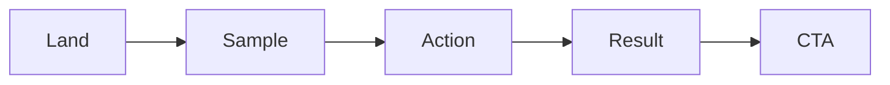

# 데모 만들기

> 포트폴리오 프로젝트 101 시리즈 (4/10)


## 이 글에서 다룰 문제

데모가 살아 있어야 프로젝트도 살아 보입니다.

## 전체 흐름


## Before/After

**Before**: 로그인한 뒤에도 빈 화면만 보입니다.

**After**: 시드 데이터와 핵심 흐름이 바로 보입니다.

## 데모 표

### 1단계 — 시나리오

```python
flow = ["land", "sample", "action", "result"]
```

### 2단계 — 시드 데이터

```python
seed = {"users": 5, "tasks": 12}
```

### 3단계 — 데모 계정

```python
demo = {"id": "guest@demo", "pw": "demo1234"}
```

### 4단계 — 백업 영상

```python
video_url = "https://youtu.be/example"
```

### 5단계 — 헬스체크

```python
health = "/healthz"
```

## 이 코드에서 주목할 점

- 첫 화면에서 시드 데이터가 바로 보여야 합니다.
- 데모 계정은 누구나 써 볼 수 있어야 합니다.
- 영상은 데모가 막힐 때를 대비한 백업입니다.

## 자주 하는 실수 5가지

1. 로그인 단계부터 막혀서 핵심 가치를 보기도 전에 이탈합니다.
2. 시드 데이터가 없어 빈 상태만 보입니다.
3. 데모 계정을 비공개로 둬서 직접 확인할 수 없습니다.
4. 백업 영상이 없어 장애가 나면 보여 줄 방법이 없습니다.
5. 헬스체크가 없어 데모 상태를 빨리 판단하기 어렵습니다.

## 실무에서는 이렇게 쓰입니다

SaaS 회사도 게스트 모드로 30초 안에 핵심 가치를 보여 주는 데모를 제공합니다.

## 체크리스트

- [ ] 시나리오를 4단계 안에 정리했다.
- [ ] 시드 데이터를 준비했다.
- [ ] 공유 계정을 제공한다.
- [ ] 백업 영상을 준비했다.

## 정리 및 다음 단계

다음 글은 배포하기입니다.

<!-- toc:begin -->
- [포트폴리오 프로젝트란 무엇인가](./01-what-is-a-portfolio-project.md)
- [좋은 프로젝트의 조건](./02-traits-of-a-good-project.md)
- [README 작성](./03-writing-the-readme.md)
- **데모 만들기 (현재 글)**
- 배포하기 (예정)
- 테스트와 문서화 (예정)
- 기술적 의사결정 기록 (예정)
- 블로그 글로 정리하기 (예정)
- 면접에서 설명하기 (예정)
- 포트폴리오 개선 체크리스트 (예정)
<!-- toc:end -->

## 참고 자료

- [Demo-Driven Development - Robert Reppel](https://www.amazon.com/Demo-Driven-Development-Robert-Reppel/dp/B08GFL12CJ)
- [Great Demo - Peter Cohan](https://greatdemo.com/)
- [Showing the Product](https://basecamp.com/shapeup/2.4-chapter-09)
- [Heroku Buttons](https://devcenter.heroku.com/articles/heroku-button)

Tags: Portfolio, Demo, UX, Showcase, Beginner
