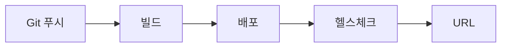

# 배포하기

> 포트폴리오 프로젝트 101 시리즈 (5/10)

포트폴리오 프로젝트는 로컬에서만 돌아가면 절반만 완성된 상태입니다. 구현을 잘했다는 주장과, 남이 실제로 열어 볼 수 있다는 사실은 전혀 다릅니다. 채용 담당자나 동료 개발자는 저장소 설명보다 먼저 “링크 있나요?”를 묻습니다. 그 질문에 답하지 못하면 프로젝트는 기능보다 접근성에서 먼저 탈락합니다.

배포는 인프라를 과하게 꾸미는 작업이 아닙니다. 최소한의 공개 URL, 안전한 환경 변수 관리, 재배포 가능한 흐름을 만드는 작업입니다. 이 세 가지가 갖춰지면 작은 개인 프로젝트도 훨씬 실전처럼 보입니다.

## 이 글에서 다룰 문제

- 포트폴리오 프로젝트를 배포할 때 가장 먼저 결정해야 할 것은 호스팅, 도메인, 자동 배포 중 무엇일까요?
- 무료 또는 저비용 호스팅을 고를 때 구현 편의성과 운영 단순성은 어떻게 균형을 맞추면 좋을까요?
- 시크릿과 환경 변수는 왜 코드 저장소가 아니라 배포 환경에서 관리해야 할까요?
- 공개 URL이 있다고 끝이 아닌 이유와, 헬스체크나 재배포 흐름이 왜 포트폴리오 신뢰도에 직접 연결되는지 어떻게 판단할 수 있을까요?

## 왜 중요한가

배포는 작업 결과를 세상과 연결합니다. 저장소 안의 코드만으로는 “돌아간다”를 증명할 수 없습니다. 실제로 접속 가능한 URL이 있고, 최소한의 운영 규칙이 갖춰져 있어야 비로소 검토 가능한 프로젝트가 됩니다.

또 하나 중요한 점은, 배포 방식이 곧 개발자의 운영 감각을 보여 준다는 사실입니다. 프로젝트가 작더라도 환경 변수를 분리하고, 다시 배포할 수 있고, 기본 상태 확인이 가능하면 단순 구현을 넘어 운영 관점까지 생각한 흔적이 남습니다.

## 한눈에 보는 흐름

배포를 복잡하게 생각할 필요는 없습니다. 코드 변경이 저장소에 올라가고, 빌드가 수행되고, 배포가 끝난 뒤, 헬스체크로 기본 상태를 확인하고, 최종적으로 공개 URL이 안정적으로 열리면 됩니다.



이 흐름의 핵심은 마지막 URL만이 아닙니다. URL이 깨졌을 때 어디를 봐야 하는지 알 수 있는 구조를 만드는 데 있습니다. 빌드 단계에서 실패하는지, 배포는 됐지만 앱이 뜨지 않는지, 헬스체크가 실패하는지를 나눌 수 있어야 문제도 빨리 찾습니다.

## 핵심 용어

- **호스팅(hosting)**: 애플리케이션을 실제로 올려 두는 서버 제공자입니다.
- **도메인(domain)**: 사용자가 접속하는 주소입니다.
- **환경 변수(env var)**: 시크릿이나 환경별 설정 값을 담는 배포 환경의 변수입니다.
- **지속적 배포(CD)**: 코드 변경을 배포까지 자동으로 연결하는 흐름입니다.
- **비용(cost)**: 매달 실제로 나가는 운영 비용입니다.

## 바꾸기 전 / 후

**Before**: localhost에서만 실행되고, 다른 사람은 결과를 확인할 수 없습니다.

**After**: 공개 URL이 있고, 환경 변수와 재배포 흐름이 분리되어 있습니다.

전자의 프로젝트는 설명에 의존합니다. 후자의 프로젝트는 확인에 의존합니다. 포트폴리오에서는 설명보다 확인이 훨씬 강합니다. 상대가 직접 열어 볼 수 있기 때문입니다.

## 실습: 배포 흐름 만들기

### 1단계 — 호스팅 선택

처음부터 복잡한 인프라를 고를 필요는 없습니다. 개인 프로젝트라면 Render, Fly.io, Railway 같은 단순한 플랫폼이 좋은 출발점이 됩니다.

```python
host = "fly.io"  # 또는 render, railway
```

이 단계에서 중요한 기준은 두 가지입니다. 배포가 쉬운가, 그리고 나중에 다시 배포하기 쉬운가입니다. 포트폴리오는 화려한 인프라보다 반복 가능한 운영 흐름이 더 중요합니다.

### 2단계 — 환경 변수 분리

데이터베이스 URL이나 시크릿 키는 코드에 넣지 않고 배포 환경에서 주입해야 합니다.

```python
env = {"DATABASE_URL": "...", "SECRET_KEY": "..."}
```

이렇게 분리하면 저장소를 공개해도 민감한 값이 노출되지 않습니다. 동시에 로컬, 스테이징, 운영 환경을 나누기도 쉬워집니다. 포트폴리오에서는 이 기본기만 보여 줘도 신뢰가 크게 올라갑니다.

### 3단계 — 빌드 명령 정리

배포는 사람이 수동으로 파일을 복사하는 과정이 아니라, 정해진 빌드 절차를 반복하는 과정이어야 합니다.

```bash
docker build -t app .
```

Docker를 쓰면 실행 환경 차이를 줄이기 좋습니다. 플랫폼이 달라도 같은 이미지를 기준으로 설명할 수 있어서, 검토자 입장에서는 재현 경로가 더 분명해집니다.

### 4단계 — 실제 배포

빌드가 끝났다면 플랫폼 명령으로 배포합니다.

```bash
fly deploy
```

여기서 중요한 것은 한 번 성공시키는 것이 아니라, 같은 명령으로 다시 올릴 수 있는 상태를 만드는 일입니다. 포트폴리오 프로젝트도 결국 유지 가능한 흐름이 있어야 가치가 오래 갑니다.

### 5단계 — 헬스체크 추가

배포가 끝난 뒤에는 앱이 실제로 응답하는지 확인할 수 있는 경로를 준비합니다.

```python
url = "https://app.fly.dev/healthz"
```

헬스체크는 단순한 장식이 아닙니다. 링크는 열리는데 앱 내부 기능이 깨졌는지, 앱 자체가 뜨지 않았는지 구분하는 출발점이 됩니다. 작은 프로젝트에서도 이 경로가 있으면 운영 감각이 훨씬 선명하게 드러납니다.

## 이 코드에서 봐야 할 점

- 호스팅 선택은 화려함보다 단순함이 우선입니다. 포트폴리오는 안정적으로 열리는 URL이 더 중요합니다.
- 환경 변수는 시크릿을 코드와 분리하는 최소 단위입니다. 공개 저장소에서는 특히 필수입니다.
- 헬스체크는 앱이 살아 있는지 빠르게 판단하는 기준입니다. 문제를 발견하는 속도를 높여 줍니다.

## 자주 하는 실수 5가지

1. 시크릿 값을 코드나 README 예제에 그대로 넣는 경우
2. 데모 URL은 있지만 어떤 주소가 공식 주소인지 분명하지 않은 경우
3. 헬스체크나 기본 상태 확인 경로가 없어 장애 판단이 어려운 경우
4. 무료 요금제나 월 비용을 고려하지 않아 데모를 오래 유지하지 못하는 경우
5. 재배포가 수동이라 작은 변경도 다시 올리기 번거로운 경우

이 실수들은 결국 데모의 수명을 짧게 만듭니다. 포트폴리오는 하루 반짝 열리는 서비스보다 몇 주, 몇 달 안정적으로 보여 줄 수 있는 작은 서비스가 훨씬 낫습니다.

## 실무에서는 이렇게 보입니다

초기 스타트업이나 개인 제품도 작은 단계에서는 단순한 플랫폼을 많이 씁니다. Render, Fly.io, Vercel처럼 배포 경험이 짧은 팀도 빠르게 올릴 수 있는 도구를 고르고, 서비스 가치가 검증되면 그다음에 복잡도를 올립니다.

포트폴리오 역시 같은 원리가 맞습니다. 처음부터 쿠버네티스를 도입하는 것보다, 공개 URL과 재배포 흐름을 안정적으로 보여 주는 편이 훨씬 설득력 있습니다.

## 시니어 엔지니어는 이렇게 판단합니다

- 호스팅은 복잡성보다 반복 가능성을 봅니다.
- 도메인이나 공식 URL이 명확하면 전달력이 좋아집니다.
- 시크릿은 반드시 환경 변수 쪽으로 밀어 넣습니다.
- 재배포는 git push 이후 자동으로 이어지는 편이 관리가 쉽습니다.
- 비용은 기능이 아니라 운영 지속 가능성을 판단하는 기준입니다.

즉, 배포의 목적은 “어떻게든 띄우기”가 아니라 “다시 띄우기 쉬운 상태 만들기”입니다.

## 체크리스트

- [ ] 호스팅 플랫폼을 하나로 정했다.
- [ ] 공개 URL을 README에 명확히 적었다.
- [ ] 데이터베이스와 시크릿 값을 환경 변수로 분리했다.
- [ ] 최소한의 헬스체크 경로를 준비했다.
- [ ] 다시 배포하는 절차를 한두 단계 안에 설명할 수 있다.

## 연습 문제

1. 여러분 프로젝트에 맞는 호스팅 후보를 하나 고르고 이유를 한 줄로 적어 보세요.
2. 코드에서 환경 변수로 옮겨야 할 민감한 값을 세 가지 적어 보세요.
3. 현재 데모가 깨졌을 때 가장 먼저 확인할 경로가 무엇인지 써 보세요.

## 정리 및 다음 글

포트폴리오 배포의 핵심은 거대한 인프라가 아닙니다. 누구나 접속할 수 있는 URL, 코드와 분리된 환경 변수, 다시 실행할 수 있는 배포 흐름, 기본 상태를 확인할 수 있는 헬스체크가 있으면 충분합니다. 이 네 가지가 있으면 작은 프로젝트도 운영 가능한 결과물로 보입니다.

다음 글에서는 테스트와 문서화를 통해 이 프로젝트가 우연히 돌아가는 것이 아니라 반복해서 검증되는 상태라는 점을 어떻게 보여 줄지 이어서 살펴보겠습니다.

<!-- toc:begin -->
- [포트폴리오 프로젝트란 무엇인가](./01-what-is-a-portfolio-project.md)
- [좋은 프로젝트의 조건](./02-traits-of-a-good-project.md)
- [README 작성](./03-writing-the-readme.md)
- [데모 만들기](./04-building-the-demo.md)
- **배포하기 (현재 글)**
- 테스트와 문서화 (예정)
- 기술적 의사결정 기록 (예정)
- 블로그 글로 정리하기 (예정)
- 면접에서 설명하기 (예정)
- 포트폴리오 개선 체크리스트 (예정)
<!-- toc:end -->

## 참고 자료

- [Fly.io Docs](https://fly.io/docs/)
- [Render Docs](https://render.com/docs)
- [The Twelve-Factor App](https://12factor.net/)
- [Deployment Strategies - Martin Fowler](https://martinfowler.com/bliki/BlueGreenDeployment.html)

Tags: Portfolio, Deploy, DevOps, Hosting, Beginner
