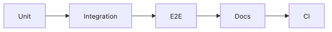

# 테스트와 문서화

포트폴리오 프로젝트가 잘 돌아간다고 말하는 것과, 실제로 검증된 상태라고 보여 주는 것은 다릅니다. 저장소를 열어 보았을 때 테스트가 하나도 없고 문서도 README 한 장으로 끝나면, 프로젝트는 구현 연습처럼 보이기 쉽습니다. 반대로 작은 프로젝트라도 기본 테스트와 문서가 있으면 결과물의 신뢰도가 크게 올라갑니다.

이 글은 Portfolio Project 101 시리즈의 6번째 글입니다. 여기서는 포트폴리오 프로젝트에서 어떤 수준의 테스트와 문서화가 있으면 충분히 믿을 만한 프로젝트로 읽히는지, 그리고 그 흔적이 왜 채용과 협업 관점에서 중요한지 살펴보겠습니다.

## 이 글에서 다룰 문제

> 코드가 동작한다는 주장만으로는 부족합니다. 테스트와 문서는 그 주장을 다른 사람이 확인할 수 있게 만드는 검증 기록입니다.

- 단위 테스트, 통합 테스트, 전체 흐름 테스트는 각각 무엇을 증명할까요?
- 자동 검증은 왜 작은 포트폴리오에서도 중요한 기준이 될까요?
- API 문서나 변경 기록은 어떤 신뢰를 더해 줄까요?
- 테스트와 문서가 없을 때 프로젝트가 왜 더 미완성처럼 보일까요?

## 왜 중요한가

테스트와 문서는 전문성을 보여 주는 가장 빠른 증거입니다. 특히 포트폴리오에서는 프로젝트가 우연히 한 번 돌아간 코드가 아니라 반복 검증된 결과물이어야 합니다. 테스트는 기능이 깨졌는지 알려 주고, 문서는 다른 사람이 프로젝트에 진입하도록 돕습니다.

채용 관점에서도 이 둘은 강한 신호입니다. 테스트가 있다는 것은 실패를 두려워하지 않고 검증 경로를 남겼다는 뜻이고, 문서가 있다는 것은 혼자만 이해하는 프로젝트로 두지 않았다는 뜻입니다. 두 흔적이 함께 있으면 규모가 작아도 훨씬 성숙한 결과물로 읽힙니다.

## 머릿속에 먼저 그릴 그림

검증은 보통 작은 단위에서 시작해 전체 흐름과 문서, 자동화로 확장됩니다.



*테스트와 문서, 자동화가 이어지는 검증 흐름*

이 순서를 기억해 두면 테스트를 무작정 늘리기보다 어디서부터 시작할지 판단하기 쉬워집니다. 빠르게 깨지는 단위 테스트가 있고, 경계면을 확인하는 통합 테스트가 있고, 핵심 사용자 흐름을 점검하는 전체 흐름 테스트가 있고, 그 모든 것을 다시 실행하게 만드는 문서와 자동화가 뒤따릅니다.

## 핵심 용어

- **단위 테스트**: 작은 함수나 로직 단위를 확인하는 테스트입니다.
- **통합 테스트**: API나 저장소 같은 경계면이 함께 동작하는지 확인하는 테스트입니다.
- **전체 흐름 테스트**: 실제 사용자 시나리오를 끝까지 따라가는 테스트입니다.
- **지속 통합**: 코드 변경마다 자동으로 검증을 실행하는 흐름입니다.
- 문서: README, API 문서, 변경 기록처럼 프로젝트 해석을 돕는 기록입니다.

## 바꾸기 전과 후

**Before**: 수동 확인에만 의존해서, 무엇이 깨졌는지 사람 기억에 기대야 합니다.

**After**: 코드 변경이 있을 때마다 자동 검증이 실행되고, 다른 사람도 문서를 따라 프로젝트를 이해할 수 있습니다.

후자의 프로젝트가 강한 이유는 반복 가능성 때문입니다. 한 번 성공한 작업보다 여러 번 같은 방식으로 확인할 수 있는 작업이 훨씬 더 믿을 만합니다.

## 단계별로 살펴보기

### 1단계 — 단위 테스트

가장 작은 단위에서 빠르게 실패를 잡습니다.

```python
def test_add():
    assert 1 + 1 == 2
```

이 예제는 단순하지만 의미는 분명합니다. 단위 테스트는 오류 위치를 빠르게 좁혀 주고, 작은 로직을 바꿀 때 가장 먼저 안전망 역할을 합니다.

### 2단계 — 통합 테스트

경계면은 실제로 함께 붙여 봐야 드러나는 문제가 많습니다.

```python
def test_api(client):
    assert client.get("/health").status_code == 200
```

API, 데이터베이스, 외부 의존성처럼 여러 조각이 만나는 지점은 단위 테스트만으로는 부족합니다. 최소한의 통합 테스트가 있어야 실제 서비스 경로가 어느 정도 검증됩니다.

### 3단계 — 전체 흐름 테스트

사용자 관점의 핵심 시나리오를 끝까지 확인합니다.

```python
e2e_steps = ["login", "create", "delete"]
```

전체 흐름 테스트는 많을 필요가 없습니다. 대신 가장 중요한 사용자 경로 하나라도 있으면 프로젝트가 어디까지 검증됐는지 훨씬 선명하게 보입니다.

### 4단계 — 지속 통합 설정

검증은 사람 기억보다 자동화에 맡기는 편이 낫습니다.

```yaml
on: [push]
jobs:
  test:
    runs-on: ubuntu-latest
```

지속 통합이 있으면 코드 변경이 생길 때마다 같은 기준으로 확인할 수 있습니다. 포트폴리오에서도 이 자동화는 꽤 강한 신호입니다. 반복 검증을 기본값으로 두고 있다는 뜻이기 때문입니다.

### 5단계 — 문서

테스트가 기계의 검증이라면 문서는 사람의 진입 경로입니다.

```python
docs = ["README", "API.md", "CHANGELOG.md"]
```

README는 입구를, API 문서는 사용법을, 변경 기록은 프로젝트가 어떻게 진화했는지를 보여 줍니다. 세 문서가 모두 완벽할 필요는 없지만, 최소한의 흔적은 남겨 두는 편이 좋습니다.

## 이 코드에서 먼저 볼 점

- 단위 테스트는 빠르게 깨지는 안전망입니다.
- 통합 테스트와 전체 흐름 테스트가 있어야 사용자 경로까지 확인됩니다.
- 지속 통합과 문서는 검증을 개인 기억에서 팀의 습관으로 바꿉니다.

## 자주 하는 실수

1. 단위 테스트만 두고 실제 사용자 흐름은 전혀 확인하지 않는 경우
2. 전체 흐름 테스트가 없어 배포 직전 핵심 경로를 검증하지 못하는 경우
3. 지속 통합이 없어 반복 검증이 사람 손에만 의존하는 경우
4. API 문서가 없어 다른 사람이 진입하기 어려운 경우
5. 변경 기록이 없어 프로젝트가 어떻게 달라졌는지 읽기 어려운 경우

테스트와 문서화는 화려한 부가 기능이 아닙니다. 프로젝트를 믿을 수 있게 만드는 기본 장치입니다. 이 둘이 비어 있으면 규모와 무관하게 결과물의 신뢰가 약해집니다.

## 실무에서는 이렇게 본다

오픈소스 프로젝트도 보통 푸시마다 기본 검증을 돌리고, 사용법과 변경 이력을 문서로 남깁니다. 팀 프로젝트에서는 더 중요합니다. 테스트와 문서가 없으면 지식이 사람 머릿속에만 남고, 프로젝트는 금방 다루기 어려워집니다.

개인 포트폴리오에서도 같은 기준이 통합니다. 작은 프로젝트라 해도 테스트 하나, 핵심 흐름 하나, README와 간단한 문서 몇 장이 있으면 훨씬 신뢰할 만한 결과물로 보입니다.

## 체크리스트

- [ ] 단위 테스트를 준비했다.
- [ ] 핵심 사용자 흐름 테스트를 최소 한 개는 정리했다.
- [ ] 코드 변경 시 자동 검증이 실행된다.
- [ ] README 외에 API 문서나 변경 기록을 남겼다.

## 연습 문제

1. 여러분 프로젝트에서 가장 먼저 테스트해야 할 함수 하나를 골라 보세요.
2. 핵심 사용자 흐름을 세 단계로 적어 보세요.
3. README 외에 지금 바로 추가할 문서 하나를 정해 보세요.

## 정리와 다음 글

포트폴리오 프로젝트에서 테스트와 문서화는 선택 사항이 아닙니다. 단위 테스트는 빠른 확인을, 통합과 전체 흐름 테스트는 실제 경로 검증을, 문서는 사람을 위한 진입 경로를 맡습니다. 여기에 지속 통합까지 더해지면 프로젝트는 우연히 되는 코드가 아니라 반복해서 검증되는 결과물로 읽힙니다.

다음 글에서는 이런 프로젝트에서 왜 그런 선택을 했는지 남기는 기술적 의사결정 기록을 살펴보겠습니다.

<!-- toc:begin -->
- [포트폴리오 프로젝트란 무엇인가](./01-what-is-a-portfolio-project.md)
- [좋은 프로젝트의 조건](./02-traits-of-a-good-project.md)
- [README 작성](./03-writing-the-readme.md)
- [데모 만들기](./04-building-the-demo.md)
- [배포하기](./05-deploying-the-project.md)
- **테스트와 문서화 (현재 글)**
- 기술적 의사결정 기록 (예정)
- 블로그 글로 정리하기 (예정)
- 면접에서 설명하기 (예정)
- 포트폴리오 개선 체크리스트 (예정)
<!-- toc:end -->

## 참고 자료

- [Test Pyramid - Martin Fowler](https://martinfowler.com/articles/practical-test-pyramid.html)
- [pytest Docs](https://docs.pytest.org/)
- [GitHub Actions Docs](https://docs.github.com/actions)
- [Keep a Changelog](https://keepachangelog.com/)

Tags: Portfolio, Testing, Documentation, Quality, Beginner
