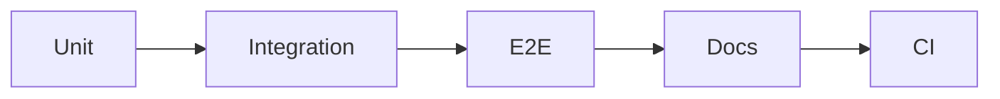

# 테스트와 문서화

> 포트폴리오 프로젝트 101 시리즈 (6/10)


## 이 글에서 다룰 문제

테스트와 문서는 전문성을 보여 주는 가장 확실한 증거입니다.

## 전체 흐름


## Before/After

**Before**: 수동 확인에만 의존합니다.

**After**: Push할 때마다 자동으로 검증합니다.

## 테스트 표

### 1단계 — 단위 테스트

```python
def test_add():
    assert 1 + 1 == 2
```

### 2단계 — 통합

```python
def test_api(client):
    assert client.get("/health").status_code == 200
```

### 3단계 — E2E

```python
e2e_steps = ["login", "create", "delete"]
```

### 4단계 — CI 설정

```yaml
on: [push]
jobs:
  test:
    runs-on: ubuntu-latest
```

### 5단계 — 문서

```python
docs = ["README", "API.md", "CHANGELOG.md"]
```

## 이 코드에서 주목할 점

- 단위 테스트는 빠르게 실패를 알려 줍니다.
- 통합 테스트는 경계면에서 깨지는 지점을 확인합니다.
- E2E 테스트는 실제 사용자 흐름을 점검합니다.

## 자주 하는 실수 5가지

1. 단위 테스트만 두고 실제 흐름 검증은 빠뜨립니다.
2. E2E 테스트가 없어 배포 직전 사용자 경로를 확인하지 못합니다.
3. CI가 없어 반복 검증이 사람 손에만 의존합니다.
4. API 문서가 없어 다른 사람이 진입하기 어렵습니다.
5. CHANGELOG가 없어 변경 내역을 추적하기 어렵습니다.

## 실무에서는 이렇게 쓰입니다

오픈소스 프로젝트도 Push 시점에 CI를 돌려 기본 품질을 지킵니다.

## 체크리스트

- [ ] 단위 테스트를 준비했다.
- [ ] E2E 시나리오를 최소 1개 만들었다.
- [ ] CI 워크플로를 연결했다.
- [ ] API 문서를 남겼다.

## 정리 및 다음 단계

다음 글은 기술적 의사결정 기록입니다.

<!-- toc:begin -->
- [포트폴리오 프로젝트란 무엇인가](./01-what-is-a-portfolio-project.md)
- [좋은 프로젝트의 조건](./02-traits-of-a-good-project.md)
- [README 작성](./03-writing-the-readme.md)
- [데모 만들기](./04-building-the-demo.md)
- [배포하기](./05-deploying-the-project.md)
- **테스트와 문서화 (현재 글)**
- 기술적 의사결정 기록 (예정)
- 블로그 글로 정리하기 (예정)
- 면접에서 설명하기 (예정)
- 포트폴리오 개선 체크리스트 (예정)
<!-- toc:end -->

## 참고 자료

- [Test Pyramid - Martin Fowler](https://martinfowler.com/articles/practical-test-pyramid.html)
- [pytest Docs](https://docs.pytest.org/)
- [GitHub Actions Docs](https://docs.github.com/actions)
- [Keep a Changelog](https://keepachangelog.com/)

Tags: Portfolio, Testing, Documentation, Quality, Beginner
