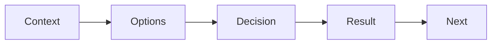

# 기술적 의사결정 기록

> 포트폴리오 프로젝트 101 시리즈 (7/10)


## 이 글에서 다룰 문제

*결정 기록* 은 *판단력* 의 *증거* 입니다.

## 전체 흐름


## Before/After

**Before**: *그냥 그렇게 했다*.

**After**: *왜 그렇게 했는지* 가 적혀 있다.

## ADR 표

### 1단계 — 컨텍스트

```python
context = "팀 1인, 2주 마감, Python 친숙"
```

### 2단계 — 대안

```python
options = ["FastAPI", "Flask", "Django"]
```

### 3단계 — 결정

```python
decision = "FastAPI"
```

### 4단계 — 근거

```python
why = ["async", "type_hints", "swagger_auto"]
```

### 5단계 — 결과

```python
result = {"build_time": "fast", "trade": "smaller_ecosystem"}
```

## 이 코드에서 주목할 점

- *컨텍스트* 가 *제일 위*.
- *대안* 은 *최소 2개*.
- *결과* 는 *솔직히*.

## 자주 하는 실수 5가지

1. ***대안* 이 없다.**
2. ***근거* 가 *유행*.**
3. ***결과* 를 *적지 않는다*.**
4. ***ADR* 이 *코드 옆* 에 *없다*.**
5. ***버전* 관리가 없다.**

## 실무에서는 이렇게 쓰입니다

회사 팀도 `docs/adr/0001-...md` 형태로 *ADR* 을 관리합니다.

## 체크리스트

- [ ] *ADR* 폴더.
- [ ] *최소 3개* ADR.
- [ ] *대안 + 결정 + 결과*.
- [ ] *번호* 부여.

## 정리 및 다음 단계

다음 글은 *블로그 글로 정리하기* 입니다.

<!-- toc:begin -->
- [포트폴리오 프로젝트란 무엇인가](./01-what-is-a-portfolio-project.md)
- [좋은 프로젝트의 조건](./02-traits-of-a-good-project.md)
- [README 작성](./03-writing-the-readme.md)
- [데모 만들기](./04-building-the-demo.md)
- [배포하기](./05-deploying-the-project.md)
- [테스트와 문서화](./06-tests-and-documentation.md)
- **기술적 의사결정 기록 (현재 글)**
- 블로그 글로 정리하기 (예정)
- 면접에서 설명하기 (예정)
- 포트폴리오 개선 체크리스트 (예정)
<!-- toc:end -->

## 참고 자료

- [Architecture Decision Records](https://adr.github.io/)
- [ADR Tools - Nat Pryce](https://github.com/npryce/adr-tools)
- [Documenting Architecture Decisions - Michael Nygard](https://cognitect.com/blog/2011/11/15/documenting-architecture-decisions)
- [ThoughtWorks Tech Radar](https://www.thoughtworks.com/radar/techniques/lightweight-architecture-decision-records)

Tags: Portfolio, ADR, Decision, Architecture, Beginner
