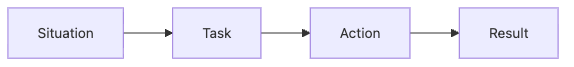

# 면접에서 설명하기

면접에서 프로젝트 설명이 길어질수록 평가가 좋아지는 것은 아닙니다. 오히려 짧은 시간 안에 문제, 판단, 결과를 또렷하게 말하는 편이 훨씬 강합니다. 면접관이 듣고 싶은 것은 기술 이름 목록이 아니라, 어떤 문제를 이해했고 어떤 기준으로 결정을 내렸는지입니다.

이 글은 Portfolio Project 101 시리즈의 9번째 글입니다. 여기서는 포트폴리오 프로젝트를 면접에서 설명할 때 짧은 시간 안에 핵심을 전달하는 구조를 살펴보겠습니다. 목표는 많이 말하는 것이 아니라, 판단력이 들리는 답변을 만드는 데 있습니다.

## 이 글에서 다룰 문제

> 좋은 면접 답변은 프로젝트 자랑이 아니라 문제, 과제, 행동, 결과를 짧게 압축한 판단 기록입니다.

- 면접관은 코드 양보다 무엇을 더 듣고 싶어 할까요?
- STAR 구조는 왜 짧은 답변에서 특히 강할까요?
- 숫자와 트레이드오프는 답변 설득력을 어떻게 바꿀까요?
- 팀 프로젝트나 개인 프로젝트에서 내 기여를 어떻게 또렷하게 말할 수 있을까요?

## 왜 중요한가

면접은 짧고, 기억에는 서사가 남습니다. 비슷한 기술 스택을 가진 지원자는 많지만, 문제를 구조적으로 설명하는 지원자는 많지 않습니다. 그래서 같은 프로젝트라도 어떻게 말하느냐에 따라 인상이 크게 달라집니다.

또 면접은 저장소를 함께 읽는 시간이 아닙니다. 대부분은 말로 먼저 설득해야 하고, 그다음에 세부 질문이 이어집니다. 처음 1~2분 설명이 흐리면 뒤 질문도 흩어집니다. 반대로 구조가 분명하면 면접관은 더 깊은 질문을 하기가 쉬워집니다.

## 머릿속에 먼저 그릴 그림

프로젝트 설명은 상황, 과제, 행동, 결과 순서로 정리하면 놓치기 쉽지 않습니다.



*상황에서 결과로 이어지는 STAR 답변 구조*

이 구조는 답변이 자연스럽게 질문을 예방하게 만듭니다. 왜 이걸 만들었는지, 정확히 무엇을 해야 했는지, 본인이 무엇을 했는지, 결국 어떤 결과가 나왔는지가 한 흐름으로 이어지기 때문입니다.

## 핵심 용어

- **답변 구조**: 상황, 과제, 행동, 결과를 순서대로 말하는 설명 틀입니다.
- **짧은 요약 답변**: 2분 안팎으로 끝내는 프로젝트 소개입니다.
- **트레이드오프**: 어떤 선택을 하면서 함께 감수한 비용이나 포기입니다.
- 지표: 결과를 숫자로 보여 주는 기준입니다.
- **후속 질문**: 첫 답변 뒤에 이어지는 추가 질문입니다.

## 바꾸기 전과 후

**Before**: "Flask로 API를 만들었습니다"처럼 구현 사실만 말합니다.

**After**: "30명이 동시에 쓰는 일정 조회 문제를 풀기 위해 Flask와 Redis를 사용했고 평균 응답 시간을 120ms 수준으로 유지했습니다"처럼 문제와 결과를 함께 말합니다.

둘 다 사실일 수 있지만, 후자의 답변은 훨씬 더 많은 정보를 짧게 담습니다. 면접에서는 바로 그 차이가 중요합니다. 구현을 했다는 사실보다, 어떤 문제를 어떤 기준으로 해결했는지가 더 강하게 남기 때문입니다.

## 단계별로 살펴보기

### 1단계 — 상황

먼저 왜 이 프로젝트가 필요했는지 설명합니다.

```python
situation = "The team schedule kept getting lost across tools"
```

상황 설명은 길게 할 필요가 없습니다. 다만 너무 추상적이면 뒤 설명이 힘을 잃습니다. 실제 불편이 느껴지는 문장으로 적는 편이 좋습니다.

### 2단계 — 과제

그 상황에서 무엇을 해결해야 했는지 분명하게 말합니다.

```python
task = "Show every schedule on a single screen"
```

과제는 프로젝트 범위를 정리해 줍니다. 무엇을 해결하지 않았는지도 함께 암시되기 때문에, 범위 감각이 있는 답변으로 들리게 만듭니다.

### 3단계 — 행동

이제 여러분이 실제로 한 일을 말합니다.

```python
action = ["Flask API", "PostgreSQL", "Deploy to Render"]
```

여기서 중요한 것은 기술 이름 자체보다 선택과 기여입니다. 왜 이 구성을 택했는지, 어떤 대안을 버렸는지를 한 문장 곁들이면 답변이 훨씬 살아납니다.

### 4단계 — 결과

결과는 가능한 한 숫자로 남깁니다.

```python
result = {"users": 30, "latency_ms": 120}
```

숫자는 답변의 증거 역할을 합니다. 사용량, 응답 시간, 배포 횟수, 오류율 감소처럼 무엇이든 좋습니다. 결과가 없으면 설명은 성실해 보여도 설득력은 약해집니다.

### 5단계 — 학습

마지막에는 프로젝트를 통해 얻은 판단을 말합니다.

```python
lesson = "Small MVPs survive"
```

이 한 문장이 답변을 닫습니다. 면접관은 기술 사용 경험뿐 아니라, 그 경험에서 무엇을 배웠는지도 듣고 싶어 합니다. 그래서 마지막 학습 문장은 꽤 중요합니다.

## 이 코드에서 먼저 볼 점

- 답변 구조는 암기 틀이 아니라 설명 순서를 안정시키는 장치입니다.
- 숫자는 결과를 뒷받침하는 증거입니다.
- 학습 문장은 답변의 마침표이자 다음 질문의 연결점이 됩니다.

## 자주 하는 실수

1. 기술 이름만 나열하고 문제와 결과를 말하지 않는 경우
2. 숫자가 하나도 없어 프로젝트 규모나 효과를 짐작하기 어려운 경우
3. 왜 그런 선택을 했는지, 어떤 트레이드오프가 있었는지 설명하지 못하는 경우
4. 팀 프로젝트에서 본인 기여가 흐릿하게 들리는 경우
5. 이 프로젝트를 통해 무엇을 배웠는지 답하지 못하는 경우

이 실수들은 결국 면접관 입장에서 "이 지원자가 정말 이 프로젝트를 이해하고 있나"라는 의문으로 이어집니다. 말의 구조를 세우는 이유도 바로 여기에 있습니다.

## 실무에서는 이렇게 본다

실무에서도 회고나 장애 분석을 할 때 비슷한 구조를 씁니다. 어떤 상황이 있었고, 무엇이 목표였고, 어떤 조치를 했으며, 결과와 교훈이 무엇이었는지 정리해야 다음 판단에 도움이 되기 때문입니다.

면접 답변도 같은 원리입니다. 단지 더 짧고 더 선명해야 할 뿐입니다. 잘 정리된 답변은 프로젝트 설명이자 판단 요약본 역할을 합니다.

## 체크리스트

- [ ] 2분 안에 답변을 마칠 수 있다.
- [ ] 최소 한 개 이상의 숫자를 포함했다.
- [ ] 최소 한 개의 트레이드오프를 설명할 수 있다.
- [ ] 마지막에 배운 점을 한 문장으로 정리할 수 있다.

## 연습 문제

1. 여러분 프로젝트를 네 문장 안에 정리해 보세요.
2. 지금 답변에 넣을 수 있는 숫자 하나를 골라 보세요.
3. 기술 선택 하나를 골라, 왜 다른 대안을 버렸는지 한 줄로 적어 보세요.

## 정리와 다음 글

면접에서 포트폴리오를 설명할 때 핵심은 많이 말하는 것이 아니라 구조 있게 말하는 것입니다. 상황, 과제, 행동, 결과, 학습이 차례로 나오면 짧은 답변도 훨씬 선명해집니다. 여기에 숫자와 트레이드오프, 본인 기여가 더해지면 프로젝트는 단순한 구현 사례가 아니라 판단 사례로 읽힙니다.

다음 글에서는 시리즈를 마무리하면서 공개 직전에 무엇을 점검하면 포트폴리오 전체 완성도를 높일 수 있는지 체크리스트 관점에서 정리해 보겠습니다.

<!-- toc:begin -->
- [포트폴리오 프로젝트란 무엇인가](./01-what-is-a-portfolio-project.md)
- [좋은 프로젝트의 조건](./02-traits-of-a-good-project.md)
- [README 작성](./03-writing-the-readme.md)
- [데모 만들기](./04-building-the-demo.md)
- [배포하기](./05-deploying-the-project.md)
- [테스트와 문서화](./06-tests-and-documentation.md)
- [기술적 의사결정 기록](./07-recording-tech-decisions.md)
- [블로그 글로 정리하기](./08-summarizing-as-blog-posts.md)
- **면접에서 설명하기 (현재 글)**
- 포트폴리오 개선 체크리스트 (예정)
<!-- toc:end -->

## 참고 자료

- [STAR Method - Indeed](https://www.indeed.com/career-advice/interviewing/how-to-use-the-star-interview-response-technique)
- [Cracking the Coding Interview - McDowell](https://www.crackingthecodinginterview.com/)
- [Behavioral Interviews - Google re:Work](https://rework.withgoogle.com/guides/hiring-use-structured-interviewing/steps/introduction/)
- [The Tech Resume Inside Out - Orosz](https://thetechresume.com/)

Tags: Portfolio, Interview, STAR, Communication, Beginner
