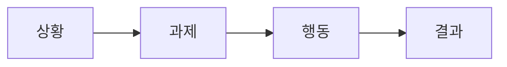

# 면접에서 설명하기

> 포트폴리오 프로젝트 101 시리즈 (9/10)

면접에서 프로젝트 설명이 길어질수록 평가가 좋아지는 것은 아닙니다. 오히려 짧은 시간 안에 문제, 판단, 결과를 또렷하게 말하는 편이 훨씬 강합니다. 면접관이 듣고 싶은 것은 기술 이름 목록이 아니라, 여러분이 어떤 문제를 이해했고 어떤 기준으로 결정을 내렸는지입니다.

많은 지원자가 여기서 실수합니다. “Flask로 API를 만들었습니다”처럼 구현 사실만 말하고 끝냅니다. 하지만 면접은 구현 보고가 아니라 판단 설명의 자리입니다. 프로젝트를 말할 때도 이야기가 필요합니다. 그때 가장 다루기 쉬운 구조가 STAR입니다.

## 이 글에서 다룰 문제

- 면접관은 포트폴리오 프로젝트에서 코드 양보다 무엇을 더 듣고 싶어 할까요?
- STAR 구조는 왜 짧은 답변에서 특히 강력하고, 기술 나열보다 무엇을 더 선명하게 보여 줄까요?
- 숫자, 트레이드오프, 개인 기여는 왜 답변의 설득력을 크게 바꿀까요?
- 2분 안에 프로젝트를 설명하면서도 판단력과 학습을 함께 드러내려면 어떤 순서로 말해야 할까요?

## 왜 중요한가

면접은 짧고, 기억에는 서사가 남습니다. 비슷한 기술 스택을 가진 지원자는 많지만, 문제를 구조적으로 설명하는 지원자는 많지 않습니다. 그래서 같은 프로젝트라도 어떻게 말하느냐에 따라 인상이 크게 달라집니다.

또 면접은 저장소를 함께 읽는 시간이 아닙니다. 대개는 말로 먼저 설득해야 하고, 그다음에 세부 질문이 이어집니다. 처음 1~2분 설명이 흐리면 뒤 질문도 흩어집니다. 반대로 구조가 분명하면 면접관은 더 깊은 질문을 하기가 쉬워집니다.

## 한눈에 보는 흐름

프로젝트 설명은 상황, 과제, 행동, 결과 순서로 정리하면 듣는 사람이 놓치지 않습니다.



이 순서가 유용한 이유는 답변이 자연스럽게 질문을 예방하기 때문입니다. 왜 이걸 만들었는지, 정확히 무엇을 해야 했는지, 본인이 무엇을 했는지, 결국 어떤 결과가 나왔는지가 한 흐름으로 연결됩니다.

## 핵심 용어

- **STAR**: Situation, Task, Action, Result를 뜻하는 답변 구조입니다.
- **엘리베이터 피치(elevator pitch)**: 2분 안팎으로 끝나는 짧은 요약 설명입니다.
- **트레이드오프(trade-off)**: 어떤 선택을 했을 때 함께 따라온 비용이나 포기입니다.
- **지표(metric)**: 결과를 수치로 보여 주는 숫자입니다.
- **후속 질문(follow-up)**: 첫 답변 뒤에 이어지는 추가 질문입니다.

## 바꾸기 전 / 후

**Before**: "Flask로 API를 만들었습니다."

**After**: "30명이 동시에 쓰는 일정 조회 문제를 풀기 위해 Flask와 Redis를 사용했고, 평균 응답 시간을 120ms 수준으로 유지했습니다."

둘 다 사실일 수 있지만, 후자의 답변은 문제와 결과가 함께 있어 훨씬 또렷합니다. 면접에서는 바로 그 차이가 중요합니다. 구현을 했다는 사실보다, 어떤 문제를 어떤 기준으로 해결했는지가 더 강하게 남기 때문입니다.

## 실습: 2분 답변 만들기

### 1단계 — 상황

먼저 왜 이 프로젝트가 필요했는지 설명합니다.

```python
situation = "팀 일정이 흩어져 분실되었다"
```

상황 설명은 길게 할 필요가 없습니다. 면접관이 문제를 이해할 정도면 충분합니다. 다만 너무 추상적이면 뒤 설명이 힘을 잃으니, 실제 불편이 느껴지는 문장으로 적는 편이 좋습니다.

### 2단계 — 과제

그 상황에서 해결해야 할 목표를 명확히 말합니다.

```python
task = "한 화면에서 일정을 통합 조회"
```

과제는 프로젝트 범위를 정리해 줍니다. 무엇을 해결하지 않았는지도 여기서 함께 암시됩니다. 범위 감각이 있는 답변은 듣는 사람을 안심시킵니다.

### 3단계 — 행동

이제 여러분이 실제로 한 일을 말합니다.

```python
action = ["Flask API", "PostgreSQL", "Render 배포"]
```

여기서 중요한 것은 기술 이름이 아니라 본인의 선택과 기여입니다. 왜 이 구성을 택했는지, 어떤 대안을 버렸는지 한 문장 정도 곁들이면 답변이 훨씬 살아납니다.

### 4단계 — 결과

결과는 가급적 숫자로 남깁니다.

```python
result = {"users": 30, "latency_ms": 120}
```

숫자는 답변의 증거 역할을 합니다. 사용량, 응답 시간, 배포 횟수, 오류율 감소처럼 무엇이든 좋습니다. 결과가 없으면 설명은 성실해 보여도 설득력은 약해집니다.

### 5단계 — 학습

마지막에는 이 프로젝트를 통해 얻은 판단을 말합니다.

```python
lesson = "MVP 는 작아야 산다"
```

이 한 문장이 답변을 닫습니다. 면접관은 기술 사용 경험뿐 아니라, 그 경험에서 무엇을 배웠는지 듣고 싶어 합니다.

## 이 코드에서 봐야 할 점

- STAR는 단순한 암기 틀이 아니라 설명 순서를 안정시키는 장치입니다.
- 숫자는 결과를 뒷받침하는 증거입니다. 작은 프로젝트라도 하나는 준비하는 편이 좋습니다.
- 학습은 답변의 마침표입니다. 무엇을 바꾸었고 다음에는 어떻게 할지까지 이어질 수 있습니다.

## 자주 하는 실수 5가지

1. 기술 이름만 나열하고 문제와 결과를 말하지 않는 경우
2. 숫자가 하나도 없어 프로젝트 규모나 효과를 짐작하기 어려운 경우
3. 왜 그런 선택을 했는지, 어떤 트레이드오프가 있었는지 설명하지 못하는 경우
4. 팀 프로젝트에서 본인 기여가 흐릿하게 들리는 경우
5. 이 프로젝트를 통해 무엇을 배웠는지 답하지 못하는 경우

이 실수들은 결국 면접관 입장에서 “이 지원자가 정말 이 프로젝트를 이해하고 있나?”라는 의문으로 이어집니다. 말의 구조를 세우는 이유가 바로 여기에 있습니다.

## 실무에서는 이렇게 보입니다

시니어 엔지니어도 회고나 장애 분석을 할 때 비슷한 구조를 씁니다. 어떤 상황이 있었고, 무엇이 목표였고, 어떤 조치를 했으며, 결과와 교훈이 무엇이었는지 정리해야 다음 판단에 도움이 되기 때문입니다.

면접 답변도 같은 원리입니다. 단지 더 짧고 더 선명해야 할 뿐입니다.

## 시니어 엔지니어는 이렇게 판단합니다

- 상황은 공감을 만들고, 과제는 초점을 잡아 줍니다.
- 행동에서는 반드시 본인 기여가 드러나야 합니다.
- 결과는 숫자로 남겨야 비교와 질문이 쉬워집니다.
- 트레이드오프를 말할 수 있으면 선택의 깊이가 보입니다.
- 학습이 솔직하면 실패 경험도 강점으로 바뀝니다.

즉, 좋은 면접 답변은 프로젝트 자랑이 아니라 판단 기록의 압축본입니다.

## 체크리스트

- [ ] 2분 안에 답변을 마칠 수 있다.
- [ ] 최소 한 개 이상의 숫자를 포함했다.
- [ ] 최소 한 개의 트레이드오프를 설명할 수 있다.
- [ ] 팀 프로젝트라면 본인 기여를 분리해 말할 수 있다.
- [ ] 마지막에 학습을 한 문장으로 정리할 수 있다.

## 연습 문제

1. 여러분 프로젝트를 STAR 구조로 네 문장 안에 정리해 보세요.
2. 결과를 설명할 숫자가 없다면 지금부터 무엇을 측정할지 적어 보세요.
3. 기술 선택 하나를 골라, 왜 그 대안을 버렸는지 한 줄로 적어 보세요.

## 정리 및 다음 글

면접에서 포트폴리오를 설명할 때 핵심은 많이 말하는 것이 아니라 구조 있게 말하는 것입니다. 상황, 과제, 행동, 결과, 학습이 차례로 나오면 짧은 답변도 훨씬 선명해집니다. 여기에 숫자와 트레이드오프, 본인 기여가 더해지면 프로젝트는 단순한 구현 사례가 아니라 판단 사례로 읽힙니다.

다음 글에서는 시리즈를 마무리하면서, 공개 직전에 무엇을 점검하면 포트폴리오 전체 완성도를 높일 수 있는지 체크리스트 관점에서 정리해 보겠습니다.

<!-- toc:begin -->
- [포트폴리오 프로젝트란 무엇인가](./01-what-is-a-portfolio-project.md)
- [좋은 프로젝트의 조건](./02-traits-of-a-good-project.md)
- [README 작성](./03-writing-the-readme.md)
- [데모 만들기](./04-building-the-demo.md)
- [배포하기](./05-deploying-the-project.md)
- [테스트와 문서화](./06-tests-and-documentation.md)
- [기술적 의사결정 기록](./07-recording-tech-decisions.md)
- [블로그 글로 정리하기](./08-summarizing-as-blog-posts.md)
- **면접에서 설명하기 (현재 글)**
- 포트폴리오 개선 체크리스트 (예정)
<!-- toc:end -->

## 참고 자료

- [STAR Method - Indeed](https://www.indeed.com/career-advice/interviewing/how-to-use-the-star-interview-response-technique)
- [Cracking the Coding Interview - McDowell](https://www.crackingthecodinginterview.com/)
- [Behavioral Interviews - Google re:Work](https://rework.withgoogle.com/guides/hiring-use-structured-interviewing/steps/introduction/)
- [The Tech Resume Inside Out - Orosz](https://thetechresume.com/)

Tags: Portfolio, Interview, STAR, Communication, Beginner
