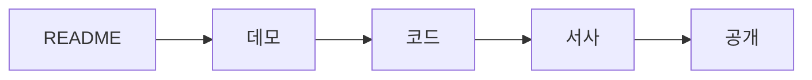

# 포트폴리오 개선 체크리스트

> 포트폴리오 프로젝트 101 시리즈 (10/10)

포트폴리오는 만드는 일보다 다듬는 일에서 품질 차이가 크게 납니다. 기능은 얼추 완성됐는데도 어딘가 덜 준비된 느낌이 드는 프로젝트가 있습니다. 대개는 구현이 부족해서가 아니라, 공개 전 마지막 점검이 빠졌기 때문입니다. README가 오래되었거나, 데모 링크가 깨졌거나, 테스트 상태를 설명하지 않거나, 프로젝트 서사가 흩어져 있으면 첫인상에서 바로 손해를 봅니다.

좋은 체크리스트는 완벽함을 강요하지 않습니다. 대신 처음 보는 사람이 어디에서 막힐지 미리 확인하게 해 줍니다. 포트폴리오를 공개하기 전에는 작성자 시선이 아니라 처음 방문한 사람의 시선으로 다시 봐야 합니다.

## 이 글에서 다룰 문제

- 포트폴리오를 공개하기 전에 마지막으로 확인해야 할 핵심 영역은 무엇일까요?
- README, 데모, 코드, 서사, 공개 채널은 왜 따로 점검해야 할까요?
- “나는 다 알고 있는 프로젝트”와 “처음 보는 사람도 이해하는 프로젝트” 사이의 차이는 어디에서 드러날까요?
- 작은 프로젝트라도 공개 전 점검 루틴이 있으면 무엇이 달라질까요?

## 왜 중요한가

첫인상은 짧은 시간 안에 결정됩니다. 방문자는 대부분 README를 읽고, 데모를 눌러 보고, 저장소 구조를 훑고, 프로젝트가 왜 가치 있는지 판단합니다. 이 과정에서 작은 끊김이 몇 번만 생겨도 전체 인상이 크게 떨어집니다.

또 포트폴리오는 한 번만 보여 주고 끝나는 자료가 아닙니다. 링크를 여러 사람에게 보내고, 시간이 지난 뒤 다시 꺼내게 됩니다. 그래서 공개 직전 점검은 그 순간의 품질 관리이면서, 이후 유지 비용을 줄이는 작업이기도 합니다.

## 한눈에 보는 흐름

공개 전 점검은 README, 데모, 코드, 서사, 공개 채널 순서로 보면 빠뜨릴 부분이 적습니다.



이 순서는 독자가 프로젝트를 만나는 순서와도 비슷합니다. 설명을 보고, 실제로 눌러 보고, 저장소를 살펴본 뒤, 이 프로젝트를 어떻게 기억할지 정하고, 마지막으로 외부 채널에서 다시 마주칩니다.

## 핵심 용어

- **스모크 테스트(smoke test)**: 기본 기능이 살아 있는지만 빠르게 확인하는 점검입니다.
- **처음 보는 눈(fresh eyes)**: 프로젝트를 전혀 모르는 방문자의 시선입니다.
- **죽은 링크(dead link)**: 더 이상 열리지 않는 깨진 링크입니다.
- **오래된 상태(stale)**: 정보가 현재 코드나 배포 상태와 맞지 않는 상태입니다.
- **공개(launch)**: 프로젝트를 외부에 공유하는 시점입니다.

## 바꾸기 전 / 후

**Before**: README는 작성자만 이해하고, 데모는 열리더라도 사용 경로가 모호합니다.

**After**: 처음 보는 사람도 5분 안에 프로젝트를 실행하거나 핵심 흐름을 확인할 수 있습니다.

포트폴리오의 품질은 기능 수보다 마찰의 개수로 체감됩니다. 어디에서 멈추는지, 어디에서 의문이 생기는지가 줄어들수록 완성도는 높아집니다.

## 실습: 공개 전 5단계 점검

### 1단계 — README 검수

README에는 최소한 프로젝트가 무엇인지, 왜 만들었는지, 어떻게 실행하는지, 데모가 어디 있는지, 라이선스가 무엇인지가 보이는 편이 좋습니다.

```python
readme = ["What", "Why", "How", "Demo", "License"]
```

이 다섯 요소가 있으면 처음 보는 사람도 저장소를 해석할 기본 재료를 얻습니다. 특히 Why와 Demo가 빠지면 프로젝트의 가치와 실제성을 동시에 놓치기 쉽습니다.

### 2단계 — 데모 검수

링크가 열리는지만 보지 말고, 핵심 흐름이 막히지 않는지도 함께 확인합니다.

```python
demo = {"url": "https://demo.example.com", "uptime": 0.99}
```

로그인부터 막히거나 시드 데이터가 비어 있으면 방문자는 금방 이탈합니다. 포트폴리오 데모는 기능 전체보다 핵심 흐름이 살아 있는지가 더 중요합니다.

### 3단계 — 코드 검수

코드 리뷰는 복잡한 리팩터링이 아니라, 공개 가능한 상태인지 보는 점검에 가깝습니다.

```python
code = {"tests": True, "lint": True, "ci": True}
```

테스트가 깨진 채 남아 있거나, 기본 실행이 되지 않거나, CI가 실패 중이면 README가 좋아도 신뢰가 오래 가지 않습니다. 포트폴리오는 코드와 설명이 같은 방향을 봐야 합니다.

### 4단계 — 서사 검수

프로젝트가 어떤 문제를 풀었고, 어떤 해결을 시도했고, 결과와 학습이 무엇인지 한 번에 말할 수 있어야 합니다.

```python
story = ["문제", "해결", "결과", "학습"]
```

이 서사가 정리되지 않으면 저장소, 블로그 글, 면접 답변이 서로 따로 놀게 됩니다. 포트폴리오의 힘은 결과물 개수보다 일관된 설명에서 나옵니다.

### 5단계 — 공개 채널 점검

마지막에는 어디에 어떻게 공유할지 확인합니다.

```python
launch = ["GitHub", "Blog", "LinkedIn"]
```

공개 채널마다 보여 주는 정보가 조금씩 다릅니다. GitHub는 원본, 블로그는 과정, LinkedIn은 요약에 가깝습니다. 그래서 링크가 서로 자연스럽게 이어지도록 정리해 두는 편이 좋습니다.

## 이 코드에서 봐야 할 점

- README는 프로젝트의 입구입니다. 여기서 막히면 뒤 내용은 볼 기회조차 줄어듭니다.
- 데모는 말보다 강한 증거입니다. 실제로 열리고 흐름이 살아 있어야 합니다.
- 서사는 프로젝트를 기억하게 만드는 장치입니다. 문제, 해결, 결과, 학습이 연결되어야 합니다.

## 자주 하는 실수 5가지

1. README가 현재 코드와 배포 상태를 반영하지 못하는 경우
2. 데모 링크가 깨졌거나, 열려도 핵심 흐름이 작동하지 않는 경우
3. 테스트나 기본 검증 상태를 확인하지 않고 공개하는 경우
4. 라이선스나 사용 조건을 남기지 않아 저장소 성격이 모호한 경우
5. 스크린샷이나 설명이 없어 방문자가 결과를 빠르게 파악하지 못하는 경우

이 다섯 가지는 모두 “처음 보는 사람”의 시점을 놓쳤을 때 생깁니다. 작성자는 익숙해서 지나치지만, 방문자는 그 자리에서 바로 멈춥니다.

## 실무에서는 이렇게 보입니다

오픈소스 프로젝트나 제품 릴리스도 공개 전에 비슷한 체크리스트를 반복합니다. 문서, 링크, 테스트, 릴리스 노트, 배포 상태를 확인하는 이유는 단순합니다. 공개 이후에 발견되는 사소한 실수는 생각보다 크게 보이기 때문입니다.

개인 포트폴리오도 다르지 않습니다. 규모는 작아도 공개 순간에는 제품처럼 보입니다.

## 시니어 엔지니어는 이렇게 판단합니다

- 항상 처음 보는 사람의 눈으로 다시 한 번 확인합니다.
- 3분 안에 가치가 보이지 않으면 전달 구조부터 손봅니다.
- 데모는 반드시 살아 있어야 하고, 깨진 링크는 바로 고칩니다.
- 서사는 숫자와 함께 움직여야 오래 기억됩니다.
- 체크리스트는 일회성이 아니라 반복 가능한 루틴이 되어야 합니다.

즉, 포트폴리오 개선은 미적 다듬기가 아니라 신뢰를 높이는 운영 작업입니다.

## 체크리스트

- [ ] README에 What, Why, How, Demo, License가 있다.
- [ ] 데모 링크가 실제로 작동하고 핵심 흐름을 확인할 수 있다.
- [ ] 테스트나 기본 검증 상태를 설명할 수 있다.
- [ ] 문제, 해결, 결과, 학습의 서사를 한 번에 말할 수 있다.
- [ ] GitHub, 블로그, 외부 공유 채널이 서로 자연스럽게 연결된다.

## 연습 문제

1. 처음 보는 사람이 3분 안에 확인해야 할 포인트를 다섯 개 적어 보세요.
2. 현재 프로젝트에서 가장 오래된 정보가 남아 있는 부분이 어디인지 찾아보세요.
3. 데모, README, 블로그 글 가운데 가장 먼저 손봐야 할 지점을 한 줄로 적어 보세요.

## 정리 및 다음 글

포트폴리오를 공개하기 전 마지막 점검은 품질을 마무리하는 단계입니다. README, 데모, 코드, 서사, 공개 채널을 차례로 확인하면 구현보다 전달에서 생기는 문제를 크게 줄일 수 있습니다. 특히 처음 보는 사람의 시선으로 다시 읽고 눌러 보고 실행해 보는 습관이 프로젝트 완성도를 눈에 띄게 높여 줍니다.

이 글로 포트폴리오 프로젝트 101 시리즈를 마칩니다. 다음 시리즈에서는 기술 글쓰기를 더 깊게 다루며, 프로젝트 경험을 글과 문서로 어떻게 오래 남길지 이어서 살펴보겠습니다.

<!-- toc:begin -->
- [포트폴리오 프로젝트란 무엇인가](./01-what-is-a-portfolio-project.md)
- [좋은 프로젝트의 조건](./02-traits-of-a-good-project.md)
- [README 작성](./03-writing-the-readme.md)
- [데모 만들기](./04-building-the-demo.md)
- [배포하기](./05-deploying-the-project.md)
- [테스트와 문서화](./06-tests-and-documentation.md)
- [기술적 의사결정 기록](./07-recording-tech-decisions.md)
- [블로그 글로 정리하기](./08-summarizing-as-blog-posts.md)
- [면접에서 설명하기](./09-explaining-in-interviews.md)
- **포트폴리오 개선 체크리스트 (현재 글)**
<!-- toc:end -->

## 참고 자료

- [The Pragmatic Programmer - Hunt & Thomas](https://pragprog.com/titles/tpp20/the-pragmatic-programmer-20th-anniversary-edition/)
- [Open Source Guides - GitHub](https://opensource.guide/)
- [Release Engineering - Google SRE Book](https://sre.google/sre-book/release-engineering/)
- [Choose a License](https://choosealicense.com/)

Tags: Portfolio, Checklist, Quality, Review, Beginner
