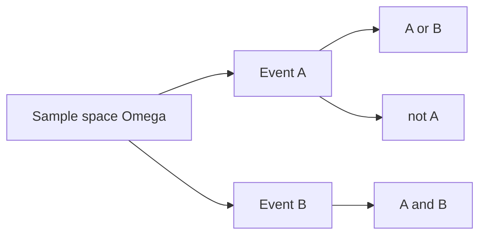

# Events and Sample Space

This is post 2 in the Probability 101 series.

> Probability 101 series (2/10)

<!-- a-grade-intro:begin -->

**Core question**: *Before computing a probability*, what must we *define*? Get *sets* right and you have *half the answer*.

> *Half of every probability problem is solved the moment you *write down the sample space*.*

<!-- a-grade-intro:end -->

## What You Will Learn

- The definition of *sample space Ω* and *events*
- *Union*, *intersection*, *complement*
- *Mutually exclusive* vs *independent*
- A 5-step events exercise
- Five common mistakes

## Why It Matters

*90% of wrong probability answers* trace back to a *wrong sample space*. Writing it *cleanly as a set* makes many problems *self-evident*.

> *Define before you compute.*

## Concept at a Glance



## Key Terms

- **Sample space Ω**: the set of *all outcomes*.
- **Event A**: a subset of Ω.
- **Union A∪B**: A or B.
- **Intersection A∩B**: A and B.
- **Complement Aᶜ**: not A.
- **Mutually exclusive**: A∩B = ∅.
- **Independent**: P(A∩B) = P(A)·P(B).

## Before / After

**Before**: *“What is P(sum is even) for two dice?”* — Where do we start?

**After**: Ω = {(i,j) : 1≤i,j≤6} (36 outcomes); A = {sum is even} → 18/36 = 1/2.

## Hands-on: 5-step Events

### Step 1 — Sample space

```python
omega = [(i, j) for i in range(1, 7) for j in range(1, 7)]
print(len(omega))  # 36
```

### Step 2 — Define events

```python
A = [o for o in omega if (o[0] + o[1]) % 2 == 0]   # even sum
B = [o for o in omega if o[0] == o[1]]              # doubles
```

### Step 3 — Union and intersection

```python
union = list(set(A) | set(B))
inter = list(set(A) & set(B))
print(len(union), len(inter))
```

### Step 4 — Complement

```python
not_A = [o for o in omega if o not in A]
print(len(A) + len(not_A))  # 36
```

### Step 5 — Check independence

```python
def P(E): return len(E) / len(omega)
print("indep?", round(P(set(A) & set(B)) - P(A) * P(B), 6))
```

## What to Notice in This Code

- Stating *Ω explicitly* turns probability into *set arithmetic*.
- *Mutually exclusive ≠ independent* — a frequent confusion.
- A *fair die* assumption means *uniform probability*.

## Five Common Mistakes

1. **Computing *without writing Ω*.**
2. **Mixing up *mutually exclusive* and *independent*.**
3. **Mixing *ordered* and *unordered* outcomes.**
4. **Ignoring *with-* vs *without-replacement* draws.**
5. **Failing to *state symmetry* assumptions.**

## How This Shows Up in Production

A/B test *group definitions*, fraud-detection *rule events*, search-evaluation *relevance events* — *defining the event set* is the starting point of *every metric*.

## How a Senior Engineer Thinks

- *Always writes Ω*.
- Reasons in *set operations*.
- Distinguishes *independent* and *mutually exclusive*.
- States *symmetry* assumptions.
- Verifies with *code*.

## Checklist

- [ ] I can define Ω.
- [ ] I know *union/intersection/complement*.
- [ ] I separate *mutually exclusive* from *independent*.
- [ ] I verify with a *simulation*.

## Practice Problems

1. Write the sample space of a *card draw* (52) and find P(face card).
2. Give an example that is *mutually exclusive* but *not independent*.
3. Show the size difference between *ordered* and *unordered* sampling spaces.

## Wrap-up and Next Steps

Sample spaces and events are the *grammar of probability*. The next episode covers *conditional probability* — what changes when we are *given new information*.

<!-- toc:begin -->
- [What Is Probability?](./01-what-is-probability.md)
- **Events and Sample Space (current)**
- Conditional Probability (upcoming)
- Bayes' Theorem (upcoming)
- Random Variables (upcoming)
- Expectation and Variance (upcoming)
- Discrete Distributions (upcoming)
- Continuous Distributions (upcoming)
- Law of Large Numbers and CLT (upcoming)
- Probability in Machine Learning (upcoming)
<!-- toc:end -->

## References

- [Khan Academy — Sample spaces](https://www.khanacademy.org/math/statistics-probability/probability-library)
- [Wikipedia — Event (probability theory)](https://en.wikipedia.org/wiki/Event_(probability_theory))
- [Wikipedia — Sample space](https://en.wikipedia.org/wiki/Sample_space)
- [Stanford CS109 — Notes](https://web.stanford.edu/class/cs109/)

Tags: Probability, SampleSpace, Events, SetTheory, Beginner
