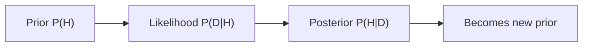

# Bayes' Theorem

This is post 4 in the Probability 101 series.

> Probability 101 series (4/10)

<!-- a-grade-intro:begin -->

**Core question**: How do our *beliefs update* when we *see new data*? One *equation* becomes the shared language of *AI, statistics, and decisions*.

> *Posterior ∝ Likelihood × Prior.*

<!-- a-grade-intro:end -->

## What You Will Learn

- The *equation and intuition* of Bayes' theorem
- The *prior / likelihood / posterior* triangle
- *Odds* and *Bayes factors*
- A 5-step Bayes exercise
- Five common mistakes

## Why It Matters

Bayes' theorem is the *only consistent rule for updating uncertainty*. *Spam filtering, medical diagnosis, A/B tests, RL* all use it.

> *Bayes' theorem is the engine of inference.*

## Concept at a Glance



## Key Terms

- **Prior P(H)**: belief *before* seeing data.
- **Likelihood P(D|H)**: probability of D *given* hypothesis H is true.
- **Posterior P(H|D)**: belief *after* seeing data.
- **Evidence P(D)**: *total probability of data* (normalization).
- **Bayes factor**: P(D|H₁) / P(D|H₂).

## Before / After

**Before**: *“Positive test → disease.”*

**After**: *P(disease|+) = P(+|disease)·P(disease) / P(+)* — a low base rate gives a low *PPV*.

## Hands-on: 5-step Bayes

### Step 1 — Prior and likelihood

```python
prior = 0.01           # P(disease)
sens = 0.99            # P(+|disease)
spec = 0.95            # P(-|no disease)
```

### Step 2 — Evidence P(+)

```python
p_pos = sens * prior + (1 - spec) * (1 - prior)
print("P(+):", p_pos)
```

### Step 3 — Posterior P(disease | +)

```python
post = sens * prior / p_pos
print("P(disease | +):", post)
```

### Step 4 — Update on a second positive

```python
prior2 = post
p_pos2 = sens * prior2 + (1 - spec) * (1 - prior2)
post2 = sens * prior2 / p_pos2
print("after 2 positives:", post2)
```

### Step 5 — Odds form

```python
prior_odds = 0.01 / 0.99
likelihood_ratio = sens / (1 - spec)
post_odds = prior_odds * likelihood_ratio
print("posterior odds:", post_odds, "P:", post_odds / (1 + post_odds))
```

## What to Notice in This Code

- A small *base rate* keeps *PPV* low even with a *sensitive test*.
- The *posterior* becomes the next *prior* — *sequential updating*.
- The *odds form* simplifies the arithmetic.

## Five Common Mistakes

1. **Treating *P(D|H)* as *P(H|D)*.**
2. **Ignoring the *base rate*.**
3. **Pretending *no prior* exists.**
4. **Confusing *likelihood* with *probability*.**
5. **Skipping the *independence assumption* in sequential updates.**

## How This Shows Up in Production

Spam filters (Naive Bayes), Bayesian A/B testing, medical diagnosis, RL *belief states* — *Bayesian inference* is the core of *probabilistic ML*.

## How a Senior Engineer Thinks

- *Names* the prior.
- Distinguishes *likelihood* from *probability*.
- Uses *odds* and *Bayes factors*.
- Validates *independence* in sequential updates.
- Runs *sensitivity analyses*.

## Checklist

- [ ] I know Bayes' theorem as a *formula*.
- [ ] I separate *prior / likelihood / posterior*.
- [ ] I can compute *PPV*.
- [ ] I can do *sequential updating*.

## Practice Problems

1. With *base rate 0.001*, *sensitivity 0.99*, *specificity 0.99*, compute *PPV*.
2. State the practical meaning of a *Bayes factor of 10*.
3. Compare the posterior under a *strong* prior vs a *weak* prior.

## Wrap-up and Next Steps

Bayes' theorem is the *math of learning*. The next episode introduces *random variables* — handling *numeric outcomes*.

<!-- toc:begin -->
- [What Is Probability?](./01-what-is-probability.md)
- [Events and Sample Space](./02-events-and-sample-space.md)
- [Conditional Probability](./03-conditional-probability.md)
- **Bayes' Theorem (current)**
- Random Variables (upcoming)
- Expectation and Variance (upcoming)
- Discrete Distributions (upcoming)
- Continuous Distributions (upcoming)
- Law of Large Numbers and CLT (upcoming)
- Probability in Machine Learning (upcoming)
<!-- toc:end -->

## References

- [3Blue1Brown — Bayes' theorem](https://www.3blue1brown.com/lessons/bayes-theorem)
- [Wikipedia — Bayes' theorem](https://en.wikipedia.org/wiki/Bayes%27_theorem)
- [Stanford CS109 — Notes](https://web.stanford.edu/class/cs109/)
- [Kevin Murphy — Probabilistic ML](https://probml.github.io/pml-book/book1.html)

Tags: Probability, Bayes, Inference, Posterior, Beginner
