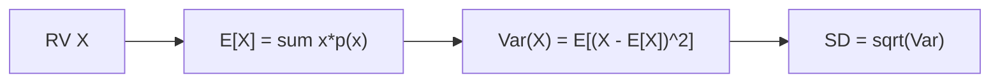

# Expectation and Variance

> Probability 101 series (6/10)

<!-- a-grade-intro:begin -->

**Core question**: If we had *one number for the center* and *one for the spread* of an uncertain quantity, what would they be?

> *Expectation is the *center*; variance is the *spread*.*

<!-- a-grade-intro:end -->

## What You Will Learn

- The definition of *E[X]*
- *Var(X)* and *standard deviation*
- *Linearity of expectation*
- A 5-step moments exercise
- Five common mistakes

## Why It Matters

Expectation and variance *summarize a distribution in two numbers*. *Loss functions, A/B analysis, risk evaluation* all rest on them.

> *Mean and variance summarize a distribution.*

## Concept at a Glance



## Key Terms

- **Expectation E[X]**: mean. Discrete: Σ x·p(x). Continuous: ∫x f(x) dx.
- **Variance Var(X)**: E[(X - E[X])²] = E[X²] - (E[X])².
- **Standard deviation SD**: √Var.
- **Linearity**: E[aX + bY] = a·E[X] + b·E[Y].
- **Moments**: 1st (mean), 2nd (variance), 3rd (skew)...

## Before / After

**Before**: *“A die averages 3.5”* — but the *spread* is unknown.

**After**: *E[X] = 3.5*, *Var(X) ≈ 2.92*, *SD ≈ 1.71* — *center plus spread*.

## Hands-on: 5-step Moments

### Step 1 — Discrete expectation

```python
import numpy as np
x = np.array([1, 2, 3, 4, 5, 6])
p = np.full(6, 1/6)
E = (x * p).sum()
print("E[X]:", E)
```

### Step 2 — Variance

```python
import numpy as np
Var = ((x - E)**2 * p).sum()
print("Var(X):", Var, "SD:", np.sqrt(Var))
```

### Step 3 — Linearity

```python
# E[2X + 3] = 2*E[X] + 3
print("E[2X+3]:", 2*E + 3)
```

### Step 4 — Simulation

```python
import numpy as np
samples = np.random.default_rng(0).integers(1, 7, 100_000)
print("mean:", samples.mean(), "var:", samples.var())
```

### Step 5 — Continuous distribution

```python
from scipy import stats
rv = stats.norm(loc=10, scale=2)
print("mean:", rv.mean(), "var:", rv.var())
```

## What to Notice in This Code

- The *mean* is a *summary*; it need not be an attainable value.
- *Var = E[X²] - (E[X])²* is the *computational* form.
- *Linearity* holds *without independence*.

## Five Common Mistakes

1. **Assuming *E[X]* must be an *attainable value of X*.**
2. **Treating *Var(aX)* as *a·Var(X)* (it is *a²·Var(X)*).**
3. **Confusing units of *standard deviation* and *variance*.**
4. **Forgetting that *outliers shake the mean*.**
5. **Forgetting the *(n-1) denominator* for *sample variance*.**

## How This Shows Up in Production

The *MSE = E[(y - ŷ)²]* loss, *expected lift* in A/B tests, *expected return / risk* in finance — all are applications of *expectation and variance*.

## How a Senior Engineer Thinks

- Reads *mean alongside SD*.
- Also checks *median / IQR*.
- Exploits *linearity*.
- Distinguishes *sample* and *population* denominators.
- Verifies via *simulation*.

## Checklist

- [ ] I can define and compute *E[X]*.
- [ ] I know both *Var(X)* formulas.
- [ ] I know *linearity*.
- [ ] I use *(n-1)* for sample variance.

## Practice Problems

1. Compute *E* and *Var* for the *sum of two dice*.
2. Under what condition does *Var(X+Y) = Var(X) + Var(Y)*?
3. Compare the impact of an *outlier* on *mean vs median*.

## Wrap-up and Next Steps

Expectation and variance are the *two axes of a distribution*. The next episode covers the main *discrete distributions*.

<!-- toc:begin -->
- [What Is Probability?](./01-what-is-probability.md)
- [Events and Sample Space](./02-events-and-sample-space.md)
- [Conditional Probability](./03-conditional-probability.md)
- [Bayes' Theorem](./04-bayes-theorem.md)
- [Random Variables](./05-random-variables.md)
- **Expectation and Variance (current)**
- Discrete Distributions (upcoming)
- Continuous Distributions (upcoming)
- Law of Large Numbers and CLT (upcoming)
- Probability in Machine Learning (upcoming)
<!-- toc:end -->

## References

- [Khan Academy — Expected value](https://www.khanacademy.org/math/statistics-probability/random-variables-stats-library)
- [Wikipedia — Expected value](https://en.wikipedia.org/wiki/Expected_value)
- [Wikipedia — Variance](https://en.wikipedia.org/wiki/Variance)
- [Stanford CS109 — Notes](https://web.stanford.edu/class/cs109/)

Tags: Probability, Expectation, Variance, Moments, Beginner
