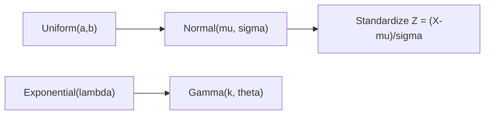

# Continuous Distributions

This is post 8 in the Probability 101 series.

> Probability 101 series (8/10)

<!-- a-grade-intro:begin -->

**Core question**: How do we model *continuous quantities* like *height, time, error*?

> *The normal distribution is the *most frequently encountered* distribution in the world.*

<!-- a-grade-intro:end -->

## What You Will Learn

- *Uniform / Normal / Exponential / Gamma*
- The *PDF, E, Var* of each
- *Why the normal* appears so often
- A 5-step continuous-distribution exercise
- Five common mistakes

## Why It Matters

In *ML, signal processing, measurement error*, *continuous distributions* are the *default assumption*. The *normal* arises *naturally* via the *CLT*.

> *Continuous distributions model the analog world.*

## Concept at a Glance



## Key Terms

- **Uniform(a,b)**: equal density on the interval. E=(a+b)/2.
- **Normal(μ,σ)**: bell shape. E=μ, Var=σ².
- **Exponential(λ)**: *waiting time*. E=1/λ.
- **Gamma(k,θ)**: *generalization of exponential*.
- **Standardization**: Z = (X-μ)/σ → N(0,1).

## Before / After

**Before**: *“Height data”* — hard to analyze.

**After**: assume *Normal(170, 7)* → *top 5%* of heights from a *formula*.

## Hands-on: 5-step Continuous Distributions

### Step 1 — Uniform

```python
from scipy import stats
rv = stats.uniform(loc=0, scale=10)  # [0, 10]
print("E:", rv.mean(), "Var:", rv.var())
```

### Step 2 — Normal

```python
from scipy import stats
rv = stats.norm(loc=170, scale=7)
print("P(X >= 180):", 1 - rv.cdf(180))
```

### Step 3 — Exponential

```python
from scipy import stats
rv = stats.expon(scale=1/0.5)  # rate 0.5
print("P(X <= 1):", rv.cdf(1))
```

### Step 4 — Gamma

```python
from scipy import stats
rv = stats.gamma(a=2, scale=1)
print("E:", rv.mean(), "Var:", rv.var())
```

### Step 5 — Standardize

```python
import numpy as np
from scipy import stats
x = np.random.default_rng(0).normal(170, 7, 10_000)
z = (x - 170) / 7
print("Z mean ~ 0:", z.mean(), "std ~ 1:", z.std())
```

## What to Notice in This Code

- A *PDF value* is *not a probability* — *integrate* to get one.
- The *exponential* is *memoryless*.
- The *normal* arises from *sums and averages* (CLT).

## Five Common Mistakes

1. **Reading *PDF values as probabilities*.**
2. **Assuming *normality* without checking.**
3. **Forgetting the *units* of standard deviation.**
4. **Forgetting the *memorylessness* of the exponential.**
5. **Ignoring *skewed* shapes like *log-normal*.**

## How This Shows Up in Production

The *normal* model for measurement error, *exponential* waiting times, *log-normal* prices, the *foundation* distributions for confidence intervals and tests — *continuous distributions* are the *vocabulary of modeling*.

## How a Senior Engineer Thinks

- *Visualizes* every distribution assumption.
- Uses *Q-Q plots* to check *normality*.
- Tries *log transforms* on *skewed* data.
- Exploits *standardization*.
- Acknowledges the *limits* of distributions.

## Checklist

- [ ] I know each *PDF* and its *E/Var*.
- [ ] I can *standardize*.
- [ ] I know *PDF ≠ probability*.
- [ ] I can draw a *Q-Q plot*.

## Practice Problems

1. For *N(0,1)*, compute *P(|X| > 2)*.
2. For *Exponential(λ=2)*, find the *median*.
3. Describe how *log-normal* differs in *shape* from *normal*.

## Wrap-up and Next Steps

Continuous distributions are the *priors of measurement*. The next episode shows *why the normal appears everywhere* via the LLN and CLT.

<!-- toc:begin -->
- [What Is Probability?](./01-what-is-probability.md)
- [Events and Sample Space](./02-events-and-sample-space.md)
- [Conditional Probability](./03-conditional-probability.md)
- [Bayes' Theorem](./04-bayes-theorem.md)
- [Random Variables](./05-random-variables.md)
- [Expectation and Variance](./06-expectation-and-variance.md)
- [Discrete Distributions](./07-discrete-distributions.md)
- **Continuous Distributions (current)**
- Law of Large Numbers and CLT (upcoming)
- Probability in Machine Learning (upcoming)
<!-- toc:end -->

## References

- [Wikipedia — Normal distribution](https://en.wikipedia.org/wiki/Normal_distribution)
- [Wikipedia — Exponential distribution](https://en.wikipedia.org/wiki/Exponential_distribution)
- [Wikipedia — Gamma distribution](https://en.wikipedia.org/wiki/Gamma_distribution)
- [scipy.stats — Continuous](https://docs.scipy.org/doc/scipy/reference/stats.html#continuous-distributions)

Tags: Probability, Continuous, Normal, Exponential, Beginner
