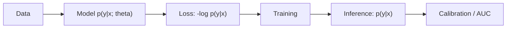

# Probability in Machine Learning

This is the final post in the Probability 101 series.

> Probability 101 series (10/10)

<!-- a-grade-intro:begin -->

**Core question**: Where does *all the probability* we have learned actually *live inside ML*?

> *Modern ML is *a machine for solving probability problems*.*

<!-- a-grade-intro:end -->

## What You Will Learn

- *Loss functions* and *likelihood*
- The probability meaning of *classifier outputs*
- *Bayesian inference* and *MAP*
- A 5-step ML probability exercise
- Five common mistakes

## Why It Matters

*Cross-entropy, MSE, NLL* are all faces of *probability*. *Without probability you cannot interpret model output*.

> *Modern ML is applied probability.*

## Concept at a Glance



## Key Terms

- **Likelihood**: L(θ) = ∏ p(yᵢ | xᵢ; θ).
- **MLE**: θ that *maximizes* the likelihood.
- **MAP**: θ that *maximizes* prior × likelihood.
- **Cross-entropy**: -Σ y log p̂.
- **Calibration**: how closely *predicted probabilities* match *actual frequencies*.

## Before / After

**Before**: *“Model output 0.8”* — *what does it mean*?

**After**: *p(y=1 | x) = 0.8* — an estimate of a *conditional probability*; verified via *calibration*.

## Hands-on: 5-step ML Probability

### Step 1 — Cross-entropy loss

```python
import numpy as np
y = np.array([1, 0, 1, 1, 0])
p = np.array([0.9, 0.2, 0.8, 0.6, 0.3])
nll = -np.mean(y*np.log(p) + (1-y)*np.log(1-p))
print("NLL:", nll)
```

### Step 2 — Logistic regression (sklearn)

```python
import numpy as np
from sklearn.linear_model import LogisticRegression
X = np.array([[0],[1],[2],[3],[4]])
y = np.array([0, 0, 1, 1, 1])
clf = LogisticRegression().fit(X, y)
print("p(y=1|x=2):", clf.predict_proba([[2]])[0, 1])
```

### Step 3 — Calibration

```python
import numpy as np
# Predicted probabilities vs observed frequencies
preds = np.array([0.1, 0.3, 0.5, 0.7, 0.9])
actual = np.array([0.12, 0.28, 0.55, 0.66, 0.91])
print("calibration gap:", np.abs(preds - actual).mean())
```

### Step 4 — Bayesian update (concept)

```python
# Posterior from prior p(theta) and likelihood p(D|theta)
prior = 0.5
likelihood = 0.8
post = likelihood * prior / (likelihood * prior + (1 - likelihood) * (1 - prior))
print("posterior:", post)
```

### Step 5 — Brier score

```python
import numpy as np
y = np.array([1, 0, 1, 0])
p = np.array([0.9, 0.2, 0.6, 0.4])
brier = np.mean((p - y)**2)
print("Brier:", brier)
```

## What to Notice in This Code

- *Cross-entropy* = *NLL* = *negative log-likelihood*.
- A logistic regression output is a *conditional probability p(y|x)*.
- *Calibration* is an evaluation axis *separate from accuracy*.

## Five Common Mistakes

1. **Treating *raw scores* directly as *probabilities*.**
2. **Ignoring *calibration*.**
3. **Evaluating only on *accuracy*.**
4. **Using *threshold 0.5* on *imbalanced data*.**
5. **Pretending there is *no Bayesian prior*.**

## How This Shows Up in Production

Spam classification, medical diagnosis, recommendation scores, anomaly detection — *probability outputs* meet *decision rules* and *cost*. *Calibration*, *Brier*, *log-loss* are the standard metrics.

## How a Senior Engineer Thinks

- Knows that *loss = probability*.
- Measures *calibration*.
- Sets *thresholds* by *cost*.
- *Includes uncertainty* in predictions.
- Uses *both Bayesian and frequentist* tools.

## Checklist

- [ ] I know *cross-entropy = NLL*.
- [ ] I measure *calibration*.
- [ ] I understand *p(y|x)*.
- [ ] I use *Brier / log-loss*.

## Practice Problems

1. Describe what goes wrong with *threshold 0.5* on *90:10 imbalanced* data.
2. Explain why a *calibration plot* matters.
3. Give the difference between *MAP* and *MLE* in one line.

## Wrap-up and Next Steps

Probability is the *native language of ML*. The next steps are *Linear Algebra 101* and *Machine Learning 101*, which add the *other axes of modeling*.

<!-- toc:begin -->
- [What Is Probability?](./01-what-is-probability.md)
- [Events and Sample Space](./02-events-and-sample-space.md)
- [Conditional Probability](./03-conditional-probability.md)
- [Bayes' Theorem](./04-bayes-theorem.md)
- [Random Variables](./05-random-variables.md)
- [Expectation and Variance](./06-expectation-and-variance.md)
- [Discrete Distributions](./07-discrete-distributions.md)
- [Continuous Distributions](./08-continuous-distributions.md)
- [Law of Large Numbers and CLT](./09-lln-and-clt.md)
- **Probability in Machine Learning (current)**
<!-- toc:end -->

## References

- [Kevin Murphy — Probabilistic ML](https://probml.github.io/pml-book/book1.html)
- [Bishop — Pattern Recognition and Machine Learning](https://www.microsoft.com/en-us/research/people/cmbishop/prml-book/)
- [scikit-learn — Calibration](https://scikit-learn.org/stable/modules/calibration.html)
- [Wikipedia — Cross-entropy](https://en.wikipedia.org/wiki/Cross-entropy)

Tags: Probability, MachineLearning, Likelihood, Inference, Beginner
