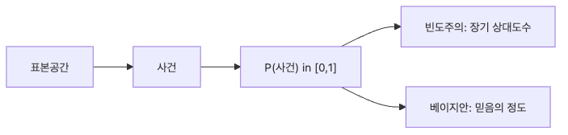

# 확률이란 무엇인가?

확률을 처음 배울 때 가장 자주 듣는 설명은 “어떤 일이 일어날 가능성”입니다. 틀린 말은 아니지만, 이 문장만으로는 금방 막힙니다. 동전의 앞면 확률이 왜 0.5인지, 비가 올 확률 70%는 무엇을 뜻하는지, 모델이 0.8을 출력했을 때 그 숫자를 어디까지 믿어야 하는지까지는 설명하지 못하기 때문입니다.

확률을 제대로 이해하려면 숫자 자체보다 먼저 그 숫자가 어떤 불확실성을 표현하는지 봐야 합니다. 그래야 통계, 데이터 분석, 머신러닝에서 만나는 수많은 확률 문장을 같은 언어로 읽을 수 있습니다.

이 글은 Probability 101 시리즈의 첫 번째 글입니다. 여기서는 확률의 정의, 빈도주의와 베이지안의 두 관점, 그리고 간단한 코드 실험을 통해 확률이 왜 데이터와 ML의 바닥 문법이 되는지 정리하겠습니다.

---

## 이 글에서 다룰 문제

- 확률은 정확히 무엇을 나타내는 숫자일까요?
- 표본공간과 사건을 먼저 정해야 하는 이유는 무엇일까요?
- 빈도주의와 베이지안은 같은 현상을 어떻게 다르게 읽을까요?
- 짧은 시뮬레이션이 왜 확률 직관을 빠르게 만들어 줄까요?
- 확률을 이해하지 못하면 데이터와 ML에서 어디서부터 해석이 흐려질까요?

> 확률은 미래를 맞히는 마법이 아니라, 가능한 결과와 현재 정보를 바탕으로 불확실성을 수치화하는 언어입니다.

## 왜 중요한가

현업에서 확률은 교과서 속 개념으로 끝나지 않습니다. 스팸 분류기는 메일이 스팸일 가능성을 점수로 내놓고, 추천 시스템은 클릭할 가능성을 계산하며, 의료 모델은 특정 질환의 위험도를 추정합니다. 숫자는 다르지만 질문은 같습니다. 이 점수가 무엇을 뜻하고, 얼마나 믿어도 되는가입니다.

확률 감각이 약하면 모델 점수도, 통계 결과도, 실험 결과도 쉽게 잘못 읽습니다. 가능도와 확률을 섞어 쓰고, 작은 표본에서 나온 비율을 곧장 일반화하고, 0.99를 사실상 1처럼 받아들이기 쉽습니다. 반대로 확률의 기본 문법을 알고 있으면 숫자 하나를 보더라도 가정, 해석, 한계를 함께 보게 됩니다.

## 핵심 개념 한눈에 보기



*핵심 개념 한눈에 보기*

## 핵심 용어

- **표본공간(sample space, Ω)**: 가능한 모든 결과의 집합입니다.
- **사건(event)**: 표본공간의 부분집합입니다.
- **확률 P(A)**: 사건 A에 부여하는 0 이상 1 이하의 수입니다.
- **빈도주의**: 반복 실험의 장기 상대도수로 확률을 읽습니다.
- **베이지안**: 현재 가진 정보 아래에서 믿음의 정도로 확률을 읽습니다.

여기서 가장 먼저 붙잡아야 할 감각은 순서입니다. 가능한 결과를 먼저 정하고, 그다음 사건을 정의하고, 마지막에 확률을 부여합니다. 이 순서가 빠지면 같은 문제를 두 사람이 전혀 다른 문제로 읽게 됩니다.

## 관점이 바뀌면 설명도 바뀝니다

“동전의 앞면 확률은 0.5다”라는 문장은 익숙합니다. 하지만 왜 0.5인지 설명하려면 한 걸음 더 들어가야 합니다. 표본공간이 `{H, T}`이고 대칭적인 동전을 가정하므로 `P(H)=0.5`라고 둘 수 있다는 설명이 있어야 합니다. 베이지안 관점에서는 관측 전 사전 믿음을 0.5로 둔다고도 말할 수 있습니다.

이 차이는 작아 보이지만 큽니다. 앞의 문장은 결과만 말합니다. 뒤의 문장은 가정과 해석을 함께 말합니다. 확률을 공부한다는 것은 숫자를 외우는 일이 아니라, 숫자를 둘러싼 가정을 드러내는 훈련에 가깝습니다.

## 5단계로 보는 확률 직관

### 1단계 — 표본공간 만들기

가장 단순한 예로 동전 던지기를 보겠습니다. 가능한 결과를 먼저 적습니다.

```python
sample_space = {"H", "T"}
```

이 한 줄이 중요한 이유는 확률이 허공의 숫자가 아니라는 점을 보여 주기 때문입니다. 결과 후보가 있어야 사건도 정의할 수 있고, 어떤 결과에 얼마의 질량을 줄지도 정할 수 있습니다.

### 2단계 — 사건과 확률 쓰기

```python
P = {"H": 0.5, "T": 0.5}
print("P(H):", P["H"], "sum:", sum(P.values()))
```

확률의 가장 기본적인 약속은 값이 0과 1 사이에 있고, 전체 질량의 합이 1이라는 점입니다. 이 약속이 무너지면 확률분포라고 부를 수 없습니다. 공리를 모두 외우지 않더라도, 적어도 전체 합이 1이어야 한다는 감각은 처음부터 몸에 붙여 두는 편이 좋습니다.

### 3단계 — 빈도주의 시뮬레이션

```python
import random
flips = [random.choice(["H","T"]) for _ in range(10_000)]
print("freq H:", flips.count("H") / len(flips))
```

이 코드는 확률을 장기 상대도수로 보는 감각을 만들어 줍니다. 10번만 던지면 결과가 크게 흔들리지만, 10,000번쯤 반복하면 비율이 0.5 근처로 붙습니다. 확률은 한 번의 결과가 아니라 반복 속에서 드러나는 패턴이라는 점을 눈으로 확인하게 됩니다.

### 4단계 — 베이지안 업데이트

```python
prior = 0.5
likelihood = 0.7  # likelihood of H under "biased coin" hypothesis
post = (likelihood * prior) / (likelihood * prior + (1 - likelihood) * (1 - prior))
print("posterior:", post)
```

베이지안 관점에서는 확률을 관측 전후로 업데이트합니다. `prior`는 관측 전 믿음이고, `post`는 데이터를 본 뒤의 믿음입니다. 예제는 단순하지만, 확률이 정적인 수가 아니라 정보가 들어오면 바뀌는 값이라는 점을 잘 보여 줍니다.

### 5단계 — 두 관점 비교하기

```python
# Same data, two interpretations
print("frequentist: long-run ratio")
print("bayesian: updated belief")
```

같은 동전 던지기 데이터를 보더라도 빈도주의는 반복 속 비율을, 베이지안은 정보 갱신을 강조합니다. 둘 중 하나만 옳고 나머지가 틀린 것이 아니라, 서로 다른 질문에 더 잘 맞는 렌즈라고 보는 편이 정확합니다.

## 이 코드에서 먼저 봐야 할 점

- 확률은 0 이상 1 이하이며 전체 질량의 합은 1입니다.
- 표본공간을 먼저 정해야 사건과 확률을 분명히 말할 수 있습니다.
- 빈도주의는 반복 실험의 비율을, 베이지안은 정보 갱신을 강조합니다.
- 시뮬레이션은 추상 개념을 손으로 확인하는 가장 빠른 방법입니다.

## 자주 헷갈리는 지점

첫째, 확률과 가능도를 같은 말로 취급하기 쉽습니다. 확률은 가정이 주어졌을 때 결과를 보고, 가능도는 관측된 데이터가 주어졌을 때 어떤 가정이 더 그럴듯한지 비교할 때 씁니다. 기호는 비슷해 보여도 질문의 방향이 다릅니다.

둘째, 표본공간을 말하지 않고 확률만 던지기 쉽습니다. “확률이 0.2입니다”라고만 말하면 그 0.2가 어떤 전체 집합 위에 정의된 값인지 알 수 없습니다. 실무에서도 이 생략은 오해를 자주 만듭니다.

셋째, 아주 작은 표본에서 일반 결론을 내리기 쉽습니다. 동전을 5번 던져 4번 앞면이 나왔다고 곧바로 편향됐다고 결론 내리면 안 됩니다. 작은 표본에서는 흔들림이 큽니다.

넷째, 주관적 확률을 비과학적이라고 밀어내기 쉽습니다. 하지만 실제 의사결정은 언제나 제한된 정보 위에서 이뤄집니다. 베이지안 확률은 그 제한을 숨기지 않고 드러내는 방식입니다.

다섯째, 확률 0.99를 사실상 1처럼 읽기 쉽습니다. 확률은 끝까지 불확실성을 남깁니다. 이 차이가 운영 환경에서는 큰 비용 차이로 이어집니다.

## 실무에서는 이렇게 드러납니다

확률은 모델 내부에서만 쓰이지 않습니다. 분류 모델의 점수 해석, 이상치 탐지 임계값, A/B 테스트 판단, 수요 예측의 신뢰 해석까지 거의 모든 데이터 시스템이 확률 언어를 씁니다. 스팸 필터는 스팸일 가능성을, 추천 시스템은 클릭할 가능성을, 사기 탐지는 비정상 거래일 가능성을 다룹니다.

그래서 실무에서는 정답 하나보다 분포를 보는 감각이 더 중요할 때가 많습니다. 평균 성능뿐 아니라 실패 확률을 보고, 단일 예측값뿐 아니라 불확실성 범위도 함께 봅니다. 확률을 이해하면 모델을 더 똑똑하게 만드는 법뿐 아니라 모델을 더 안전하게 읽는 법도 함께 배우게 됩니다.

## 체크리스트

- [ ] 표본공간, 사건, 확률의 차이를 설명할 수 있습니다.
- [ ] 빈도주의와 베이지안의 차이를 말할 수 있습니다.
- [ ] 간단한 시뮬레이션으로 확률 직관을 확인할 수 있습니다.
- [ ] 전체 확률 질량의 합이 1이라는 조건을 이해합니다.

## 정리

확률은 불확실성을 숫자로 정리하는 언어입니다. 이 글에서 먼저 가져가야 할 핵심은 세 가지입니다. 확률은 표본공간 위에서 정의된다는 점, 반복 속 비율과 믿음의 갱신이라는 두 관점이 함께 존재한다는 점, 그리고 작은 코드 실험이 추상 개념을 빠르게 현실로 끌어내린다는 점입니다.

다음 글에서는 사건과 표본공간을 더 정확히 다룹니다. 이번 글이 확률이 왜 필요한지를 보여 줬다면, 다음 글은 확률을 어디 위에 세워야 하는지를 다룹니다.

<!-- toc:begin -->
- **확률이란 무엇인가? (현재 글)**
- 사건과 표본공간 (예정)
- 조건부확률 (예정)
- 베이즈 정리 (예정)
- 확률변수 (예정)
- 기대값과 분산 (예정)
- 이산분포 (예정)
- 연속분포 (예정)
- 대수의 법칙과 중심극한정리 (예정)
- 머신러닝에서의 확률 (예정)
<!-- toc:end -->

## 참고 자료

- [Khan Academy — Probability](https://www.khanacademy.org/math/statistics-probability/probability-library)
- [Wikipedia — Probability axioms](https://en.wikipedia.org/wiki/Probability_axioms)
- [3Blue1Brown — Bayes' theorem](https://www.3blue1brown.com/lessons/bayes-theorem)
- [Stanford CS109 — Probability for Computer Scientists](https://web.stanford.edu/class/cs109/)

Tags: Probability, Foundations, Intuition, DataScience, Beginner
