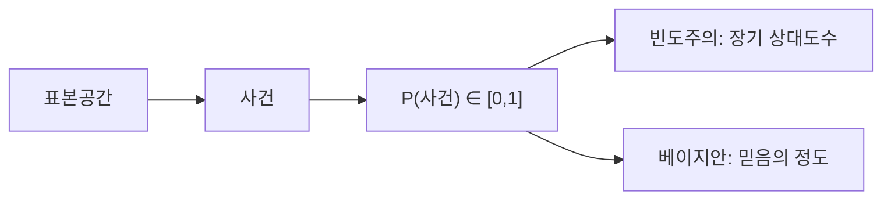

# 확률이란 무엇인가?

확률을 처음 배울 때 가장 자주 듣는 문장은 “어떤 일이 일어날 가능성”입니다. 틀린 설명은 아니지만, 여기서 멈추면 금방 막힙니다. 동전이 앞면이 나올 확률이 0.5라는 말은 왜 맞을까요? 비가 올 확률 70%는 누가 어떻게 정한 걸까요? 모델이 0.8을 출력했을 때 그 숫자는 무엇을 뜻할까요?

확률은 단순한 숫자가 아니라 불확실성을 다루는 공통 언어입니다. 통계는 확률 위에서 서고, 머신러닝은 확률을 해석하는 문제로 자주 돌아옵니다. 그래서 확률을 처음 배울 때는 공식을 외우기보다 “이 숫자가 무엇을 표현하는가”부터 분명히 잡아 두는 편이 훨씬 중요합니다.

이 글은 Probability 101 시리즈의 출발점입니다. 여기서는 확률의 기본 정의, 빈도주의와 베이지안의 두 관점, 그리고 작은 코드 예제를 통해 왜 확률이 데이터와 ML의 바닥 문법이 되는지 설명하겠습니다.

## 이 글에서 다룰 문제

- 확률은 정확히 무엇을 나타내는 숫자일까요?
- 표본공간과 사건을 먼저 정해야 하는 이유는 무엇일까요?
- 빈도주의와 베이지안은 같은 대상을 어떻게 다르게 읽을까요?
- 간단한 시뮬레이션이 왜 확률 직관을 빠르게 만들어 줄까요?
- 확률을 이해하지 못하면 데이터 분석과 ML에서 어디서 막히게 될까요?

> 확률은 세상을 완벽히 아는 도구가 아니라, 모르는 상태를 정직하게 표현하는 도구입니다.

## 왜 중요한가

현업에서 확률은 교과서 속 주제가 아니라 해석의 기준입니다. 스팸 분류기가 메일을 스팸으로 분류할 확률을 내고, 추천 시스템이 어떤 상품을 클릭할 가능성을 점수로 만들고, 의료 모델이 특정 질환의 위험도를 추정합니다. 숫자는 다르지만 공통 질문은 같습니다. “이 숫자를 어디까지 믿어도 되는가?”

확률 감각이 약하면 모델 출력도, 통계 결과도, 실험 결과도 곧바로 흐려집니다. p-value를 보고도 의미를 혼동하고, 작은 표본에서 나온 비율을 곧장 일반화하고, 가능도(likelihood)와 확률(probability)을 섞어 쓰게 됩니다. 반대로 확률의 기본 문법을 알고 있으면 숫자 하나를 받아들일 때도 훨씬 단단한 해석이 가능합니다.

## 핵심 개념 한눈에 보기



## 핵심 용어

- **표본공간(sample space, Ω)**: 가능한 모든 결과의 집합입니다.
- **사건(event)**: 표본공간의 부분집합입니다.
- **확률 P(A)**: 사건 A에 부여하는 0 이상 1 이하의 수입니다.
- **빈도주의(frequentist)**: 반복 실험에서 상대도수가 수렴하는 값으로 확률을 읽습니다.
- **베이지안(Bayesian)**: 현재 가진 정보 아래에서 믿음의 정도로 확률을 읽습니다.

여기서 가장 먼저 잡아야 할 감각은 순서입니다. 사건보다 먼저 표본공간이 나오고, 확률을 말하기 전에 무엇이 가능한 결과인지부터 정해야 합니다. 이 단계가 빠지면 같은 문장을 두 사람이 전혀 다르게 해석하게 됩니다.

## Before / After

**Before**: “동전이 앞면이 나올 확률은 50%다.”라는 문장을 외워 두었지만, 왜 50%인지 설명하기는 어렵습니다.

**After**: “표본공간이 {H, T}이고 대칭적인 동전을 가정하므로 P(H)=0.5라고 둘 수 있다. 또는 베이지안 관점에서는 관측 전 동전에 대해 가진 사전 믿음을 0.5로 둘 수 있다.”라고 말할 수 있습니다.

둘의 차이는 작아 보이지만 매우 큽니다. 앞의 문장은 결과만 말합니다. 뒤의 문장은 가정, 해석, 근거를 함께 말합니다. 확률 공부는 바로 이 차이를 만드는 과정입니다.

## 5단계로 보는 확률 직관

### Step 1 — 표본공간 만들기

가장 단순한 예는 동전 던지기입니다. 가능한 결과를 먼저 분명히 써 둡니다.

```python
sample_space = {"H", "T"}
```

이 한 줄이 중요한 이유는 확률이 허공에 떠 있는 숫자가 아니라는 점을 보여 주기 때문입니다. 결과 후보를 명시해야 사건도 정의할 수 있고, 각 결과에 얼마의 질량을 줄지도 결정할 수 있습니다.

### Step 2 — 사건과 확률 쓰기

```python
P = {"H": 0.5, "T": 0.5}
print("P(H):", P["H"], "sum:", sum(P.values()))
```

확률의 가장 기본적인 약속은 값이 0과 1 사이에 있고, 전체 합이 1이라는 점입니다. 이 약속이 무너지면 확률분포라고 부를 수 없습니다. Kolmogorov 공리를 깊게 배우기 전이라도, 적어도 “전체 질량은 1”이라는 감각은 처음부터 몸에 붙여 두는 편이 좋습니다.

### Step 3 — 빈도주의 시뮬레이션

```python
import random
flips = [random.choice(["H","T"]) for _ in range(10_000)]
print("freq H:", flips.count("H") / len(flips))
```

이 코드는 확률을 관측 비율로 보는 빈도주의 감각을 만들어 줍니다. 10번만 던지면 0.5와 꽤 다를 수 있지만, 10,000번쯤 반복하면 비율이 0.5 근처로 붙는 모습을 볼 수 있습니다. 여기서 중요한 점은 “확률 = 한 번의 결과”가 아니라 “반복 속에서 드러나는 장기 패턴”이라는 사실입니다.

### Step 4 — 베이지안 업데이트

```python
prior = 0.5
likelihood = 0.7  # 관측이 H일 likelihood (편향된 동전 가설)
post = (likelihood * prior) / (likelihood * prior + (1 - likelihood) * (1 - prior))
print("posterior:", post)
```

베이지안 관점에서는 확률을 관측 전후로 업데이트합니다. prior는 관측 전 믿음이고, posterior는 데이터를 본 뒤의 믿음입니다. 이 예제는 매우 단순화되어 있지만, 확률이 정적인 숫자가 아니라 정보가 들어오면 바뀌는 값이라는 점을 잘 보여 줍니다.

### Step 5 — 두 관점 비교하기

```python
# 같은 데이터에 대해 다른 해석
print("frequentist: long-run ratio")
print("bayesian: updated belief")
```

같은 동전 던지기 데이터라도 해석의 초점은 달라집니다. 빈도주의는 충분히 반복했을 때의 비율을 보려 하고, 베이지안은 현재 정보 아래에서 합리적인 믿음을 업데이트하려 합니다. 둘 중 하나만 옳고 나머지가 틀린 것이 아닙니다. 문제의 성격에 따라 더 잘 맞는 렌즈가 달라집니다.

## 이 코드에서 주목할 점

- 확률은 0 이상 1 이하의 값이며, 전체 질량의 합은 1입니다.
- 표본공간을 먼저 정해야 사건과 확률을 분명히 말할 수 있습니다.
- 빈도주의는 반복 실험의 상대도수에, 베이지안은 정보 갱신에 초점을 둡니다.
- 시뮬레이션은 추상 개념을 손으로 확인하는 가장 빠른 방법입니다.

## 자주 하는 실수 5가지

1. **확률과 가능도를 같은 말로 취급하는 실수**

   확률은 가정이 주어졌을 때 결과가 얼마나 그럴듯한지를 말하고, 가능도는 관측된 데이터가 주어졌을 때 어떤 가정이 더 그럴듯한지를 비교할 때 씁니다. 기호가 비슷해 보여도 질문의 방향이 다릅니다.

2. **표본공간을 말하지 않고 확률만 던지는 실수**

   “이벤트가 일어날 확률은 0.2입니다.”라고만 말하면 듣는 사람은 그 0.2가 어떤 전체 집합 위에서 정의된 값인지 알 수 없습니다.

3. **아주 작은 표본에서 일반 결론을 내리는 실수**

   동전을 5번 던져 4번 앞면이 나왔다고 곧바로 “이 동전은 편향됐다”라고 결론 내리면 안 됩니다. 작은 표본에서는 흔들림이 큽니다.

4. **주관적 확률을 비과학적이라고 밀어내는 실수**

   실제 의사결정은 언제나 제한된 정보 위에서 이뤄집니다. 베이지안 확률은 그 제한을 숨기지 않고 드러내는 방법입니다.

5. **확률 0 또는 1을 결정론으로 읽는 실수**

   모델이 0.99를 냈다고 해서 사실상 1이라고 읽어 버리면 위험합니다. 확률은 여전히 불확실성을 남깁니다.

## 실무에서는 이렇게 드러납니다

확률은 모델 내부에서만 쓰이지 않습니다. 분류 모델의 점수 해석, 이상치 탐지 임계값, A/B 테스트 판단, 수요 예측 신뢰구간, 리스크 모델링까지 거의 모든 데이터 시스템이 확률 언어를 씁니다. 스팸 필터는 “스팸일 가능성”을, 추천 시스템은 “클릭할 가능성”을, 사기 탐지는 “이 거래가 정상 범위를 벗어날 가능성”을 다룹니다.

그래서 실무에서는 정답 하나보다 분포를 보는 감각이 더 중요할 때가 많습니다. 평균 성능이 아니라 실패 확률을 보고, 단일 예측값이 아니라 불확실성 범위를 함께 봅니다. 확률을 이해하면 모델을 더 똑똑하게 만드는 것만이 아니라, 모델을 더 안전하게 읽는 법도 함께 배우게 됩니다.

## 숙련자는 이렇게 생각합니다

- 확률을 말할 때는 먼저 표본공간과 사건을 분명히 둡니다.
- 데이터가 적으면 빈도주의 추정만 고집하지 않고 사전 정보의 역할도 봅니다.
- 숫자를 바로 믿지 않고 시뮬레이션이나 재표본추출로 직관을 점검합니다.
- probability와 likelihood를 섞어 쓰지 않습니다.
- 예측값 하나보다 그 값이 품은 불확실성을 함께 봅니다.

## 체크리스트

- [ ] 표본공간, 사건, 확률의 차이를 설명할 수 있습니다.
- [ ] 빈도주의와 베이지안의 차이를 한 문단으로 말할 수 있습니다.
- [ ] 간단한 시뮬레이션으로 확률 직관을 확인할 수 있습니다.
- [ ] 전체 확률 질량의 합이 1이라는 조건을 이해합니다.

## 연습 문제

1. 두 개의 주사위를 던질 때 표본공간을 어떻게 잡을지 적고, 합이 7일 확률을 계산해 보세요.
2. 같은 사건 하나를 골라 빈도주의 설명과 베이지안 설명을 각각 두 줄씩 써 보세요.
3. 확률 0.99와 확률 1의 실무적 차이를 한 문장으로 적어 보세요.

## 마무리

확률은 불확실성을 숫자로 정리하는 언어입니다. 이 언어를 알아야 통계도, 머신러닝도, 의사결정도 서로 연결됩니다. 첫 글에서 꼭 가져가야 할 핵심은 세 가지입니다. 확률은 표본공간 위에서 정의된다는 점, 반복 속의 비율과 믿음의 갱신이라는 두 관점이 공존한다는 점, 그리고 작은 코드 실험이 추상 개념을 빠르게 현실로 끌어내린다는 점입니다.

다음 글에서는 사건과 표본공간을 더 정확히 다룹니다. 이번 글이 “확률이 왜 필요한가”를 잡아 주는 글이었다면, 다음 글은 “확률을 어디 위에 세워야 하는가”를 다루는 글입니다.

<!-- toc:begin -->
- **확률이란 무엇인가? (현재 글)**
- 사건과 표본공간 (예정)
- 조건부확률 (예정)
- 베이즈 정리 (예정)
- 확률변수 (예정)
- 기대값과 분산 (예정)
- 이산분포 (예정)
- 연속분포 (예정)
- 대수의 법칙과 중심극한정리 (예정)
- 머신러닝에서의 확률 (예정)
<!-- toc:end -->

## 참고 자료

- [Khan Academy — Probability](https://www.khanacademy.org/math/statistics-probability/probability-library)
- [Wikipedia — Probability axioms](https://en.wikipedia.org/wiki/Probability_axioms)
- [3Blue1Brown — Bayes' theorem](https://www.3blue1brown.com/lessons/bayes-theorem)
- [Stanford CS109 — Probability for Computer Scientists](https://web.stanford.edu/class/cs109/)

Tags: Probability, Foundations, Intuition, DataScience, Beginner
