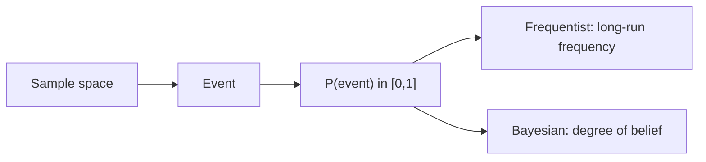

# 확률이란 무엇인가?

> Probability 101 시리즈 (1/10)

<!-- a-grade-intro:begin -->

**핵심 질문**: *확률* 은 *세상의 성질* 일까요, 우리의 *불확실성에 대한 믿음* 일까요?

> *확률은 *반복 가능한 빈도* 일 수도, *우리의 믿음 정도* 일 수도 있다.*

<!-- a-grade-intro:end -->

## 이 글에서 배울 것

- *확률* 의 *정의*
- *빈도주의* 와 *베이지안* 두 관점
- 확률이 *데이터/ML* 에서 *중요한 이유*
- 5단계 직관 실습
- 흔한 함정 5가지

## 왜 중요한가

ML, 통계, 의사결정의 *공통 언어* 가 확률입니다. *확률이 약하면* 모델 결과를 *해석할 수 없습니다*.

> *Probability is the foundation of statistical reasoning.*

## 개념 한눈에 보기



## 핵심 용어 정리

- **표본공간 Ω**: *가능한 모든 결과* 의 집합.
- **사건**: 표본공간의 *부분집합*.
- **확률 P(A)**: 0 이상 1 이하의 *수*, *전체 합 = 1*.
- **빈도주의**: *반복 실험* 의 *극한 비율*.
- **베이지안**: *주어진 정보* 하의 *믿음의 정도*.

## Before/After

**Before**: *“동전이 앞면 나올 확률이 50%”* — *왜* 그런지 *모름*.

**After**: *“표본공간 {H,T}, 대칭이므로 P(H)=0.5 — 또는 베이즈적으로 *동전에 대한 사전믿음*.”*

## 실습: 5단계 확률 직관

### 1단계 — 표본공간

```python
sample_space = {"H", "T"}
```

### 2단계 — 사건과 확률

```python
P = {"H": 0.5, "T": 0.5}
print("P(H):", P["H"], "sum:", sum(P.values()))
```

### 3단계 — 빈도주의 시뮬레이션

```python
import random
flips = [random.choice(["H","T"]) for _ in range(10_000)]
print("freq H:", flips.count("H") / len(flips))
```

### 4단계 — 베이지안 업데이트

```python
prior = 0.5
likelihood = 0.7  # 관측이 H일 likelihood (편향된 동전 가설)
post = (likelihood * prior) / (likelihood * prior + (1 - likelihood) * (1 - prior))
print("posterior:", post)
```

### 5단계 — 두 관점 비교

```python
# 같은 데이터에 대해 다른 해석
print("frequentist: long-run ratio")
print("bayesian: updated belief")
```

## 이 코드에서 주목할 점

- *확률* 은 *공리* (Kolmogorov) *기반* — 0~1, 전체 합 = 1.
- *빈도주의* 와 *베이지안* 은 *서로 보완*.
- *시뮬레이션* 은 직관을 *검증* 하는 가장 빠른 방법.

## 자주 하는 실수 5가지

1. ***확률* 과 *가능도(likelihood)*** 혼동.
2. ***표본공간* 을 *명시* 하지 않음.**
3. ***작은 표본* 으로 *확률 결론*.**
4. ***주관적 확률* 을 *허구* 로 무시.**
5. ***확률 = 0/1*** 을 *결정론적* 으로 오해.

## 실무에서는 이렇게 쓰입니다

스팸 필터, 추천 시스템, 사기 탐지, 의료 진단 — *확률 점수* 가 *결정* 의 핵심입니다. *Bayesian A/B*, *Probabilistic ML* 에서 중요합니다.

## 시니어 엔지니어는 이렇게 생각합니다

- *표본공간* 을 항상 명시한다.
- *빈도주의/베이지안* 둘 다 사용한다.
- *시뮬레이션* 으로 *검증* 한다.
- *확률* 과 *가능도* 를 구분한다.
- *불확실성* 을 *수치* 로 표현한다.

## 체크리스트

- [ ] *표본공간/사건/확률* 을 정의한다.
- [ ] 두 *해석* 을 안다.
- [ ] *시뮬레이션* 할 수 있다.
- [ ] *Kolmogorov 공리* 를 안다.

## 연습 문제

1. *주사위 두 개의 합* 의 표본공간을 적고 *합 = 7* 의 확률을 구하세요.
2. 동일 사건의 *빈도주의/베이지안 해석* 을 두 줄로 적으세요.
3. *확률 0.99* 와 *확률 1* 의 *실무적 차이* 를 적으세요.

## 정리 및 다음 단계

확률은 *불확실성의 언어* 입니다. 다음 글에서는 *사건과 표본공간* 을 더 정밀하게 정의합니다.

<!-- toc:begin -->
- **확률이란 무엇인가? (현재 글)**
- 사건과 표본공간 (예정)
- 조건부확률 (예정)
- 베이즈 정리 (예정)
- 확률변수 (예정)
- 기대값과 분산 (예정)
- 이산분포 (예정)
- 연속분포 (예정)
- 대수의 법칙과 중심극한정리 (예정)
- 머신러닝에서의 확률 (예정)
<!-- toc:end -->

## 참고 자료

- [Khan Academy — Probability](https://www.khanacademy.org/math/statistics-probability/probability-library)
- [Wikipedia — Probability axioms](https://en.wikipedia.org/wiki/Probability_axioms)
- [3Blue1Brown — Bayes' theorem](https://www.3blue1brown.com/lessons/bayes-theorem)
- [Stanford CS109 — Probability for Computer Scientists](https://web.stanford.edu/class/cs109/)

Tags: Probability, Foundations, Intuition, DataScience, Beginner
