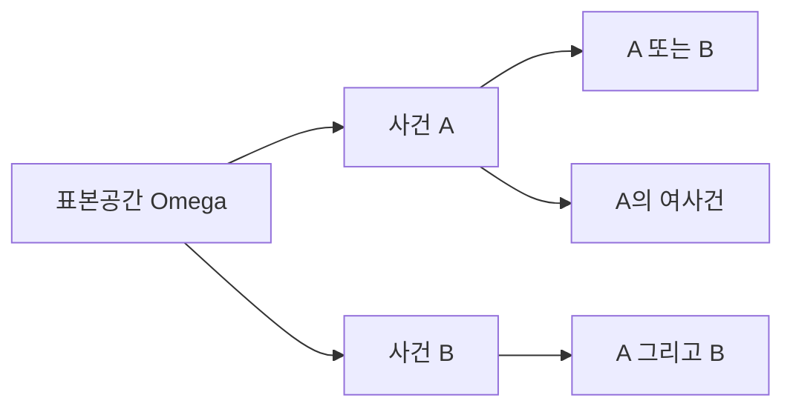

# 사건과 표본공간

확률 문제를 풀다가 자꾸 틀리는 이유는 계산이 약해서가 아니라 문제를 시작하는 방식이 흐리기 때문인 경우가 많습니다. 특히 가능한 결과 전체를 먼저 적지 않고 바로 확률 계산으로 들어가면, 같은 문장을 보고도 서로 다른 답을 내기 쉽습니다.

확률에서 표본공간과 사건은 문법에 가깝습니다. 문법이 흔들리면 그 뒤 계산은 맞아 보여도 뜻이 흔들립니다.

이 글은 Probability 101 시리즈의 2번째 글입니다. 여기서는 표본공간과 사건을 집합 관점에서 정의하고, 합사건·곱사건·여사건·독립 같은 기본 연산을 코드와 함께 정리하겠습니다.

---

## 이 글에서 다룰 문제

- 표본공간은 왜 확률 계산보다 먼저 나와야 할까요?
- 사건을 집합으로 쓰면 무엇이 쉬워질까요?
- 합사건, 곱사건, 여사건은 각각 무엇을 뜻할까요?
- 상호배반과 독립은 왜 자주 헷갈릴까요?
- 순서가 있는 경우와 없는 경우는 왜 답을 크게 바꿀까요?

> 확률 문제의 절반은 계산 전에 표본공간을 제대로 쓰는 순간 이미 풀린 것이나 다름없습니다.

## 왜 중요한가

잘못된 확률 답의 상당수는 잘못된 표본공간에서 나옵니다. 주사위 두 개를 던질 때 `(1,6)`과 `(6,1)`을 같은 결과로 볼지 다른 결과로 볼지부터 분명하지 않으면, 이후 계산은 멀쩡해 보여도 전부 다른 문제를 푼 셈이 됩니다.

표본공간을 집합으로 정리해 두면 확률 문제가 갑자기 집합 연산 문제로 바뀝니다. 사건은 부분집합이 되고, 합사건은 합집합이 되며, 곱사건은 교집합이 됩니다. 이렇게 바꿔 읽는 습관이 생기면 복잡해 보이던 문제도 훨씬 안정적으로 다룰 수 있습니다.

## 핵심 개념 한눈에 보기



## 핵심 용어

- **표본공간 Ω**: 가능한 모든 결과의 집합입니다.
- **사건 A**: Ω의 부분집합입니다.
- **합사건 A∪B**: A 또는 B가 일어나는 경우입니다.
- **곱사건 A∩B**: A와 B가 함께 일어나는 경우입니다.
- **여사건 Aᶜ**: A가 일어나지 않는 경우입니다.
- **상호배반**: `A∩B = ∅`인 관계입니다.
- 독립: `P(A∩B) = P(A)·P(B)`인 관계입니다.

상호배반과 독립은 특히 자주 섞입니다. 함께 일어날 수 없다는 말과 서로 영향을 주지 않는다는 말은 전혀 다릅니다. 확률 입문에서 이 차이를 일찍 분리해 두는 편이 좋습니다.

## 문제를 집합으로 바꾸면 쉬워집니다

“주사위 두 개의 합이 짝수일 확률”이라는 질문을 들으면 막막할 수 있습니다. 하지만 표본공간을 `Ω = {(i,j) : 1≤i,j≤6}`으로 두고 사건 A를 “합이 짝수인 경우”로 정의하면 바로 집합 크기 문제로 바뀝니다. 이때 전체 결과 수는 36개이고, 합이 짝수인 결과는 18개이므로 확률은 `18/36 = 1/2`입니다.

계산 기술보다 표현 방식이 더 중요합니다. 문제를 집합으로 바꿔 적는 순간, 무엇이 전체이고 무엇이 사건인지가 분명해집니다.

## 5단계로 보는 사건과 표본공간

### 1단계 — 표본공간 만들기

```python
omega = [(i, j) for i in range(1, 7) for j in range(1, 7)]
print(len(omega))  # 36
```

두 주사위를 순서 있게 던진다고 보면 결과는 36개입니다. 이 단계에서 이미 순서를 구분한다는 가정이 들어갑니다. 확률 계산은 이렇게 가정을 노출하는 일에서 시작합니다.

### 2단계 — 사건 정의하기

```python
A = [o for o in omega if (o[0] + o[1]) % 2 == 0]   # even sum
B = [o for o in omega if o[0] == o[1]]              # doubles
```

사건은 말로만 두지 말고 집합으로 적는 편이 좋습니다. 그래야 이후 합집합, 교집합, 여집합을 코드로도 바로 확인할 수 있습니다.

### 3단계 — 합사건과 곱사건

```python
union = list(set(A) | set(B))
inter = list(set(A) & set(B))
print(len(union), len(inter))
```

`A 또는 B`는 합집합이고, `A 그리고 B`는 교집합입니다. 말로 읽을 때는 익숙하지만, 집합 연산으로 보면 훨씬 명확해집니다.

### 4단계 — 여사건

```python
not_A = [o for o in omega if o not in A]
print(len(A) + len(not_A))  # 36
```

여사건은 전체에서 사건을 뺀 나머지입니다. 사건과 여사건의 크기를 더하면 항상 전체 크기로 돌아와야 합니다. 아주 기본적인 점검이지만 문제를 풀 때 실수를 줄이는 데 유용합니다.

### 5단계 — 독립성 확인

```python
def P(E): return len(E) / len(omega)
print("indep?", round(P(set(A) & set(B)) - P(A) * P(B), 6))
```

독립인지 확인하려면 `P(A∩B)`와 `P(A)P(B)`를 비교해야 합니다. 겹치지 않는다는 사실만으로는 독립을 말할 수 없습니다. 이 구분이 입문 단계에서 가장 자주 무너집니다.

## 이 코드에서 먼저 봐야 할 점

- 표본공간을 명시하면 확률 문제가 집합 연산 문제로 바뀝니다.
- 상호배반과 독립은 다른 개념입니다.
- 공정한 주사위를 가정하면 각 원소에 같은 확률을 둘 수 있습니다.
- 순서를 구분하는지 여부가 답을 바꿉니다.

## 자주 헷갈리는 지점

첫째, Ω를 적지 않고 계산에 들어가기 쉽습니다. 이 습관은 초반에는 빨라 보여도 뒤로 갈수록 더 많은 오해를 낳습니다.

둘째, 상호배반과 독립을 혼동하기 쉽습니다. 둘이 동시에 일어날 수 없으면 오히려 독립이 아닌 경우가 많습니다.

셋째, 순서가 있는 경우와 없는 경우를 섞기 쉽습니다. 주사위, 카드, 추첨 문제에서 이 차이는 거의 항상 답을 바꿉니다.

넷째, 복원 추출과 비복원 추출을 대충 넘기기 쉽습니다. 같은 뽑기 문제처럼 보여도 전제가 달라지면 확률 구조가 달라집니다.

다섯째, 대칭성 가정을 말하지 않고 넘어가기 쉽습니다. 공정한 주사위인지, 편향된 동전인지, 각 결과가 같은 확률인지부터 드러내야 합니다.

## 실무에서는 이렇게 드러납니다

실무 시스템에서도 사건 정의는 출발점입니다. A/B 테스트의 그룹 정의, 사기 탐지 규칙의 발동 사건, 검색 평가의 관련성 사건처럼 결국 지표는 어떤 사건을 어떻게 정의했는지에서 시작합니다.

그래서 강한 팀일수록 계산식보다 먼저 이벤트 정의를 문서로 남깁니다. 무엇을 성공으로 볼지, 어떤 로그를 사건으로 볼지, 서로 배타적인 조건과 겹칠 수 있는 조건을 어떻게 나눌지부터 잡아야 지표도 안정됩니다.

## 체크리스트

- [ ] 표본공간을 먼저 정의할 수 있습니다.
- [ ] 합사건, 곱사건, 여사건을 구분할 수 있습니다.
- [ ] 상호배반과 독립의 차이를 설명할 수 있습니다.
- [ ] 순서 유무와 복원 여부를 명시할 수 있습니다.

## 정리

표본공간과 사건은 확률의 문법입니다. 이 글에서 남겨야 할 핵심은 세 가지입니다. 표본공간을 먼저 적어야 한다는 점, 사건은 집합으로 정의할 때 가장 분명해진다는 점, 그리고 상호배반과 독립은 닮아 보여도 전혀 다른 질문이라는 점입니다.

다음 글에서는 조건부확률을 다룹니다. 이번 글이 가능한 결과의 지도를 그리는 작업이었다면, 다음 글은 새로운 정보를 알았을 때 그 지도가 어떻게 바뀌는지 보여 줍니다.

<!-- toc:begin -->
- [확률이란 무엇인가?](./01-what-is-probability.md)
- **사건과 표본공간 (현재 글)**
- 조건부확률 (예정)
- 베이즈 정리 (예정)
- 확률변수 (예정)
- 기대값과 분산 (예정)
- 이산분포 (예정)
- 연속분포 (예정)
- 대수의 법칙과 중심극한정리 (예정)
- 머신러닝에서의 확률 (예정)
<!-- toc:end -->

## 참고 자료

- [Khan Academy — Sample spaces](https://www.khanacademy.org/math/statistics-probability/probability-library)
- [Wikipedia — Event (probability theory)](https://en.wikipedia.org/wiki/Event_(probability_theory))
- [Wikipedia — Sample space](https://en.wikipedia.org/wiki/Sample_space)
- [Stanford CS109 — Notes](https://web.stanford.edu/class/cs109/)

Tags: Probability, SampleSpace, Events, SetTheory, Beginner
