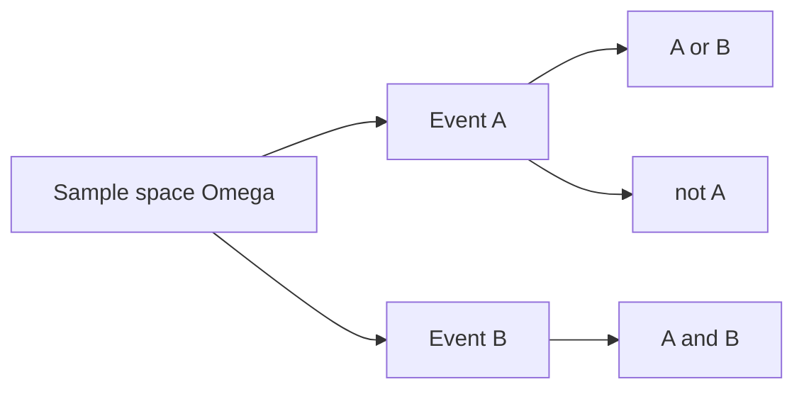

# 사건과 표본공간

> Probability 101 시리즈 (2/10)


## 이 글에서 다룰 문제

확률 문제의 오답 상당수는 표본공간을 잘못 잡는 데서 나옵니다. 집합으로 명확히 적기만 해도 많은 문제가 바로 풀립니다.

> *Define before you compute.*

## 전체 흐름


## Before/After

**Before**: “주사위 두 개 합이 짝수일 확률?” — 어디서 시작해야 할지 막막합니다.

**After**: Ω = {(i,j) : 1≤i,j≤6} (36개), A = {합이 짝수} → 18/36 = 1/2.

## 5단계 사건

### 1단계 — 표본공간

```python
omega = [(i, j) for i in range(1, 7) for j in range(1, 7)]
print(len(omega))  # 36
```

### 2단계 — 사건 정의

```python
A = [o for o in omega if (o[0] + o[1]) % 2 == 0]   # 합 짝수
B = [o for o in omega if o[0] == o[1]]              # 같은 눈
```

### 3단계 — 합사건 / 곱사건

```python
union = list(set(A) | set(B))
inter = list(set(A) & set(B))
print(len(union), len(inter))
```

### 4단계 — 여사건

```python
not_A = [o for o in omega if o not in A]
print(len(A) + len(not_A))  # 36
```

### 5단계 — 독립성 확인

```python
def P(E): return len(E) / len(omega)
print("indep?", round(P(set(A) & set(B)) - P(A) * P(B), 6))
```

## 이 코드에서 주목할 점

- Ω를 명시하면 집합 연산만으로 모든 확률을 풀 수 있습니다.
- 상호배반과 독립은 다릅니다.
- 공정한 주사위라는 가정은 uniform 확률을 뜻합니다.

## 자주 하는 실수 5가지

1. Ω를 적지 않고 계산합니다.
2. 상호배반과 독립을 혼동합니다.
3. ***순서가 있는/없는*** 결과 혼합.
4. ***복원/비복원*** 추출 무시.
5. 대칭성 가정을 분명하게 밝히지 않습니다.

## 실무에서는 이렇게 쓰입니다

A/B 테스트의 그룹 정의, 사기 탐지의 룰 사건, 검색 평가의 관련성 사건처럼 사건을 집합으로 정의하는 일이 지표의 출발점입니다.

## 체크리스트

- [ ] Ω 정의를 안다.
- [ ] 합사건, 곱사건, 여사건을 안다.
- [ ] 상호배반과 독립을 구분한다.
- [ ] 코드 시뮬레이션으로 검증한다.

## 정리 및 다음 단계

표본공간과 사건은 확률의 문법입니다. 다음 글에서는 조건부확률로 정보가 주어졌을 때의 확률을 다룹니다.

<!-- toc:begin -->
- [확률이란 무엇인가?](./01-what-is-probability.md)
- **사건과 표본공간 (현재 글)**
- 조건부확률 (예정)
- 베이즈 정리 (예정)
- 확률변수 (예정)
- 기대값과 분산 (예정)
- 이산분포 (예정)
- 연속분포 (예정)
- 대수의 법칙과 중심극한정리 (예정)
- 머신러닝에서의 확률 (예정)
<!-- toc:end -->

## 참고 자료

- [Khan Academy — Sample spaces](https://www.khanacademy.org/math/statistics-probability/probability-library)
- [Wikipedia — Event (probability theory)](https://en.wikipedia.org/wiki/Event_(probability_theory))
- [Wikipedia — Sample space](https://en.wikipedia.org/wiki/Sample_space)
- [Stanford CS109 — Notes](https://web.stanford.edu/class/cs109/)

Tags: Probability, SampleSpace, Events, SetTheory, Beginner
