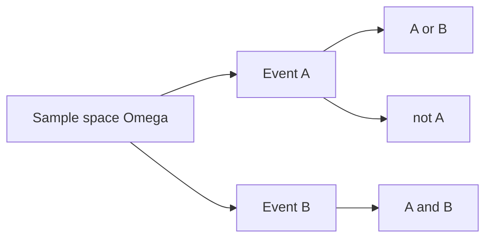

# 사건과 표본공간

> Probability 101 시리즈 (2/10)


## 이 글에서 다룰 문제

확률 *오답의 90%* 는 *표본공간을 잘못 잡는 데서* 나옵니다. *집합* 으로 *명확히* 적기만 해도 많은 문제가 *자명* 해집니다.

> *Define before you compute.*

## 개념 한눈에 보기



## Before/After

**Before**: *“주사위 두 개 합이 짝수일 확률?”* — 어디서 시작?

**After**: Ω = {(i,j) : 1≤i,j≤6} (36개), A = {합이 짝수} → 18/36 = 1/2.

## 실습: 5단계 사건

### 1단계 — 표본공간

```python
omega = [(i, j) for i in range(1, 7) for j in range(1, 7)]
print(len(omega))  # 36
```

### 2단계 — 사건 정의

```python
A = [o for o in omega if (o[0] + o[1]) % 2 == 0]   # 합 짝수
B = [o for o in omega if o[0] == o[1]]              # 같은 눈
```

### 3단계 — 합사건 / 곱사건

```python
union = list(set(A) | set(B))
inter = list(set(A) & set(B))
print(len(union), len(inter))
```

### 4단계 — 여사건

```python
not_A = [o for o in omega if o not in A]
print(len(A) + len(not_A))  # 36
```

### 5단계 — 독립성 확인

```python
def P(E): return len(E) / len(omega)
print("indep?", round(P(set(A) & set(B)) - P(A) * P(B), 6))
```

## 이 코드에서 주목할 점

- *Ω* 를 *명시* 하면 *집합 연산* 으로 모든 확률이 풀린다.
- *상호배반 ≠ 독립* — 흔한 혼동.
- *공정한 주사위* 가정은 *uniform 확률* 을 의미.

## 자주 하는 실수 5가지

1. ***Ω* 를 *적지 않고*** 계산.
2. ***상호배반* 과 *독립* 혼동.**
3. ***순서가 있는/없는*** 결과 혼합.
4. ***복원/비복원*** 추출 무시.
5. ***대칭성* 가정** 을 *명시* 하지 않음.

## 실무에서는 이렇게 쓰입니다

A/B 테스트의 *그룹 정의*, 사기 탐지의 *룰 사건*, 검색 평가의 *관련성 사건* — *사건의 집합 정의* 가 *지표* 의 출발점입니다.

## 체크리스트

- [ ] Ω 정의를 안다.
- [ ] *합/곱/여* 를 안다.
- [ ] *상호배반/독립* 을 구분한다.
- [ ] *코드 시뮬레이션* 으로 검증한다.

## 정리 및 다음 단계

표본공간과 사건은 *확률의 문법* 입니다. 다음 글에서는 *조건부확률* 로 *정보가 주어졌을 때* 의 확률을 다룹니다.

<!-- toc:begin -->
- [확률이란 무엇인가?](./01-what-is-probability.md)
- **사건과 표본공간 (현재 글)**
- 조건부확률 (예정)
- 베이즈 정리 (예정)
- 확률변수 (예정)
- 기대값과 분산 (예정)
- 이산분포 (예정)
- 연속분포 (예정)
- 대수의 법칙과 중심극한정리 (예정)
- 머신러닝에서의 확률 (예정)
<!-- toc:end -->

## 참고 자료

- [Khan Academy — Sample spaces](https://www.khanacademy.org/math/statistics-probability/probability-library)
- [Wikipedia — Event (probability theory)](https://en.wikipedia.org/wiki/Event_(probability_theory))
- [Wikipedia — Sample space](https://en.wikipedia.org/wiki/Sample_space)
- [Stanford CS109 — Notes](https://web.stanford.edu/class/cs109/)

Tags: Probability, SampleSpace, Events, SetTheory, Beginner
