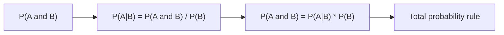

# 조건부확률

> Probability 101 시리즈 (3/10)


## 이 글에서 다룰 문제

진짜 세상은 조건부로 움직입니다. 비가 왔다는 조건에서의 교통체증 확률, 증상이 있다는 조건에서의 질병 확률처럼 모든 추론은 조건에서 시작합니다.

> *Conditioning is the heart of probability.*

## 전체 흐름


## Before/After

**Before**: “검사 양성이면 병에 걸린 확률은 양성률과 같다.” — 틀린 말입니다.

**After**: P(질병 | 양성) = P(양성 | 질병)·P(질병) / P(양성) — 조건의 방향이 다릅니다.

## 5단계 조건부확률

### 1단계 — 데이터 준비

```python
# 100명 중 병자 5명. 검사 민감도 0.9, 특이도 0.95
N, sick = 100, 5
TP = round(sick * 0.9)
FN = sick - TP
TN = round((N - sick) * 0.95)
FP = (N - sick) - TN
print(TP, FN, TN, FP)
```

### 2단계 — P(양성)

```python
pos = TP + FP
print("P(pos):", pos / N)
```

### 3단계 — P(질병 | 양성)

```python
print("P(sick|pos):", TP / pos)
```

### 4단계 — 곱셈정리 검증

```python
P_sick = sick / N
P_pos_given_sick = TP / sick
print("P(sick and pos):", P_pos_given_sick * P_sick, "==", TP / N)
```

### 5단계 — 독립성 검증

```python
P_pos = pos / N
print("indep?", round(TP/N - P_sick * P_pos, 6))  # 0이 아니면 종속
```

## 이 코드에서 주목할 점

- 분모가 바뀌는 것이 조건부의 본질입니다.
- 민감도(P(+|병))와 양성예측도(P(병|+))는 다릅니다. 흔한 오해입니다.
- 기저율이 작으면 양성예측도도 작아집니다.

## 자주 하는 실수 5가지

1. P(A|B)와 P(B|A)를 같은 값으로 봅니다.
2. 기저율을 무시합니다(base rate fallacy).
3. 독립과 상호배반을 혼동합니다.
4. 조건을 명시하지 않습니다.
5. 곱셈정리의 전제를 생략합니다.

## 실무에서는 이렇게 쓰입니다

스팸 필터, 의료 검사, 사기 탐지, 자동완성에서는 조건부확률이 모델 출력의 의미를 결정합니다.

## 체크리스트

- [ ] P(A|B)의 정의를 안다.
- [ ] 곱셈정리를 쓸 수 있다.
- [ ] 독립을 검증할 수 있다.
- [ ] 기저율 오류를 안다.

## 정리 및 다음 단계

조건부확률은 맥락을 다루는 도구입니다. 다음 글에서는 이 개념의 정점인 베이즈 정리를 봅니다.

<!-- toc:begin -->
- [확률이란 무엇인가?](./01-what-is-probability.md)
- [사건과 표본공간](./02-events-and-sample-space.md)
- **조건부확률 (현재 글)**
- 베이즈 정리 (예정)
- 확률변수 (예정)
- 기대값과 분산 (예정)
- 이산분포 (예정)
- 연속분포 (예정)
- 대수의 법칙과 중심극한정리 (예정)
- 머신러닝에서의 확률 (예정)
<!-- toc:end -->

## 참고 자료

- [Khan Academy — Conditional probability](https://www.khanacademy.org/math/statistics-probability/probability-library/conditional-probability-independence)
- [Wikipedia — Conditional probability](https://en.wikipedia.org/wiki/Conditional_probability)
- [Wikipedia — Base rate fallacy](https://en.wikipedia.org/wiki/Base_rate_fallacy)
- [Stanford CS109 — Notes](https://web.stanford.edu/class/cs109/)

Tags: Probability, Conditional, Independence, Inference, Beginner
