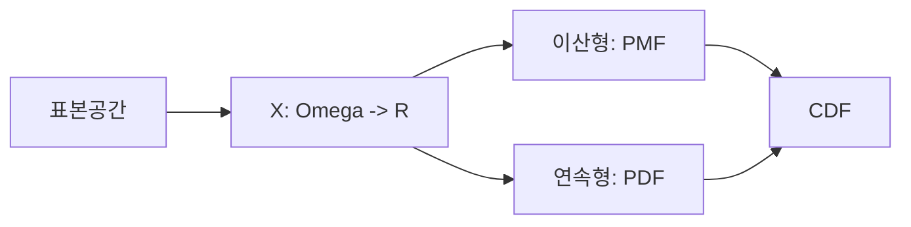

# 확률변수

사건과 확률만으로도 많은 문제를 설명할 수 있지만, 숫자를 다루기 시작하면 더 강한 도구가 필요합니다. 주사위 결과를 1부터 6까지의 숫자로 보고, 시험 점수나 대기시간처럼 값을 가진 결과를 분석하려면 확률을 숫자 위에 올려놓아야 합니다. 그때 등장하는 개념이 확률변수입니다.

확률변수를 이해하면 기대값, 분산, 분포, 회귀 같은 수치 분석이 왜 가능한지 자연스럽게 이어집니다. 머신러닝 모델의 출력도 결국은 어떤 확률변수의 실현값으로 읽을 수 있습니다.

이 글은 Probability 101 시리즈의 5번째 글입니다. 여기서는 확률변수의 정의, 이산형과 연속형의 차이, PMF·PDF·CDF의 역할, 그리고 샘플링으로 분포를 확인하는 방법을 정리하겠습니다.

---

## 이 글에서 다룰 문제

- 확률변수는 왜 사건보다 한 단계 더 강한 표현일까요?
- 이산형과 연속형은 무엇이 다를까요?
- PMF, PDF, CDF는 각각 어떤 질문에 답할까요?
- 연속형에서 왜 `P(X = x) = 0`일까요?
- 샘플링은 분포 이해에 어떤 도움을 줄까요?

> 확률변수는 가능한 결과를 숫자로 옮기는 함수이며, 분포는 그 숫자 위에 확률 질량이나 밀도를 배치하는 규칙입니다.

## 왜 중요한가

주사위 결과를 단순한 사건으로만 보면 “3이 나왔다” 정도만 말할 수 있습니다. 하지만 `X = 주사위 눈`이라는 확률변수로 두면 평균 3.5, 분산 약 2.92, 누적확률, 샘플링 같은 수치 분석이 모두 가능해집니다. 확률이 통계로 넘어가는 지점이 바로 여기입니다.

실무에서도 마찬가지입니다. 센서 값, 응답 시간, 사용자 점수, 예측 확률은 모두 숫자로 관측됩니다. 확률변수의 관점이 없으면 이 숫자들을 사건의 나열로만 보게 되고, 분포적 해석을 놓치기 쉽습니다.

## 핵심 개념 한눈에 보기



## 핵심 용어

- **확률변수 X**: 표본공간의 결과를 실수에 대응시키는 함수입니다.
- **이산 확률변수**: 셀 수 있는 값을 가집니다.
- **연속 확률변수**: 구간 위에서 값을 가집니다.
- **PMF `p(x)`**: 이산형에서 `P(X = x)`를 주는 함수입니다.
- **PDF `f(x)`**: 연속형에서 밀도를 주는 함수입니다.
- **CDF `F(x)`**: `P(X ≤ x)`를 주는 누적분포함수입니다.

여기서 꼭 분리해야 할 것은 PMF와 PDF입니다. PMF의 값은 확률이지만, PDF의 값은 확률이 아니라 밀도입니다. 연속형에서는 구간 아래 면적이 확률이 됩니다.

## 숫자로 옮기는 순간 질문이 달라집니다

“주사위 결과”라는 말은 사건을 떠올리게 합니다. 하지만 `X = 주사위 눈`이라고 두는 순간 질문이 달라집니다. 평균은 얼마인가, 4 이하일 확률은 얼마인가, 분산은 얼마나 되는가 같은 수치 질문이 가능해집니다. 확률변수는 결과를 숫자의 세계로 옮겨 주는 번역기라고 보면 됩니다.

## 5단계로 보는 확률변수

### 1단계 — 이산 확률변수 만들기

```python
import numpy as np
x = np.array([1, 2, 3, 4, 5, 6])
p = np.full(6, 1/6)  # PMF
print("sum p:", p.sum())
```

공정한 주사위는 가장 단순한 이산 확률변수 예시입니다. `x`는 가능한 값이고 `p`는 각 값의 PMF입니다. 여기서도 전체 확률 합이 1이어야 합니다.

### 2단계 — 누적분포함수 보기

```python
cdf = np.cumsum(p)
print("CDF:", cdf)
```

CDF는 “x 이하일 확률”을 보여 줍니다. PMF와 PDF가 형태는 다르더라도, CDF는 이산형과 연속형 모두에서 공통으로 정의됩니다.

### 3단계 — 연속 확률변수 보기

```python
from scipy import stats
rv = stats.norm(loc=0, scale=1)
print("PDF at 0:", rv.pdf(0), "CDF at 0:", rv.cdf(0))
```

정규분포 예시에서 `pdf(0)`은 0에서의 밀도입니다. 이 값 자체가 확률은 아닙니다. 연속형에서는 반드시 구간 확률로 읽어야 합니다.

### 4단계 — 샘플링하기

```python
import numpy as np
samples = np.random.default_rng(0).normal(0, 1, 10_000)
print("mean:", samples.mean(), "std:", samples.std())
```

샘플링은 분포를 이해하는 가장 좋은 방법 중 하나입니다. 이론적으로 배운 평균과 표준편차가 실제 표본에서 어떻게 드러나는지 바로 확인할 수 있습니다.

### 5단계 — 구간 확률 계산하기

```python
from scipy import stats
rv = stats.norm()
print("P(-1 <= X <= 1):", rv.cdf(1) - rv.cdf(-1))
```

연속형에서 확률은 구간으로 계산합니다. 한 점의 확률은 0이지만, 구간의 확률은 0이 아닙니다. 이 차이를 코드로 직접 확인하는 편이 좋습니다.

## 이 코드에서 먼저 봐야 할 점

- PMF 값은 확률이고 PDF 값은 밀도입니다.
- 연속형에서는 `P(X = x) = 0`입니다.
- CDF는 이산형과 연속형 모두에서 정의됩니다.
- 샘플링은 분포 직관을 빠르게 만듭니다.

## 자주 헷갈리는 지점

첫째, PDF 값을 곧바로 확률로 읽기 쉽습니다. 이것이 연속분포 입문에서 가장 흔한 실수입니다.

둘째, 이산형과 연속형을 같은 방식으로 계산하려 하기 쉽습니다. 이산형은 합으로, 연속형은 적분 또는 CDF 차이로 봐야 합니다.

셋째, PMF의 합이 1이 아닌데도 그대로 쓰기 쉽습니다. 확률 모델의 가장 기본적인 점검을 놓치는 셈입니다.

넷째, CDF와 PDF를 같은 것으로 생각하기 쉽습니다. 하나는 누적확률이고, 다른 하나는 밀도입니다.

다섯째, 표본 통계를 곧바로 모수로 받아들이기 쉽습니다. 샘플 평균과 분포의 진짜 평균은 구분해서 봐야 합니다.

## 실무에서는 이렇게 드러납니다

머신러닝 모델의 softmax 출력, 센서 노이즈, 대기시간, 사용자 행동 점수 모두 확률변수 관점에서 읽을 수 있습니다. 어떤 값이 어느 범위에 자주 놓이는지, 극단값은 얼마나 드문지, 평균과 분산은 어떤지 같은 질문이 전부 확률변수와 분포 언어로 바뀝니다.

그래서 강한 엔지니어는 숫자를 볼 때 단일 값보다 분포를 먼저 떠올립니다. 하나의 관측값만 보는 대신, 그것이 어떤 확률변수의 실현값인지 묻습니다. 이 감각이 있어야 평균, 분산, 추정, 예측 불확실성으로 자연스럽게 넘어갈 수 있습니다.

## 체크리스트

- [ ] 확률변수의 정의를 설명할 수 있습니다.
- [ ] 이산형과 연속형을 구분할 수 있습니다.
- [ ] PMF, PDF, CDF의 역할을 구분할 수 있습니다.
- [ ] 구간 확률을 CDF로 계산할 수 있습니다.

## 정리

확률변수는 확률을 수치 분석으로 옮기는 다리입니다. 이 글에서 남겨야 할 핵심은 세 가지입니다. 결과를 숫자로 옮겨야 기대값과 분산 같은 분석이 가능하다는 점, PMF와 PDF는 비슷해 보여도 해석이 다르다는 점, 그리고 CDF는 분포를 읽는 가장 공통적인 도구라는 점입니다.

다음 글에서는 기대값과 분산을 다룹니다. 이번 글이 숫자를 담는 그릇을 만들었다면, 다음 글은 그 숫자들의 중심과 퍼짐을 요약하는 방법을 설명합니다.

<!-- toc:begin -->
- [확률이란 무엇인가?](./01-what-is-probability.md)
- [사건과 표본공간](./02-events-and-sample-space.md)
- [조건부확률](./03-conditional-probability.md)
- [베이즈 정리](./04-bayes-theorem.md)
- **확률변수 (현재 글)**
- 기대값과 분산 (예정)
- 이산분포 (예정)
- 연속분포 (예정)
- 대수의 법칙과 중심극한정리 (예정)
- 머신러닝에서의 확률 (예정)
<!-- toc:end -->

## 참고 자료

- [Khan Academy — Random variables](https://www.khanacademy.org/math/statistics-probability/random-variables-stats-library)
- [Wikipedia — Random variable](https://en.wikipedia.org/wiki/Random_variable)
- [scipy.stats](https://docs.scipy.org/doc/scipy/reference/stats.html)
- [Stanford CS109 — Notes](https://web.stanford.edu/class/cs109/)

Tags: Probability, RandomVariable, Distribution, PMF, Beginner
