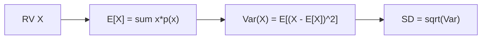

# 기대값과 분산

> Probability 101 시리즈 (6/10)


## 이 글에서 다룰 문제

기대값과 분산은 분포를 두 숫자로 요약합니다. 손실함수, A/B 분석, 위험 평가 모두 이 두 값을 사용합니다.

> *Mean and variance summarize a distribution.*

## 전체 흐름


## Before/After

**Before**: “주사위는 평균 3.5” — 흩어짐은 알 수 없습니다.

**After**: E[X] = 3.5, Var(X) ≈ 2.92, SD ≈ 1.71처럼 중심과 흩어짐을 함께 볼 수 있습니다.

## 5단계 모멘트

### 1단계 — 이산 기대값

```python
import numpy as np
x = np.array([1, 2, 3, 4, 5, 6])
p = np.full(6, 1/6)
E = (x * p).sum()
print("E[X]:", E)
```

### 2단계 — 분산

```python
import numpy as np
Var = ((x - E)**2 * p).sum()
print("Var(X):", Var, "SD:", np.sqrt(Var))
```

### 3단계 — 선형성

```python
# E[2X + 3]는 2*E[X] + 3과 같습니다
print("E[2X+3]:", 2*E + 3)
```

### 4단계 — 시뮬레이션

```python
import numpy as np
samples = np.random.default_rng(0).integers(1, 7, 100_000)
print("mean:", samples.mean(), "var:", samples.var())
```

### 5단계 — 연속 분포

```python
from scipy import stats
rv = stats.norm(loc=10, scale=2)
print("mean:", rv.mean(), "var:", rv.var())
```

## 이 코드에서 주목할 점

- 기대값은 대표값이지만, 항상 실제로 가능한 값일 필요는 없습니다.
- Var = E[X²] - (E[X])² 공식은 계산에 유용합니다.
- 선형성은 독립 가정 없이도 성립합니다.

## 자주 하는 실수 5가지

1. E[X]를 X가 실제로 가질 수 있는 값이라고 단정합니다.
2. Var(aX)를 a·Var(X)로 잘못 씁니다. 실제로는 a²·Var(X)입니다.
3. 표준편차와 분산의 단위를 혼동합니다.
4. 이상치가 기대값을 크게 흔들 수 있다는 점을 무시합니다.
5. 표본 분산의 (n-1) 분모를 무시합니다.

## 실무에서는 이렇게 쓰입니다

손실함수 MSE = E[(y - ŷ)²], A/B 분석의 기대 lift, 금융의 기대수익과 위험처럼 모두 기대값과 분산의 응용입니다.

## 체크리스트

- [ ] E[X]를 정의하고 계산할 수 있다.
- [ ] Var(X)의 두 공식을 안다.
- [ ] 선형성을 안다.
- [ ] 표본 분산에서는 (n-1) 분모를 사용한다.

## 정리 및 다음 단계

기대값과 분산은 분포의 두 축입니다. 다음 글에서는 이산분포의 대표들을 봅니다.

<!-- toc:begin -->
- [확률이란 무엇인가?](./01-what-is-probability.md)
- [사건과 표본공간](./02-events-and-sample-space.md)
- [조건부확률](./03-conditional-probability.md)
- [베이즈 정리](./04-bayes-theorem.md)
- [확률변수](./05-random-variables.md)
- **기대값과 분산 (현재 글)**
- 이산분포 (예정)
- 연속분포 (예정)
- 대수의 법칙과 중심극한정리 (예정)
- 머신러닝에서의 확률 (예정)
<!-- toc:end -->

## 참고 자료

- [Khan Academy — Expected value](https://www.khanacademy.org/math/statistics-probability/random-variables-stats-library)
- [Wikipedia — Expected value](https://en.wikipedia.org/wiki/Expected_value)
- [Wikipedia — Variance](https://en.wikipedia.org/wiki/Variance)
- [Stanford CS109 — Notes](https://web.stanford.edu/class/cs109/)

Tags: Probability, Expectation, Variance, Moments, Beginner
