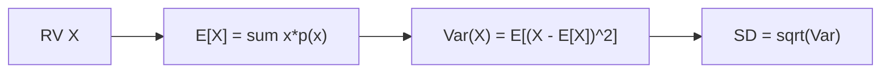

# 기대값과 분산

> Probability 101 시리즈 (6/10)


## 이 글에서 다룰 문제

기대값과 분산은 *분포를 두 숫자로 요약* 합니다. *손실함수, A/B 분석, 위험 평가* 모두 이 두 값을 사용합니다.

> *Mean and variance summarize a distribution.*

## 개념 한눈에 보기



## Before/After

**Before**: *“주사위는 평균 3.5”* — *흩어짐* 모름.

**After**: *E[X] = 3.5*, *Var(X) ≈ 2.92*, *SD ≈ 1.71* — *중심+흩어짐* 한 쌍.

## 실습: 5단계 모멘트

### 1단계 — 이산 기대값

```python
import numpy as np
x = np.array([1, 2, 3, 4, 5, 6])
p = np.full(6, 1/6)
E = (x * p).sum()
print("E[X]:", E)
```

### 2단계 — 분산

```python
import numpy as np
Var = ((x - E)**2 * p).sum()
print("Var(X):", Var, "SD:", np.sqrt(Var))
```

### 3단계 — 선형성

```python
# E[2X + 3] = 2*E[X] + 3
print("E[2X+3]:", 2*E + 3)
```

### 4단계 — 시뮬레이션

```python
import numpy as np
samples = np.random.default_rng(0).integers(1, 7, 100_000)
print("mean:", samples.mean(), "var:", samples.var())
```

### 5단계 — 연속 분포

```python
from scipy import stats
rv = stats.norm(loc=10, scale=2)
print("mean:", rv.mean(), "var:", rv.var())
```

## 이 코드에서 주목할 점

- *기대값* 은 *대표값* — 항상 가능한 값일 필요는 없다.
- *Var = E[X²] - (E[X])²* 는 *계산* 에 유용.
- *선형성* 은 *독립 가정 없이* 성립.

## 자주 하는 실수 5가지

1. ***E[X]* 가 *X 의 가능한 값* 이라고 단정**.
2. ***Var(aX) = a·Var(X)*** *(아님, a²·Var(X))*.
3. ***표준편차* 와 *분산* 단위 혼동**.
4. ***이상치* 에 *기대값* 이 *흔들림* 무시**.
5. ***표본 분산 (n-1) 분모*** 무시.

## 실무에서는 이렇게 쓰입니다

손실함수 *MSE = E[(y - ŷ)²]*, A/B 분석의 *기대 lift*, 금융의 *기대수익/위험* — 모두 *기대값과 분산* 의 응용입니다.

## 체크리스트

- [ ] *E[X]* 를 정의/계산할 수 있다.
- [ ] *Var(X)* 두 공식을 안다.
- [ ] *선형성* 을 안다.
- [ ] *표본 분산 (n-1)* 을 사용한다.

## 정리 및 다음 단계

기대값과 분산은 *분포의 두 축* 입니다. 다음 글에서는 *이산분포* 의 대표들을 봅니다.

<!-- toc:begin -->
- [확률이란 무엇인가?](./01-what-is-probability.md)
- [사건과 표본공간](./02-events-and-sample-space.md)
- [조건부확률](./03-conditional-probability.md)
- [베이즈 정리](./04-bayes-theorem.md)
- [확률변수](./05-random-variables.md)
- **기대값과 분산 (현재 글)**
- 이산분포 (예정)
- 연속분포 (예정)
- 대수의 법칙과 중심극한정리 (예정)
- 머신러닝에서의 확률 (예정)
<!-- toc:end -->

## 참고 자료

- [Khan Academy — Expected value](https://www.khanacademy.org/math/statistics-probability/random-variables-stats-library)
- [Wikipedia — Expected value](https://en.wikipedia.org/wiki/Expected_value)
- [Wikipedia — Variance](https://en.wikipedia.org/wiki/Variance)
- [Stanford CS109 — Notes](https://web.stanford.edu/class/cs109/)

Tags: Probability, Expectation, Variance, Moments, Beginner
