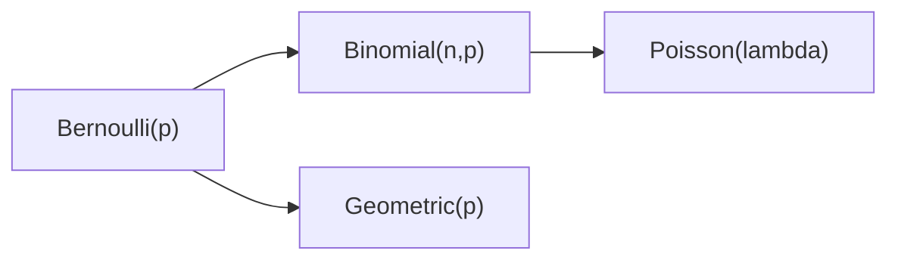

# 이산분포

> Probability 101 시리즈 (7/10)


## 이 글에서 다룰 문제

대부분의 셈 데이터는 이 네 분포 중 하나로 설명할 수 있습니다. 모수만 정하면 평균, 분산, 확률이 공식으로 나옵니다.

> *Distributions are reusable models of the world.*

## 전체 흐름


## Before/After

**Before**: “주문이 시간당 5건 평균” — 어떤 분포를 써야 할지 모릅니다.

**After**: Poisson(λ=5)로 두면 시간당 0건일 확률도 공식으로 계산할 수 있습니다.

## 5단계 이산분포

### 1단계 — 베르누이/이항

```python
from scipy import stats
print("Binomial(10, 0.3) P(X=3):", stats.binom.pmf(3, 10, 0.3))
```

### 2단계 — 기하

```python
from scipy import stats
print("Geometric(0.2) P(X=5):", stats.geom.pmf(5, 0.2))
```

### 3단계 — 포아송

```python
from scipy import stats
print("Poisson(5) P(X=0):", stats.poisson.pmf(0, 5))
```

### 4단계 — 평균/분산 비교

```python
from scipy import stats
for d in [stats.binom(10, 0.3), stats.geom(0.2), stats.poisson(5)]:
    print(d.dist.name, d.mean(), d.var())
```

### 5단계 — 시뮬레이션

```python
import numpy as np
samples = np.random.default_rng(0).poisson(5, 10_000)
print("mean:", samples.mean(), "var:", samples.var())
```

## 이 코드에서 주목할 점

- 같은 데이터라도 어떤 모델을 고르느냐에 따라 해석이 달라집니다.
- 포아송은 평균=분산 가정을 둡니다. 맞지 않으면 Negative Binomial을 고려해야 합니다.
- 이항분포는 고정된 시도 수 n을, 기하분포는 첫 성공까지의 횟수를 다룹니다.

## 자주 하는 실수 5가지

1. 이항분포를 기하분포처럼 사용합니다.
2. 포아송 분산이 평균과 다르는데도 포아송을 강행합니다.
3. 독립 시도 가정을 무시합니다.
4. 표본 1개만 보고 모수를 추정하려 합니다.
5. 확률과 가능도를 혼동합니다.

## 실무에서는 이렇게 쓰입니다

A/B의 전환 수(이항), 콜센터 도착(포아송), 재시도 수(기하), 에러 수(포아송)처럼 이산분포는 카운트 데이터 분석의 기본입니다.

## 체크리스트

- [ ] 네 분포의 모수와 E/Var를 안다.
- [ ] 상황을 적절한 분포와 매핑할 수 있다.
- [ ] scipy.stats로 PMF를 다룬다.
- [ ] 과분산을 점검한다.

## 정리 및 다음 단계

이산분포는 카운트 모델의 사전입니다. 다음 글에서는 연속분포를 봅니다.

<!-- toc:begin -->
- [확률이란 무엇인가?](./01-what-is-probability.md)
- [사건과 표본공간](./02-events-and-sample-space.md)
- [조건부확률](./03-conditional-probability.md)
- [베이즈 정리](./04-bayes-theorem.md)
- [확률변수](./05-random-variables.md)
- [기대값과 분산](./06-expectation-and-variance.md)
- **이산분포 (현재 글)**
- 연속분포 (예정)
- 대수의 법칙과 중심극한정리 (예정)
- 머신러닝에서의 확률 (예정)
<!-- toc:end -->

## 참고 자료

- [Wikipedia — Bernoulli distribution](https://en.wikipedia.org/wiki/Bernoulli_distribution)
- [Wikipedia — Binomial distribution](https://en.wikipedia.org/wiki/Binomial_distribution)
- [Wikipedia — Poisson distribution](https://en.wikipedia.org/wiki/Poisson_distribution)
- [scipy.stats — Discrete](https://docs.scipy.org/doc/scipy/reference/stats.html#discrete-distributions)

Tags: Probability, Discrete, Bernoulli, Binomial, Beginner
