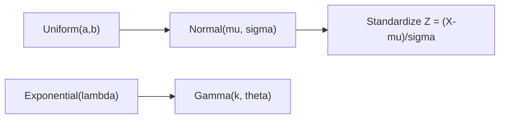

# 연속분포

이산분포에서는 가능한 값을 하나씩 셀 수 있었습니다. 하지만 현실의 많은 값은 그렇게 끊어져 있지 않습니다. 키, 몸무게, 대기시간, 측정 오차, 반응 시간처럼 연속적인 축 위에서 움직이는 값은 다른 언어로 다뤄야 합니다. 그 언어가 연속분포입니다.

연속분포를 이해하면 정규분포를 가정한다는 말이 무엇인지, 왜 PDF 값 자체는 확률이 아닌지, 왜 표준화가 데이터 분석과 머신러닝에서 자주 쓰이는지 한 번에 연결됩니다.

이 글은 Probability 101 시리즈의 8번째 글입니다. 여기서는 균등분포, 정규분포, 지수분포, 감마분포를 중심으로 연속분포의 기본 직관과 실무적 해석 포인트를 정리하겠습니다.

---

## 이 글에서 다룰 문제

- 연속형 값을 확률적으로 모델링한다는 말은 무엇일까요?
- 확률밀도함수는 왜 확률처럼 보이지만 확률이 아닐까요?
- 균등, 정규, 지수, 감마분포는 각각 어떤 상황에서 쓰일까요?
- 지수분포의 무기억성은 어떤 직관을 줄까요?
- 표준화는 왜 서로 다른 데이터를 같은 눈금으로 맞추는 데 유용할까요?

> 연속분포는 한 점의 확률을 말하기보다, 어떤 구간에 얼마나 많은 질량이 놓여 있는지를 설명하는 틀입니다.

## 왜 중요한가

현실 데이터의 상당수는 연속형입니다. 센서 값, 응답 시간, 생산 공정 오차, 가격, 길이, 온도처럼 서비스와 분석에서 만나는 많은 변수는 자연스럽게 연속분포로 읽는 편이 더 맞습니다.

분포를 하나 고르면 평균, 퍼짐, 드문 값의 위치, 구간 확률 같은 질문을 함께 다룰 수 있습니다. 특히 정규분포는 측정 오차와 평균의 세계에서 자주 나타나고, 지수분포와 감마분포는 대기시간 문제에서 계속 등장합니다. 연속분포를 이해하면 데이터를 숫자의 모음이 아니라 모양이 있는 대상으로 보게 됩니다.

## 핵심 개념 한눈에 보기



## 핵심 용어

- **균등분포**: 구간 전체에 같은 밀도를 둡니다.
- **정규분포**: 종 모양의 대표 연속분포입니다.
- **지수분포**: 대기시간을 자주 모델링합니다.
- **감마분포**: 여러 대기시간의 합을 표현하기 좋습니다.
- 표준화: `Z = (X-μ)/σ`로 바꿔 공통 기준에서 비교하는 작업입니다.

연속분포에서 반드시 붙잡아야 할 차이는 이것입니다. 함수값을 바로 확률로 읽으면 안 됩니다. 확률은 함수 아래의 면적에서 나옵니다.

## 구간으로 읽는 습관이 핵심입니다

“키가 180일 확률”이라고 말하고 싶어질 때가 있습니다. 하지만 연속형에서는 한 점의 확률이 0입니다. 대신 “180 이상일 확률”처럼 구간으로 바꿔 읽어야 합니다. 이 구간 사고가 생기면 PDF와 CDF의 역할도 훨씬 자연스럽게 보입니다.

## 5단계로 보는 연속분포

### 1단계 — 균등분포로 시작하기

```python
from scipy import stats
rv = stats.uniform(loc=0, scale=10)  # [0, 10]
print("E:", rv.mean(), "Var:", rv.var())
```

균등분포는 가장 단순한 연속분포입니다. 구간 안에서 어느 위치도 같은 밀도를 가진다고 두는 모델이라 기준점을 잡기에 좋습니다.

### 2단계 — 정규분포 읽기

```python
from scipy import stats
rv = stats.norm(loc=170, scale=7)
print("P(X >= 180):", 1 - rv.cdf(180))
```

정규분포에서는 평균과 표준편차가 거의 모든 설명을 담당합니다. `cdf`를 쓰면 어떤 값 이하 또는 이상일 확률을 바로 계산할 수 있습니다.

### 3단계 — 지수분포 보기

```python
from scipy import stats
rv = stats.expon(scale=1/0.5)  # rate 0.5
print("P(X <= 1):", rv.cdf(1))
```

지수분포는 대기시간 모델의 기본입니다. 다음 요청이 올 때까지 시간, 다음 장애가 날 때까지 시간처럼 기다림의 문제에 잘 붙습니다.

### 4단계 — 감마분포 보기

```python
from scipy import stats
rv = stats.gamma(a=2, scale=1)
print("E:", rv.mean(), "Var:", rv.var())
```

감마분포는 지수분포를 넓힌 형태로 이해하면 쉽습니다. 하나의 대기시간이 아니라 여러 기다림이 누적된 총시간을 다룰 때 자주 등장합니다.

### 5단계 — 표준화하기

```python
import numpy as np
from scipy import stats
x = np.random.default_rng(0).normal(170, 7, 10_000)
z = (x - 170) / 7
print("Z mean ~ 0:", z.mean(), "std ~ 1:", z.std())
```

표준화는 서로 다른 스케일의 데이터를 같은 기준으로 비교하게 해 줍니다. 평균에서 얼마나 떨어져 있는지, 그 거리가 표준편차 몇 개분인지로 읽게 만드는 과정입니다.

## 이 코드에서 먼저 봐야 할 점

- PDF 값은 확률이 아니라 밀도입니다.
- 지수분포는 무기억성을 가집니다.
- 정규분포는 평균과 표준편차로 요약됩니다.
- 표준화는 해석과 비교를 훨씬 쉽게 만듭니다.

## 자주 헷갈리는 지점

첫째, PDF 값을 곧바로 확률로 읽기 쉽습니다. 연속분포에서 가장 자주 나오는 오해입니다.

둘째, 정규성 가정을 검증 없이 쓰기 쉽습니다. 오른쪽 꼬리가 긴 데이터는 정규보다 로그정규가 더 맞을 수 있습니다.

셋째, 표준편차의 단위를 잊기 쉽습니다. 원래 변수와 같은 단위를 가진다는 점이 해석의 핵심입니다.

넷째, 지수분포의 무기억성을 놓치기 쉽습니다. 이미 오래 기다렸다고 해서 곧 끝날 가능성이 더 커지는 것은 아닙니다.

다섯째, 분포를 완벽한 진실처럼 대하기 쉽습니다. 실제로는 현실을 덜 왜곡하는 근사를 고르는 편이 더 중요합니다.

## 실무에서는 이렇게 드러납니다

측정 오차는 정규분포로, 도착 간격은 지수분포로, 여러 대기시간의 합은 감마분포로 읽는 식으로 연속분포는 모델링의 기본 어휘가 됩니다. 회귀 모델의 오차 가정, 이상치 판단, 스케일링, 신뢰구간 해석도 이 분포 감각 위에 놓입니다.

강한 엔지니어는 데이터를 보기 전부터 분포를 단정하지 않습니다. 먼저 히스토그램과 분위수를 보고, 오른쪽 꼬리가 긴지, 대칭에 가까운지, 대기시간 문제인지부터 확인합니다. 그다음에야 어떤 분포가 덜 왜곡하는 근사인지 판단합니다.

## 체크리스트

- [ ] 연속분포에서 확률을 구간으로 읽을 수 있습니다.
- [ ] 균등, 정규, 지수, 감마분포의 역할을 구분할 수 있습니다.
- [ ] PDF와 CDF의 차이를 설명할 수 있습니다.
- [ ] 표준화의 뜻과 용도를 설명할 수 있습니다.

## 정리

연속분포는 연속형 데이터를 읽는 기본 문법입니다. 이 글에서 남겨야 할 핵심은 세 가지입니다. 연속형 확률은 면적으로 읽어야 한다는 점, 각 분포는 서로 다른 현실 생성 과정을 요약한다는 점, 그리고 표준화는 서로 다른 데이터를 같은 눈금으로 비교하게 해 준다는 점입니다.

다음 글에서는 대수의 법칙과 중심극한정리를 다룹니다. 이번 글이 분포의 모양을 다뤘다면, 다음 글은 왜 평균과 정규분포가 통계 전반에서 그렇게 자주 등장하는지 설명합니다.

<!-- toc:begin -->
- [확률이란 무엇인가?](./01-what-is-probability.md)
- [사건과 표본공간](./02-events-and-sample-space.md)
- [조건부확률](./03-conditional-probability.md)
- [베이즈 정리](./04-bayes-theorem.md)
- [확률변수](./05-random-variables.md)
- [기대값과 분산](./06-expectation-and-variance.md)
- [이산분포](./07-discrete-distributions.md)
- **연속분포 (현재 글)**
- 대수의 법칙과 중심극한정리 (예정)
- 머신러닝에서의 확률 (예정)
<!-- toc:end -->

## 참고 자료

- [Wikipedia — Normal distribution](https://en.wikipedia.org/wiki/Normal_distribution)
- [Wikipedia — Exponential distribution](https://en.wikipedia.org/wiki/Exponential_distribution)
- [Wikipedia — Gamma distribution](https://en.wikipedia.org/wiki/Gamma_distribution)
- [scipy.stats — Continuous](https://docs.scipy.org/doc/scipy/reference/stats.html#continuous-distributions)

Tags: Probability, Continuous, Normal, Exponential, Beginner
