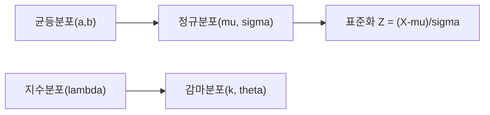

# 연속분포

이산분포를 배울 때는 가능한 결과를 하나씩 셀 수 있었습니다. 주사위 눈금, 동전 앞뒷면, 결함 제품 수처럼 결과가 분리되어 있기 때문입니다. 하지만 현실의 많은 값은 그렇게 떨어져 있지 않습니다. 키, 몸무게, 시간, 길이, 측정 오차, 반응 시간은 보통 연속적인 축 위에서 움직입니다.

이때 필요한 언어가 연속분포입니다. 연속분포를 제대로 이해하면 “정규분포를 가정한다”는 말이 무엇을 뜻하는지, 왜 PDF 값 자체는 확률이 아닌지, 왜 평균과 표준편차만 알아도 많은 현상을 빠르게 요약할 수 있는지 감이 생깁니다. 나아가 신호처리, 실험 데이터 분석, 머신러닝의 오차 모델까지 한 줄로 이어서 볼 수 있습니다.

이 글에서는 대표적인 연속분포 네 가지인 균등분포, 정규분포, 지수분포, 감마분포를 살펴보고, 표준화가 왜 강력한 도구인지, 정규분포가 왜 그렇게 자주 등장하는지까지 연결하겠습니다. 영어 이름을 외우는 것보다 각 분포가 어떤 상황의 움직임을 요약하는지 잡는 데 집중하겠습니다.

## 이 글에서 다룰 문제

- 연속형 값을 확률적으로 모델링한다는 말은 정확히 무엇일까요?
- 확률밀도함수는 왜 확률처럼 보이는데도 확률이 아닐까요?
- 균등, 정규, 지수, 감마분포는 각각 어떤 상황에서 쓰일까요?
- 지수분포의 무기억성은 어떤 직관을 주고, 감마분포는 왜 그 일반화일까요?
- 정규분포와 표준화는 데이터 분석과 ML에서 왜 거의 기본 문법처럼 쓰일까요?

> 연속분포는 개별 점 하나의 확률보다, 구간 전체에 얼마나 질량이 놓여 있는지를 보는 관점입니다.

## 왜 중요한가

현실 데이터의 상당수는 연속형입니다. 측정 장비가 내놓는 값도, 사용자 반응 시간도, 센서 노이즈도, 생산 공정의 오차도 연속적인 축 위에 놓입니다. 그래서 연속분포를 모르면 “데이터를 어떤 모양으로 가정할 것인가”라는 가장 기본적인 질문에 답하기 어렵습니다.

정규분포가 특히 많이 등장하는 이유도 여기 있습니다. 여러 작은 요인이 합쳐진 결과는 종종 정규분포에 가까워지고, 평균이나 오차를 다루는 많은 통계 기법이 이 성질을 바탕으로 서 있습니다. 반면 대기시간 같은 문제는 지수분포가, 여러 대기시간의 합은 감마분포가 더 자연스럽습니다. 분포를 고른다는 것은 수학 문제를 푸는 일이 아니라, 데이터가 움직이는 방식에 가장 맞는 설명을 고르는 일입니다.

여기서 중요한 태도는 완벽한 모양을 찾겠다는 욕심보다, 현상을 가장 덜 왜곡하는 근사를 고르겠다는 태도입니다. 분포를 하나 고르면 평균, 퍼짐, 드문 값의 위치, 구간 확률 같은 질문을 한꺼번에 다룰 수 있습니다. 그래서 연속분포는 계산 기술이라기보다 관찰을 정리하는 틀에 가깝습니다.

## 핵심 개념 한눈에 보기



## 핵심 용어

- **균등분포**: 구간 전체에 같은 밀도를 둡니다. 직관적으로 “어느 위치나 비슷하게 가능하다”는 가정입니다.
- **정규분포**: 가운데가 높고 양쪽으로 부드럽게 줄어드는 종 모양 분포입니다.
- **지수분포**: 사건이 일어날 때까지의 대기시간을 자주 모델링합니다.
- **감마분포**: 지수분포를 더 일반화한 형태로, 여러 대기시간의 합을 다루기 좋습니다.
- **표준화**: X를 Z = (X-μ)/σ로 바꿔 평균 0, 표준편차 1 기준에서 비교하는 작업입니다.

여기서 꼭 분리해야 할 개념이 하나 있습니다. 연속분포에서는 한 점의 확률이 아니라 구간의 확률을 봅니다. 그래서 함수값을 읽는 습관보다, 그 함수 아래 면적을 확률로 읽는 습관을 먼저 들이는 편이 좋습니다.

## Before / After

**Before**: “키 데이터가 있다.”라고만 말하면 분포의 모양도, 어느 구간이 드문 값인지도 감이 잘 오지 않습니다.

**After**: “키를 대략 Normal(170, 7)로 가정하면 상위 5%가 어느 지점부터 시작하는지 CDF와 분위수로 계산할 수 있다.”라고 말할 수 있습니다.

전자는 데이터가 있다는 사실만 말합니다. 후자는 데이터의 구조를 가정하고 그 가정 위에서 계산 가능한 질문으로 바꿉니다. 연속분포의 힘은 바로 이 변환에 있습니다.

## 5단계로 보는 연속분포 직관

### Step 1 — 균등분포로 기준 잡기

```python
from scipy import stats
rv = stats.uniform(loc=0, scale=10)  # [0, 10]
print("E:", rv.mean(), "Var:", rv.var())
```

균등분포는 가장 단순한 연속분포입니다. 0에서 10 사이의 어느 점도 같은 밀도를 가진다고 가정합니다. 시작점과 구간 길이만 알면 평균과 분산도 바로 계산할 수 있습니다. 복잡한 분포를 이해하기 전 기준점으로 삼기 좋습니다.

### Step 2 — 정규분포 읽기

```python
from scipy import stats
rv = stats.norm(loc=170, scale=7)
print("P(X >= 180):", 1 - rv.cdf(180))
```

정규분포에서는 평균과 표준편차가 거의 모든 설명을 담당합니다. 평균은 중심을, 표준편차는 퍼짐을 말합니다. `cdf`를 쓰면 어떤 값 이하일 확률을 계산할 수 있고, 그 반대로 분위수도 구할 수 있습니다. 실제 분석에서는 “180 이상일 확률”처럼 구간 질문으로 자주 나타납니다.

### Step 3 — 대기시간과 지수분포

```python
from scipy import stats
rv = stats.expon(scale=1/0.5)  # rate 0.5
print("P(X <= 1):", rv.cdf(1))
```

지수분포는 대기시간 모델의 기본입니다. 콜센터에 다음 전화가 걸려올 때까지 시간, 서버에 다음 요청이 도착할 때까지 시간처럼 “얼마나 기다려야 하나”를 묻는 문제에 잘 맞습니다. 평균이 1/λ라는 점도 중요하지만, 더 중요한 성질은 무기억성입니다. 이미 오래 기다렸다고 해서 앞으로 더 빨리 끝날 보장이 없다는 뜻입니다.

### Step 4 — 여러 대기시간을 묶는 감마분포

```python
from scipy import stats
rv = stats.gamma(a=2, scale=1)
print("E:", rv.mean(), "Var:", rv.var())
```

감마분포는 지수분포를 넓힌 버전으로 보면 이해가 쉽습니다. 하나의 사건을 기다리는 시간이 아니라, 여러 사건이 쌓일 때까지 걸리는 총시간을 모델링하기 좋습니다. 그래서 대기시간 문제를 조금 더 현실적으로 확장할 때 자주 등장합니다.

### Step 5 — 표준화로 같은 눈금 만들기

```python
import numpy as np
from scipy import stats
x = np.random.default_rng(0).normal(170, 7, 10_000)
z = (x - 170) / 7
print("Z mean ~ 0:", z.mean(), "std ~ 1:", z.std())
```

표준화는 서로 다른 스케일의 데이터를 같은 기준선 위에 올리는 작업입니다. 평균을 빼고 표준편차로 나누면 “평균에서 몇 표준편차 떨어졌는가”라는 공통 해석이 생깁니다. 데이터 전처리, 이상치 탐지, 정규근사 계산에서 이 과정이 매우 자주 쓰입니다.

## 이 코드에서 주목할 점

- 확률밀도함수 값 자체는 확률이 아닙니다. 구간 아래 면적을 적분해야 확률이 됩니다.
- 정규분포는 평균과 표준편차로 중심과 퍼짐을 압축해 보여 줍니다.
- 지수분포는 무기억성 덕분에 대기시간 모델에서 특별한 위치를 가집니다.
- 감마분포는 여러 대기시간을 합쳐 볼 때 자연스럽게 등장합니다.
- 표준화는 분포를 공통 기준에서 비교하게 해 주는 실용적인 도구입니다.

## 자주 하는 실수 5가지

1. **확률밀도함수 값과 확률을 같은 것으로 읽는 실수**

   연속분포에서 한 점의 확률은 0입니다. `pdf(180)`이 크다고 해서 “180이 나올 확률이 크다”라고 읽으면 안 됩니다. 말해야 하는 것은 그 주변 구간의 질량입니다.

2. **정규성 가정을 검증 없이 사용하는 실수**

   데이터가 정규처럼 생겼다고 믿고 바로 평균, 표준편차, z-score 계산으로 들어가면 왜도가 큰 데이터에서 크게 빗나갈 수 있습니다.

3. **표준편차의 단위를 잊는 실수**

   표준편차는 원래 변수와 같은 단위를 가집니다. 키가 cm라면 표준편차도 cm입니다. 이 점을 놓치면 숫자의 해석이 흐려집니다.

4. **지수분포의 무기억성을 놓치는 실수**

   이미 오래 기다렸으니 이제 곧 끝날 것 같다고 생각하기 쉽지만, 지수분포는 그런 직관과 다르게 움직입니다.

5. **로그정규 같은 비대칭 분포를 무시하는 실수**

   가격, 소득, 응답 시간처럼 오른쪽 꼬리가 긴 데이터는 정규보다 로그정규가 더 맞는 경우가 많습니다.

## 실무에서는 이렇게 드러납니다

연속분포는 모델링의 기본 어휘입니다. 측정 오차는 정규분포로, 도착 간격은 지수분포로, 누적 대기시간은 감마분포로, 가격이나 크기 같은 양수 데이터는 로그정규분포로 보는 식입니다. 꼭 분포를 완벽히 맞혀야 하는 것은 아니지만, 어떤 모양을 가정하는지 알아야 추정과 해석도 올바르게 따라갑니다.

머신러닝에서도 마찬가지입니다. 회귀 모델의 오차항을 정규로 두는 순간 손실함수와 추정 방식이 바뀌고, 표준화는 학습 안정성과 최적화 속도에 직접 영향을 줍니다. 분포는 배경지식이 아니라 모델이 세계를 단순화하는 방식입니다.

실제로 분석을 시작할 때는 거창한 수식보다 간단한 질문이 더 유용합니다. 값이 어느 구간에 몰리는지, 오른쪽 꼬리가 긴지, 시간이 누적되며 커지는지, 하나의 기다림인지 여러 기다림의 합인지부터 묻는 편이 좋습니다. 이런 질문이 정리되면 어떤 분포를 먼저 의심해야 하는지도 훨씬 또렷해집니다.

## 숙련자는 이렇게 생각합니다

- 분포를 가정할 때는 먼저 히스토그램이나 분위수 비교 그림으로 모양을 확인합니다.
- 평균과 표준편차만 보지 않고 왜도와 꼬리도 함께 봅니다.
- 오른쪽 꼬리가 긴 데이터는 로그 변환이나 로그정규 가정을 검토합니다.
- 표준화가 계산 편의를 넘어 해석의 기준점을 준다는 사실을 압니다.
- 분포는 현실을 완벽히 복사하는 도구가 아니라, 충분히 유용한 근사라는 점을 잊지 않습니다.

## 체크리스트

- [ ] 균등, 정규, 지수, 감마분포의 역할을 구분할 수 있습니다.
- [ ] 확률밀도함수 값과 확률이 다르다는 점을 설명할 수 있습니다.
- [ ] 평균과 표준편차로 정규분포를 해석할 수 있습니다.
- [ ] 표준화를 직접 계산하고 의미를 말할 수 있습니다.

## 연습 문제

1. N(0,1)에서 P(|X| > 2)를 계산해 보세요.
2. Exponential(λ=2)의 median이 왜 평균과 다른지 설명해 보세요.
3. 로그정규분포가 정규분포와 어떻게 다른 모양을 가지는지 한 문단으로 적어 보세요.

## 마무리

연속분포는 연속형 데이터를 읽는 기본 문법입니다. 이 글에서 꼭 남겨야 할 핵심은 세 가지입니다. 확률은 함수값이 아니라 면적으로 읽어야 한다는 점, 각 분포는 현실의 다른 생성 과정을 요약한다는 점, 그리고 표준화는 서로 다른 데이터를 같은 눈금으로 비교하게 해 주는 강력한 실용 도구라는 점입니다.

다음 글에서는 대수의 법칙과 중심극한정리를 다룹니다. 그 글은 왜 정규분포가 곳곳에 나타나는지, 그리고 왜 평균이 통계와 ML에서 그렇게 중요한지 설명하는 연결 고리가 될 것입니다.

<!-- toc:begin -->
- [확률이란 무엇인가?](./01-what-is-probability.md)
- [사건과 표본공간](./02-events-and-sample-space.md)
- [조건부확률](./03-conditional-probability.md)
- [베이즈 정리](./04-bayes-theorem.md)
- [확률변수](./05-random-variables.md)
- [기대값과 분산](./06-expectation-and-variance.md)
- [이산분포](./07-discrete-distributions.md)
- **연속분포 (현재 글)**
- 대수의 법칙과 중심극한정리 (예정)
- 머신러닝에서의 확률 (예정)
<!-- toc:end -->

## 참고 자료

- [Wikipedia — Normal distribution](https://en.wikipedia.org/wiki/Normal_distribution)
- [Wikipedia — Exponential distribution](https://en.wikipedia.org/wiki/Exponential_distribution)
- [Wikipedia — Gamma distribution](https://en.wikipedia.org/wiki/Gamma_distribution)
- [scipy.stats — Continuous](https://docs.scipy.org/doc/scipy/reference/stats.html#continuous-distributions)

Tags: Probability, Continuous, Normal, Exponential, Beginner
