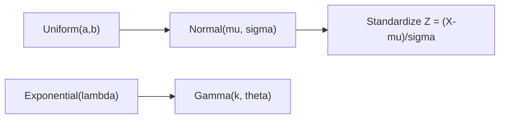

# 연속분포

> Probability 101 시리즈 (8/10)


## 이 글에서 다룰 문제

*머신러닝, 신호처리, 측정 오차* 에서 *연속분포* 는 *기본 가정* 입니다. *정규분포* 는 *CLT* 덕분에 *자연스럽게* 나타납니다.

> *Continuous distributions model the analog world.*

## 개념 한눈에 보기



## Before/After

**Before**: *“키 데이터”* — 분석 어려움.

**After**: *Normal(170, 7)* 가정 → *상위 5%* 의 키를 *공식* 으로 계산.

## 실습: 5단계 연속분포

### 1단계 — 균등

```python
from scipy import stats
rv = stats.uniform(loc=0, scale=10)  # [0, 10]
print("E:", rv.mean(), "Var:", rv.var())
```

### 2단계 — 정규

```python
from scipy import stats
rv = stats.norm(loc=170, scale=7)
print("P(X >= 180):", 1 - rv.cdf(180))
```

### 3단계 — 지수

```python
from scipy import stats
rv = stats.expon(scale=1/0.5)  # rate 0.5
print("P(X <= 1):", rv.cdf(1))
```

### 4단계 — 감마

```python
from scipy import stats
rv = stats.gamma(a=2, scale=1)
print("E:", rv.mean(), "Var:", rv.var())
```

### 5단계 — 표준화

```python
import numpy as np
from scipy import stats
x = np.random.default_rng(0).normal(170, 7, 10_000)
z = (x - 170) / 7
print("Z mean ~ 0:", z.mean(), "std ~ 1:", z.std())
```

## 이 코드에서 주목할 점

- *PDF 값* 자체는 *확률 아님* — 적분이 확률.
- *지수* 는 *무기억성* (memoryless).
- *정규* 는 *합/평균* 으로 *항상* 등장 (CLT).

## 자주 하는 실수 5가지

1. ***PDF 값 = 확률*** *(아님)*.
2. ***정규성* 가정** 무비판 사용.
3. ***표준편차* 단위* 무시.**
4. ***지수* 의 *무기억성*** 잊음.
5. ***로그-정규* 같은 *비대칭* 무시.**

## 실무에서는 이렇게 쓰입니다

측정오차의 *정규* 모델, 대기시간의 *지수*, 가격의 *로그-정규*, 신뢰구간/검정의 *근본* 분포 — *연속분포* 는 *모델링의 기본 어휘* 입니다.

## 체크리스트

- [ ] 네 분포의 *PDF* 와 *E/Var* 를 안다.
- [ ] *표준화* 를 할 수 있다.
- [ ] *PDF≠확률* 을 안다.
- [ ] *Q-Q plot* 을 그릴 수 있다.

## 정리 및 다음 단계

연속분포는 *현실 측정값의 사전* 입니다. 다음 글에서는 *대수의 법칙과 CLT* 로 *왜 정규분포가 도처에 있는지* 봅니다.

<!-- toc:begin -->
- [확률이란 무엇인가?](./01-what-is-probability.md)
- [사건과 표본공간](./02-events-and-sample-space.md)
- [조건부확률](./03-conditional-probability.md)
- [베이즈 정리](./04-bayes-theorem.md)
- [확률변수](./05-random-variables.md)
- [기대값과 분산](./06-expectation-and-variance.md)
- [이산분포](./07-discrete-distributions.md)
- **연속분포 (현재 글)**
- 대수의 법칙과 중심극한정리 (예정)
- 머신러닝에서의 확률 (예정)
<!-- toc:end -->

## 참고 자료

- [Wikipedia — Normal distribution](https://en.wikipedia.org/wiki/Normal_distribution)
- [Wikipedia — Exponential distribution](https://en.wikipedia.org/wiki/Exponential_distribution)
- [Wikipedia — Gamma distribution](https://en.wikipedia.org/wiki/Gamma_distribution)
- [scipy.stats — Continuous](https://docs.scipy.org/doc/scipy/reference/stats.html#continuous-distributions)

Tags: Probability, Continuous, Normal, Exponential, Beginner
