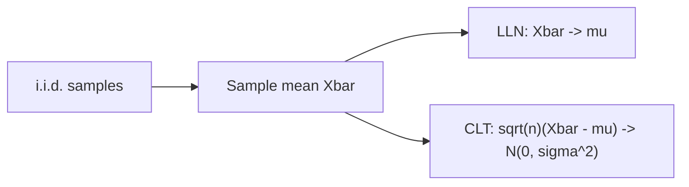

# 대수의 법칙과 중심극한정리

> Probability 101 시리즈 (9/10)


## 이 글에서 다룰 문제

신뢰구간, 가설검정, A/B 분석은 모두 CLT 위에 서 있습니다. LLN이 없으면 표본 통계에는 의미가 없습니다.

> *LLN gives accuracy; CLT gives shape.*

## 전체 흐름


## Before/After

**Before**: “표본평균이 모평균과 같다.” — 언제 왜 그런지 모릅니다.

**After**: LLN은 수렴을 보장하고, CLT는 오차의 분포를 알려줍니다.

## 5단계 LLN/CLT

### 1단계 — LLN 시뮬레이션

```python
import numpy as np
rng = np.random.default_rng(0)
samples = rng.uniform(0, 1, 10_000)
running = np.cumsum(samples) / np.arange(1, len(samples) + 1)
print("means at n=10, 100, 10_000:", running[9], running[99], running[-1])
```

### 2단계 — CLT 시뮬레이션

```python
import numpy as np
rng = np.random.default_rng(0)
means = [rng.exponential(1, 30).mean() for _ in range(10_000)]
print("mean ~ 1:", np.mean(means), "std ~ 1/sqrt(30):", np.std(means))
```

### 3단계 — 분포 시각화

```python
# 표본 평균의 히스토그램이 정규분포에 가까워 보입니다
import matplotlib.pyplot as plt
plt.hist(means, bins=40); plt.show()
```

### 4단계 — 표준오차

```python
import math
sigma = 1.0
n = 30
print("SE:", sigma / math.sqrt(n))
```

### 5단계 — 모집단 분포 무관성 확인

```python
import numpy as np
rng = np.random.default_rng(0)
# 비정규 모집단도 평균은 정규에 가까움
for dist in ["uniform", "exponential", "binomial"]:
    if dist == "uniform":
        s = rng.uniform(0, 1, (10_000, 30)).mean(axis=1)
    elif dist == "exponential":
        s = rng.exponential(1, (10_000, 30)).mean(axis=1)
    else:
        s = rng.binomial(10, 0.3, (10_000, 30)).mean(axis=1)
    print(dist, "mean of means:", round(s.mean(), 3))
```

## 이 코드에서 주목할 점

- n이 클수록 X̄의 표준오차는 1/√n으로 줄어듭니다.
- 모집단이 비정규여도 표본평균은 근사적으로 정규분포를 따릅니다.
- CLT는 합과 평균에만 바로 적용됩니다. 최댓값에는 EVT를 봐야 합니다.

## 자주 하는 실수 5가지

1. ***i.i.d.*** 가정 무시.
2. ***작은 n*** 에서 CLT 강요.
3. ***이상치/꼬리분포*** 무시.
4. ***표준편차 ≠ 표준오차*** 혼동.
5. ***LLN ≠ Gambler's fallacy*** 혼동.

## 실무에서는 이렇게 쓰입니다

A/B의 전환율 차이 신뢰구간, 모니터링의 평균 응답시간, ML의 손실 평균 모두 CLT가 근거입니다.

## 체크리스트

- [ ] LLN의 의미를 안다.
- [ ] CLT의 의미와 한계를 안다.
- [ ] 표준오차를 안다.
- [ ] 부트스트랩의 존재를 안다.

## 정리 및 다음 단계

LLN은 수렴을, CLT는 형태를 보장합니다. 마지막 글에서는 이 모든 것을 머신러닝의 확률로 묶습니다.

<!-- toc:begin -->
- [확률이란 무엇인가?](./01-what-is-probability.md)
- [사건과 표본공간](./02-events-and-sample-space.md)
- [조건부확률](./03-conditional-probability.md)
- [베이즈 정리](./04-bayes-theorem.md)
- [확률변수](./05-random-variables.md)
- [기대값과 분산](./06-expectation-and-variance.md)
- [이산분포](./07-discrete-distributions.md)
- [연속분포](./08-continuous-distributions.md)
- **대수의 법칙과 중심극한정리 (현재 글)**
- 머신러닝에서의 확률 (예정)
<!-- toc:end -->

## 참고 자료

- [Wikipedia — Law of large numbers](https://en.wikipedia.org/wiki/Law_of_large_numbers)
- [Wikipedia — Central limit theorem](https://en.wikipedia.org/wiki/Central_limit_theorem)
- [3Blue1Brown — CLT](https://www.youtube.com/watch?v=zeJD6dqJ5lo)
- [Stanford CS109 — Notes](https://web.stanford.edu/class/cs109/)

Tags: Probability, LLN, CLT, Sampling, Beginner
